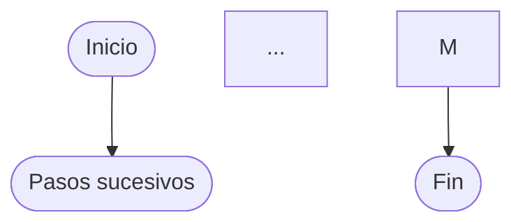
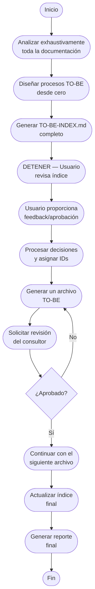

# PROMPT Maestro · 020203 — TO-BE (Diseño desde cero con aprobación)

## Resumen Ejecutivo

**Objetivo**: Diseñar un catálogo TO-BE completamente nuevo basado en la visión del consultor (`to-be-guidelines.md`), traduciendo esa visión en procesos concretos que resuelvan los problemas identificados en el AS-IS.

**Concepto clave**: Un **proceso** es una secuencia de actividades con inicio claro, fin definido, actor principal, objetivo medible y pasos secuenciales. NO son procesos: sistemas, plataformas, herramientas, módulos o aplicaciones.

**Flujo de trabajo**:
1. **FASE 1**: Análisis → Diseño de procesos → Generación de índice completo → Aprobación del usuario
2. **FASE 2**: Generación de archivos individuales solo para procesos aprobados

**Fuente principal**: `to-be-guidelines.md` define CÓMO resolver los problemas identificados en el AS-IS.

---

## 0) Parámetros de ejecución (variables)

- **{PRODUCT_NAME}** · **{RELEASE_TAG}** · **{AUTHOR}** · **{ORG}** · **{DEFAULT_LOCALE}** (p. ej., `es-ES`).
- **Raíz de descubrimiento (F1/F2)**
    - **{DISCOVERY_ROOT}**: `02-discovery/`
    - **{ASIS_ROOT}**: `02-discovery/0202-prd/020202-as-is/`
    - **{INTERVIEWS_GLOB}**: `02-discovery/0201-interviews/**/(PROMPT-transcription.md|PROMPT-minute.md)`
    - **{CONTEXT_DIR}**: `02-discovery/0202-prd/020201-context/`
- **Raíz de TO-BE (F3)**
    - **{FOLDER_ROOT}**: `02-discovery/0202-prd/020203-to-be/`
    - **{PROC_DIR_TO_BE}**: `02-discovery/0202-prd/020203-to-be/processes/`
- **{OVERWRITE_POLICY}**: `none | safe | all`
    - `none`: no reescribe si existe.
    - `safe`: sólo reescribe si cambia el *hash* previo con sello `GEN-BY:PROMPT-to-be`.
    - `all`: fuerza reescritura.
- **{PROC_FILTER?}**: lista opcional de *slugs* o nombres a considerar (si vacío → todos).

---

## 1) Objetivo

Diseñar un **catálogo TO-BE completamente nuevo** que implemente la visión del consultor documentada en `to-be-guidelines.md` (si existe), traduciendo esa visión en procesos concretos que resuelvan los problemas identificados en el AS-IS.

El TO-BE debe:
- **Basarse principalmente en la visión del `to-be-guidelines.md`** como fuente de inspiración principal
- **Traducir esa visión en procesos concretos** que resuelvan los problemas AS-IS identificados
- **Partir de los objetivos de negocio y experiencia deseada**, no del AS-IS
- **Eliminar** procesos o pasos sin valor agregado
- **Consolidar o dividir** procesos según optimice el flujo
- **Digitalizar, simplificar y automatizar por defecto**, dejando intervención manual solo donde agregue valor
- **Incluir inteligencia artificial solo cuando sea evidente**, cuando sea de impacto alto y coste bajo
- **Aplicar mejores prácticas** de la industria y patrones probados
- **Diseñar para el futuro**, no parchar el presente

**Todos los procesos TO-BE requieren aprobación explícita** del usuario antes de generar archivos.

---

## 2) Fuentes y límites

Usa como **fuente principal de inspiración**:
- `@/{FOLDER_ROOT}/to-be-guidelines.md` - **Visión del consultor sobre la aplicación futura**
  - Este archivo es la **GUÍA PRINCIPAL** para el diseño TO-BE
  - Contiene la visión, principios, tecnologías y enfoque deseado
  - Los procesos TO-BE deben **implementar esta visión**

Usa como fuentes para **identificar problemas a resolver**:
- `@/{ASIS_ROOT}` - Procesos actuales con sus deficiencias
- `@/{INTERVIEWS_GLOB}` - Dolores y necesidades expresadas
- `@/{CONTEXT_DIR}` - Contexto del negocio

**Enfoque de diseño**: Los procesos AS-IS identifican los **procesos de negocio actuales, con sus problemas y oportunidades**, mientras que `to-be-guidelines.md` define **la visión e ideas del consultor sobre la aplicación futura**.

Siempre cita rutas fuente.

---

## 3) Reglas de catálogo y definición de procesos

### 3.1 Definición de proceso (CRÍTICO - LEER PRIMERO)
Un **proceso TO-BE** es una **secuencia de actividades** con:
- **Inicio claro**: Evento o condición que dispara el proceso
- **Fin definido**: Resultado o estado final esperado
- **Actor principal**: Rol específico que ejecuta el proceso
- **Objetivo medible**: Propósito concreto y cuantificable
- **Pasos secuenciales**: Flujo de actividades ordenadas

**NO son procesos**: sistemas, plataformas, herramientas, módulos, aplicaciones, infraestructura, frameworks o arquitecturas.

**Ejemplos correctos de procesos TO-BE:**
- ✅ "Proceso de registro diario de tiempo por consultor"
- ✅ "Proceso de aprobación mensual de horas facturables"
- ✅ "Proceso de onboarding de nuevo empleado"

**Ejemplos INCORRECTOS (NO son procesos):**
- ❌ "Sistema de gestión de proyectos"
- ❌ "Plataforma unificada de comunicación"
- ❌ "Módulo de contabilidad analítica"

**Regla fundamental**: Si no puedes identificar claramente quién lo hace, cuándo empieza, cuándo termina y qué produce, NO es un proceso.

### 3.2 Características del catálogo
- **Todo proceso TO-BE es un diseño nuevo** desde cero, no una evolución del AS-IS
- **Todo proceso TO-BE debe ser lo suficientemente concreto** y definir un conjunto de pasos inicio-fin ejecutados por un rol determinado para la consecución de un objetivo específico.
- **No escatimar en número de procesos** deben ser lo suficientemente granulares.
- **Origen** de cada proceso: `{REIMAGINADO | NUEVO}`.
    - `REIMAGINADO`: proceso TO-BE que resuelve necesidades cubiertas por uno o más AS-IS existentes.
    - `NUEVO`: proceso TO-BE para necesidades no cubiertas actualmente.
- **Todos los procesos requieren aprobación explícita** antes de generar archivos
- **Relación con AS-IS**:
    - Un TO-BE puede reemplazar múltiples AS-IS (consolidación)
    - Un AS-IS puede dividirse en múltiples TO-BE (especialización)
    - Un AS-IS puede eliminarse sin reemplazo TO-BE (eliminación de desperdicio)
    - Un TO-BE puede no tener AS-IS relacionado (proceso nuevo)
- **Estados**: `{Borrador | Final}`
    - `Borrador`: Inicial o con TODOs pendientes
    - `Final`: Completo, sin TODOs, validado y listo para implementación
- **Criterios para estado Final**:
    - Sin TODOs pendientes
    - Todos los campos obligatorios completos
    - Al menos 3 KPIs definidos
    - Matriz CRUD completa
- **Idempotencia**: re-ejecuciones no duplican; actualizan por `slug` y `ID`.
- **Unicidad**: validar que no existan slugs duplicados

---

## 4) Estructura de carpetas y archivos (salidas)

```
{FOLDER_ROOT}/
├─ TO-BE-INDEX.md                            (índice maestro; TODOS los procesos TO-BE)
└─ processes/
   ├─ TO-BE-001-{slug}.md
   ├─ TO-BE-002-{slug}.md
   └─ ...
```

- **ID**: `TO-BE-###` (003 dígitos, consecutivo).
- **slug**: `kebab-case` breve y semántico (sin tildes, único).
- **Sello**: todos los archivos incluyen `GEN-BY:PROMPT-to-be` + `hash:` (SHA-256) al final.

---

## 5) Plantillas de documentos

### 5.1 Índice maestro — `TO-BE-INDEX.md`

```markdown
# TO-BE — {PRODUCT_NAME} — {RELEASE_TAG}

## 1. Objetivo y alcance (global)
[COMPLETAR con análisis detallado: problema principal a resolver, hipótesis de transformación, 
criterios medibles de éxito]

## 2. Contexto y actores (global)
[COMPLETAR con mapeo exhaustivo: todos los stakeholders internos/externos, roles y sistemas actuales, 
nuevos actores TO-BE, dependencias críticas]

## 3. Resumen AS-IS y brecha (global)
[COMPLETAR con síntesis profunda del AS-IS: procesos actuales implicados resumidos, métricas baseline detalladas,
dolores principales categorizados, análisis de causas raíz, brechas identificadas vs mejores prácticas,
cuantificación del riesgo de no cambiar, oportunidades no explotadas]
**Fuentes AS-IS:** [citar rutas específicas a archivos analizados en 0201-interviews/**/, 0202-prd/020201-context/, 0202-prd/020202-as-is/]
**Visión TO-BE:** [resumir cómo la visión del consultor aborda estos problemas]

## 4. Catálogo de procesos TO-BE
[COMPLETAR la tabla con un listado detallado de los nuevos procesos TO-BE planteados pendientes de aprobación. No simplificar procesos, listar tantos como sean necesarios para respetar la definición de proceso hecha en el apartado "3) Reglas de catálogo y definición de procesos"]

| ID   | Proceso TO-BE | Explicación | Estado | Origen | Archivo |
|------|---------------|-------------|--------|--------|---------|

## 5. Matriz de transformación AS-IS → TO-BE
[COMPLETAR con análisis detallado de la transformación]

| Proceso AS-IS | → | Proceso(s) TO-BE | Tipo de cambio | Justificación |
|---------------|---|------------------|----------------|---------------|
| [Mapear TODOS los AS-IS y su destino en TO-BE] | | | |

## 6. Resumen ejecutivo (preliminar)
[COMPLETAR con métricas del diseño propuesto]
- **Total procesos TO-BE propuestos**: {total}
- **Origen REIMAGINADO**: {count} ()
- **Procesos AS-IS que se consolidan**: {detalle}
- **Procesos AS-IS que se eliminan**: {detalle}
- **Beneficios esperados**: [cuantificar mejoras en tiempo, costo, calidad, experiencia]

---
*GEN-BY:PROMPT-to-be · hash:{INDEX_HASH} · {DATETIME_ISO}*
```

### 5.2 Proceso TO-BE — `processes/TO-BE-###-{slug}.md`

```markdown
---
id: TO-BE-###
name: {NOMBRE_CORTO}
slug: {slug}
estado: {Borrador|Final}
origen: {REIMAGINADO|NUEVO}
owner: {AUTHOR}@{ORG}
product: {PRODUCT_NAME}
release: {RELEASE_TAG}
locale: {DEFAULT_LOCALE}
gen_by: PROMPT-to-be
hash: {DOC_HASH}
---

# Proceso TO-BE-###: {NOMBRE_CORTO}

## 1. Objetivo y alcance (del proceso)
**Actor principal**: [Rol que ejecuta el proceso]
**Evento disparador**: [Qué inicia el proceso]
**Propósito**: [Resultado medible que produce el proceso]
**Scope funcional**: [Desde... hasta...]
**Criterios de éxito**: [KPI/SLO específicos del proceso]
**Frecuencia**: [Diario/Semanal/Mensual/Por evento]
**Duración objetivo**: [Tiempo de ejecución esperado]
**Supuestos/restricciones**: [técnicas, regulatorias, operativas]

## 2. Contexto y actores
**Participantes:** [roles/sistemas y responsabilidad/handoffs]
**Stakeholders clave:** […]. **Dependencias:** […]. **Gobernanza:** […].

### 2.1 Dependencias entre procesos TO-BE
**Procesos prerequisito:** [lista de TO-BE-### que deben existir antes]
**Procesos dependientes:** [lista de TO-BE-### que dependen de este]
**Orden de implementación sugerido:** [secuencia]

## 3. Transformación AS-IS → TO-BE (trazabilidad)
### 3.1 Procesos AS-IS relacionados
**Procesos AS-IS de referencia:** [Lista de AS-IS-### con nombres que este TO-BE reimagina]
**Tipo de transformación:** [Reimaginación | Consolidación | División | Nuevo sin precedente]

### 3.2 Análisis del estado actual (procesos AS-IS relacionados)
**Síntesis de procesos AS-IS relacionados:** [2–4 párrafos describiendo cómo funciona actualmente]

### 3.3 Problemas y oportunidades identificadas
**Dolores principales:**
1. [Dolor 1 - referencia a entrevista/análisis]
2. [Dolor 2 - referencia a entrevista/análisis]
3. [...]

**Causas raíz:** [análisis de por qué ocurren los problemas]
**Oportunidades no explotadas:** [qué se podría hacer que no se hace]
**Riesgo de mantener AS-IS:** [impacto de no cambiar]

### 3.4 Estrategia de transformación
**Principios de rediseño aplicados:**
- [Ej: Automatización de decisiones rutinarias]
- [Ej: Eliminación de aprobaciones sin valor]
- [Ej: Consolidación de pasos redundantes]

**Justificación del nuevo diseño:** [por qué este TO-BE es la mejor solución]

**Fuentes:** rutas a `0201-interviews/**/(PROMPT-*.md)`, `0202-prd/020202-as-is/`, `0202-prd/020201-context/`.

## 4. Proceso TO-BE

### **4.1 Descripción detallada** [Descripción detallada y completa del proceso]

### **4.2 Diagrama de flujo** [Representación visual mermaid del proceso]
[- **Incluir SIEMPRE** esta línea al inicio:  
  `%%{init: {'flowchart': {'htmlLabels': true, 'useMaxWidth': false, 'wrap': true}}}%%`
- Dividir automáticamente los textos largos en varias líneas usando `<br/>`.
- Los nodos deben ir en formato `([ ... ])` para que no se corten.
- Ejemplo de nodo correcto:  
  `A([Analizar documentación<br/>de procesos existentes])`
- **Nunca** usar texto largo en una sola línea sin `<br/>`.]


### **4.3 Flujo principal (happy path)**
| # | Actor | Actividad | Sistema/Herramienta | Reglas de Negocio | Tiempo |
|---|-------|-----------|-------------------|-------------------|--------|
| 1 | [Rol] | [Verbo + objeto de la acción] | [Sistema usado] | [Reglas aplicadas] | [min] |
| 2 | [Rol] | [Verbo + objeto de la acción] | [Sistema usado] | [Reglas aplicadas] | [min] |
| ... | | | | | |

### **4.5 Puntos de decisión y variantes**
- [Condición 1]: Si X entonces Y, sino Z
- [Condición 2]: Criterios de decisión y flujos alternativos

### **4.6 Excepciones y manejo de errores**
- [Excepción 1]: Qué hacer cuando...
- [Excepción 2]: Plan de contingencia para...

### **4.7 Riesgos del proceso y mitigaciones**
| Riesgo | Probabilidad | Impacto | Mitigación |
|--------|--------------|---------|------------|
| [Descripción] | Alta/Media/Baja | Alto/Medio/Bajo | [Plan de acción] |

### **4.8 Preguntas abiertas** 
Son preguntas abiertas y dudas relativas al proceso de negocio, no desde el punto de vista técnico de la solución.
```

### **4.9 Ideas adicionales** 
Listado de ideas que, sin ser necesarias, podrían mejorar el proceso base definido.

---
*GEN-BY:PROMPT-to-be · hash:{DOC_HASH} · {DATETIME_ISO}*
```

---

## 6) Política de sobrescritura

- `none`: si existe, **no** reescribe (marca *skipped* en reporte).
- `safe`: reescribe **sólo si** cambia el *hash* respecto al último `GEN-BY:PROMPT-to-be`.
- `all`: reescribe siempre.

---

## 7) Algoritmo de ejecución (dos fases claramente separadas)
[- **Incluir SIEMPRE** esta línea al inicio:  
  `%%{init: {'flowchart': {'htmlLabels': true, 'useMaxWidth': false, 'wrap': true}}}%%`
- Dividir automáticamente los textos largos en varias líneas usando `<br/>`.
- Los nodos deben ir en formato `([ ... ])` para que no se corten.
- Ejemplo de nodo correcto:  
  `A([Analizar documentación<br/>de procesos existentes])`
- **Nunca** usar texto largo en una sola línea sin `<br/>`.]



### Detalle de pasos:

1. **Analizar necesidades y oportunidades**
    - **PRIMERO**, si existe `{FOLDER_ROOT}/to-be-guidelines.md`:
        - Leerlo **completamente** como base principal del diseño
        - Extraer la visión, principios y enfoque propuesto
        - Identificar las tecnologías y arquitectura sugeridas
    - **DESPUÉS**, estudiar **EXHAUSTIVAMENTE**:
        - `{ASIS_ROOT}` - Para identificar QUÉ procesos mejorar
        - `{INTERVIEWS_GLOB}` - Para entender los dolores específicos
        - `{CONTEXT_DIR}` - Para el contexto del negocio
    - **NO omitir ningún archivo ni sección**
    - Mapear problemas AS-IS con soluciones propuestas en guidelines
    - Agrupar por dominios funcionales según la visión del consultor
    - Aplicar `{PROC_FILTER?}` si existe

2. **Diseñar procesos TO-BE desde cero**
    - Para cada dominio/necesidad, diseñar el proceso ideal futuro
    - Aplicar mejores prácticas y patrones de la industria
    - Identificar qué AS-IS quedarían reemplazados/consolidados
    - Clasificar cada TO-BE como:
        - `REIMAGINADO`: resuelve necesidades ya cubiertas por AS-IS existentes
        - `NUEVO`: resuelve necesidades no cubiertas actualmente

3. **Escribir inventario inicial COMPLETO**
    - Generar `TO-BE-INDEX.md` **COMPLETO** con:
        - Secciones 1-3: Objetivo, contexto, resumen AS-IS (completar con análisis)
        - Sección 4: Tabla de catálogo de procesos TO-BE
        - Sección 5: Matriz de transformación AS-IS → TO-BE
        - Sección 6: Resumen ejecutivo preliminar
    - No presentar resúmenes ni listas simplificadas

4. **DETENERSE para revisión y aprobación**
    - El usuario revisará el índice completo generado
    - Esperará instrucciones específicas del usuario
    - No sugerir formatos de respuesta predefinidos

5. **Asignar IDs y normalizar**
    - Numerar todos los TO-BE aprobados
    - Aplicar renombres y fusiones según decisiones
    - Actualizar matriz de transformación AS-IS → TO-BE
    - Actualizar estado en sección 4 del índice para procesos aprobados

6. **Generar archivos TO-BE con revisión iterativa**
    - Para cada proceso aprobado:
        - **Generar archivo TO-BE individual**  
            - Crear `processes/TO-BE-###-{slug}.md`
            - Incluir diseño completo desde cero (no copiar del AS-IS)
            - Documentar la transformación y justificación
            - Calcular hash y añadir sello `GEN-BY`
            - Respetar `{OVERWRITE_POLICY}`
        - **Solicitar revisión del consultor**
            - El consultor revisa cada archivo individualmente
        - **Decisión**
            - Si aprobado → continuar con el siguiente archivo
            - Si rechazado → volver a generar el mismo archivo
    - El flujo continúa hasta que **todos los archivos estén aprobados**

7. **Actualizar índice y matriz**
    - Actualizar `TO-BE-INDEX.md` con todos los procesos
    - Incluir matriz de transformación AS-IS → TO-BE
    - Calcular y mostrar estadísticas del resumen ejecutivo

8. **Generar reporte final**
    - Resumen de transformación: X procesos AS-IS → Y procesos TO-BE
    - Procesos aprobados, rechazados, diferidos
    - Origen de los aprobados: REIMAGINADOS vs NUEVOS
    - Archivos creados/actualizados/omitidos
    - TODOs pendientes si existen

---

## 8) Comandos del usuario

El usuario puede proporcionar instrucciones en lenguaje natural después de revisar el índice. El asistente debe interpretar y ejecutar las acciones correspondientes.

---

## 9) Formato de impresión

En este chat, el asistente mostrará:

### FASE 1 - Vista previa del índice:
```
📋 TO-BE-INDEX.md generado:
[Muestra las secciones clave, especialmente 4.1 con los procesos propuestos]
```

### FASE 2 - Confirmación de acciones post-aprobación:
```
✅ Procesos aprobados: X
❌ Procesos rechazados: Y
📝 Archivos que se generarían:
- TO-BE-001-{slug}.md
- TO-BE-002-{slug}.md
- ...
```

> Para la implementación real en Cursor, usar el formato `=== WRITE {path} (mode:{policy}) ===` con el contenido completo del archivo.

---

## 10) Validaciones automáticas

### 10.1 Validaciones básicas
- **Validación de procesos**: Cada TO-BE debe ser un proceso con inicio, fin y actor, NO un sistema
- **Consistencia de IDs**: nombre del archivo = `TO-BE-###-{slug}`.
- **Hash & Sello** presentes en cada archivo (`GEN-BY:PROMPT-to-be · hash:{…} · {DATETIME_ISO}`).
- **Trazabilidad**: sección de transformación AS-IS → TO-BE con referencias.
- **Política `{OVERWRITE_POLICY}`** respetada (reportar *skipped/overwritten*).
- **Sin duplicados**: re-ejecuciones actualizan por `slug`/`ID`.
- **Sin archivos antes de aprobación**: no generar ningún archivo de proceso hasta aprobación explícita.
- **Unicidad de slugs**: validar que no existan duplicados
- **Nomenclatura de procesos**: Todos deben empezar con "Proceso de..." y especificar la acción

### 10.2 Validación de completitud por proceso
- **Para estado=Final**: 
    - No debe contener TODOs
    - Todos los campos obligatorios completos
    - Al menos 3 KPIs definidos
    - Matriz CRUD completa para todas las entidades
- **Para estado=Borrador**:
    - Puede tener TODOs
    - Debe tener al menos objetivo y alcance definidos

---

## 11) Instrucción al asistente

Actúa como Analista Funcional, Consultor de Negocio y Arquitecto de Procesos para {PRODUCT_NAME}. Tu misión es **rediseñar completamente PROCESOS** desde una perspectiva TO-BE ideal, no mejorar incrementalmente el AS-IS.

**Principios de diseño TO-BE:**
- Partir de los objetivos de negocio y experiencia usuario deseada
- Eliminar pasos sin valor agregado
- Consolidar o especializar procesos según optimice el flujo
- Usar mejores prácticas de la industria
- Diseñar para escalar y evolucionar

**Flujo de ejecución - FASE 1 (CRÍTICO):**

1. **Analiza primero el `to-be-guidelines.md`** (si existe) - Es tu fuente principal de inspiración
2. **Analiza EXHAUSTIVAMENTE** los problemas en {ASIS_ROOT}, {INTERVIEWS_GLOB} y {CONTEXT_DIR}
3. **Diseña PROCESOS TO-BE** basados en la visión del consultor
4. **Clasifica** cada proceso como REIMAGINADO o NUEVO
5. **GENERA Y ESCRIBE** el archivo `{FOLDER_ROOT}/TO-BE-INDEX.md` **COMPLETO**
6. **DETENTE** - No continúes hasta recibir feedback del usuario

**Qué NO hacer:**
- No diseñar sistemas/plataformas como procesos - Un proceso tiene inicio, fin y actor claro
- No copiar procesos AS-IS al TO-BE con mejoras menores
- No generar archivos sin aprobación explícita para ningún proceso
- No presentar resúmenes en lugar del índice completo
- No tener mentalidad incremental: el TO-BE es una reimaginación completa

---
*Fin del prompt maestro TO-BE*