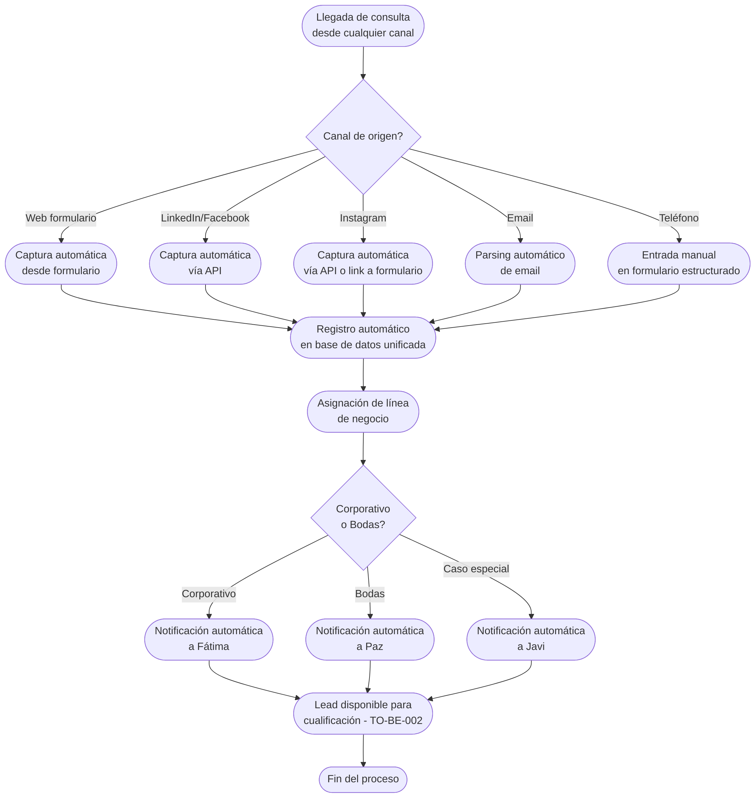

# Proceso TO-BE-001: Captación automática de leads desde múltiples canales

## 1. Objetivo y alcance (del proceso)

**Actor principal**: Sistema centralizado (con supervisión de Fátima para Corporativo, Paz para Bodas)

**Evento disparador**: Llegada de consulta desde cualquier canal (web, LinkedIn, Facebook, Instagram, email, teléfono)

**Propósito**: Capturar automáticamente todas las consultas de clientes potenciales desde múltiples canales y centralizarlas en una base de datos unificada, eliminando la pérdida de información por procesos manuales dispersos

**Scope funcional**: Desde la recepción de la consulta en cualquier canal hasta su registro completo en el sistema centralizado con notificación inmediata al equipo responsable

**Criterios de éxito**: 
- 100% de leads capturados automáticamente (sin post-its ni capturas de pantalla)
- Tiempo de captura < 1 minuto desde recepción hasta registro
- Notificación al equipo < 5 minutos desde captura
- 0% de pérdida de información por canales manuales

**Frecuencia**: Continua (cada vez que llega una consulta)

**Duración objetivo**: < 1 minuto (captura automática) + < 5 minutos (notificación)

**Supuestos/restricciones**: 
- Integración técnica con canales externos (LinkedIn, Facebook, Instagram API)
- Canales telefónicos requieren entrada manual pero con formulario estructurado
- Mantener flexibilidad para canales personales (teléfono Javi para amigos/familiares)

## 2. Contexto y actores

**Participantes:**
- **Sistema centralizado**: Captura automática desde canales digitales, registro en base de datos
- **Fátima**: Supervisión y gestión de leads Corporativo
- **Paz**: Supervisión y gestión de leads Bodas
- **Javi (CEO)**: Contacto directo para casos especiales (amigos/familiares)
- **Canales de captación**: Web (Squarespace), LinkedIn, Facebook, Instagram, Email corporativo, Teléfono

**Stakeholders clave:** 
- Clientes potenciales (inician el proceso)
- Equipo comercial (reciben notificaciones)
- Administración (necesita visibilidad de leads para planificación)

**Dependencias:** 
- Integración con formulario web (Squarespace o nuevo)
- APIs de redes sociales (LinkedIn, Facebook, Instagram)
- Sistema de notificaciones (email, push, dashboard)
- Base de datos unificada (CRM)

**Gobernanza:** 
- Fátima gestiona leads Corporativo
- Paz gestiona leads Bodas
- Javi puede intervenir en casos especiales

### 2.1 Dependencias entre procesos TO-BE

**Procesos prerequisito:** Ninguno (es el proceso inicial del flujo comercial)

**Procesos dependientes:** 
- TO-BE-002: Registro y cualificación de leads (requiere lead capturado)
- TO-BE-003: Respuesta automática inicial (requiere lead capturado)

**Orden de implementación sugerido:** Primero (proceso base del flujo comercial)

## 3. Transformación AS-IS → TO-BE (trazabilidad)

### 3.1 Procesos AS-IS relacionados

**Procesos AS-IS de referencia:** AS-IS-001: Captación unificada de leads (Corporativo y Bodas)

**Tipo de transformación:** Reimaginación con automatización completa

### 3.2 Análisis del estado actual (procesos AS-IS relacionados)

El proceso AS-IS actual es completamente manual y disperso. Para Corporativo, los leads entran por web, LinkedIn, Facebook o contacto directo al móvil de Javi, y Fátima o Javi reciben la consulta de forma manual. Para Bodas, los leads entran por 5 vías diferentes: Instagram (Javi dedica 30 min diarios, hace capturas de pantalla), página web (formulario Squarespace), correo electrónico, teléfono de Javi (anota en post-it) y teléfono de ONGAKU. La información queda registrada de forma manual/dispersa en múltiples lugares: post-its, capturas de pantalla, emails, Google Sheets. No hay base de datos unificada, lo que genera alto riesgo de pérdida de información y olvidos frecuentes de respuesta.

### 3.3 Problemas y oportunidades identificadas

**Dolores principales:**
1. Proceso completamente manual y disperso - información en múltiples lugares (post-its, capturas de pantalla, emails, Google Sheets) _(Fuente: AS-IS-001 P1)_
2. Falta de centralización - no hay base de datos unificada para buscar y seguir leads eficientemente _(Fuente: AS-IS-001 P2)_
3. Alto riesgo de pérdida de información - post-its que se pierden, capturas de pantalla que se olvidan _(Fuente: AS-IS-001 P3)_
4. Olvidos frecuentes de respuesta - muchas veces son los propios clientes quienes recuerdan que no han recibido respuesta _(Fuente: AS-IS-001 P4)_
5. Proceso lento y propenso a errores - en periodos de mucho trabajo o vacaciones se acumula y se traspapele información _(Fuente: AS-IS-001 P5)_
6. Dependencia de memoria del equipo - proceso muy dependiente de que el equipo se acuerde de seguirlo _(Fuente: AS-IS-001 P7)_

**Causas raíz:** 
- Falta de automatización en la captura de leads desde canales digitales
- Ausencia de sistema centralizado que unifique todos los canales
- Dependencia de procesos manuales (post-its, capturas) que requieren intervención humana
- No hay integración entre canales y sistema de gestión

**Oportunidades no explotadas:** 
- Automatización completa de captura desde APIs de redes sociales
- Formulario web mejorado que capture todos los datos relevantes desde el inicio
- Integración de todos los canales en un único punto de entrada
- Notificaciones automáticas inmediatas al equipo

**Riesgo de mantener AS-IS:** 
- Pérdida estimada del 15-20% de leads por olvidos y falta de seguimiento
- Imposibilidad de escalar sin aumentar proporcionalmente el equipo
- Riesgo reputacional por no responder a consultas
- Dificultad para analizar efectividad de canales de captación

### 3.4 Estrategia de transformación

**Principios de rediseño aplicados:**
- Automatización completa de captura desde canales digitales
- Centralización de toda la información en base de datos unificada
- Eliminación de procesos manuales (post-its, capturas de pantalla)
- Notificaciones automáticas inmediatas al equipo responsable
- Integración con APIs de redes sociales para captura automática

**Justificación del nuevo diseño:** 
Este proceso TO-BE elimina completamente la dependencia de procesos manuales dispersos, capturando automáticamente todas las consultas desde cualquier canal y centralizándolas inmediatamente en una base de datos unificada. Esto garantiza que ningún lead se pierda, permite análisis de efectividad de canales, y libera al equipo de tareas manuales repetitivas para enfocarse en la cualificación y seguimiento comercial.

**Fuentes:** 
- `02-discovery/0201-interviews/020101-interview-01/minute-01.md` (Sección 5)
- `02-discovery/0202-prd/020201-context/company-info.md` (Canales de Venta, Canales de Captación)
- `02-discovery/0202-prd/020202-as-is/processes/AS-IS-001-captacion-leads-unificada/AS-IS-001-captacion-leads-unificada.md`

## 4. Proceso TO-BE

### **4.1 Descripción detallada**

El proceso inicia cuando llega una consulta desde cualquier canal (web, LinkedIn, Facebook, Instagram, email, teléfono). El sistema captura automáticamente la información disponible según el canal:

- **Web (formulario)**: Captura automática de todos los campos del formulario
- **LinkedIn/Facebook**: Integración con API para capturar mensajes directos y contactos
- **Instagram**: Integración con API o redirección a formulario unificado mediante link en bio
- **Email**: Parsing automático de emails entrantes para extraer información estructurada
- **Teléfono**: Formulario estructurado para entrada manual (manteniendo flexibilidad para casos especiales)

Una vez capturada la información, el sistema la registra automáticamente en la base de datos unificada con:
- Datos del lead (nombre, teléfono, email, fecha consulta)
- Canal de origen
- Línea de negocio detectada (Corporativo/Bodas) según palabras clave o formulario
- Estado inicial: "Nuevo"
- Timestamp de captura

Inmediatamente después del registro, el sistema envía notificación automática al responsable correspondiente:
- Leads Corporativo → Notificación a Fátima
- Leads Bodas → Notificación a Paz
- Casos especiales → Notificación a Javi

La notificación incluye todos los datos capturados y un enlace directo al lead en el sistema para su gestión inmediata.

### **4.2 Diagrama de flujo**

### **4.3 Flujo principal (happy path)**

| # | Actor | Actividad | Sistema/Herramienta | Reglas de Negocio | Tiempo |
|---|-------|-----------|-------------------|-------------------|--------|
| 1 | Cliente potencial | Envía consulta desde canal (web, LinkedIn, Facebook, Instagram, email, teléfono) | Canal externo (formulario web, API redes sociales, email, teléfono) | Consulta debe contener al menos: nombre o email | < 1 min |
| 2 | Sistema | Captura automáticamente información disponible según canal | Sistema centralizado con integraciones | Web: todos los campos del formulario LinkedIn/Facebook: mensaje y datos de contacto Instagram: mensaje o redirección a formulario Email: parsing de campos estructurados Teléfono: formulario manual estructurado | < 30 seg |
| 3 | Sistema | Registra lead en base de datos unificada con datos capturados, canal origen, timestamp, estado "Nuevo" | Base de datos CRM | Todos los campos disponibles se registran Canal de origen es obligatorio Timestamp automático | < 10 seg |
| 4 | Sistema | Detecta línea de negocio (Corporativo/Bodas) según palabras clave, formulario o canal | Sistema centralizado | Detección automática con posibilidad de corrección manual Si no se detecta, queda pendiente de asignación | < 5 seg |
| 5 | Sistema | Envía notificación automática al responsable correspondiente (Fátima/Paz/Javi) | Sistema de notificaciones (email, push, dashboard) | Notificación incluye todos los datos capturados y enlace directo al lead Notificación < 5 minutos desde captura | < 1 min |
| 6 | Responsable (Fátima/Paz/Javi) | Recibe notificación y accede al lead en el sistema | Dashboard del sistema | Lead disponible para cualificación inmediata | - |

### **4.5 Puntos de decisión y variantes**

- **Canal de origen**: Diferentes canales requieren diferentes métodos de captura (automática vía API vs manual estructurado)
- **Detección de línea de negocio**: Si no se detecta automáticamente, el lead queda pendiente de asignación manual
- **Casos especiales (teléfono Javi)**: Para amigos/familiares, Javi puede registrar manualmente pero con formulario estructurado que garantiza captura completa

### **4.6 Excepciones y manejo de errores**

- **Error en integración API**: Si falla la captura automática desde API, se registra como "captura manual pendiente" y se notifica al equipo para entrada manual
- **Información incompleta**: Si faltan datos críticos (email, teléfono), el sistema marca el lead como "información incompleta" y notifica al equipo para completar
- **Detección incorrecta de línea de negocio**: El responsable puede corregir manualmente la asignación
- **Canal no integrado**: Nuevos canales se pueden añadir mediante configuración, pero requieren desarrollo de integración

### **4.7 Riesgos del proceso y mitigaciones**

| Riesgo | Probabilidad | Impacto | Mitigación |
|--------|--------------|---------|------------|
| Fallo en integración con APIs de redes sociales | Media | Alto | Implementar captura manual estructurada como respaldo, notificar al equipo para entrada manual |
| Información capturada incompleta o incorrecta | Media | Medio | Validación de campos críticos, marcado de leads incompletos, notificación al equipo para completar |
| Sobrecarga de notificaciones si hay muchos leads | Baja | Medio | Agregación de notificaciones, resumen diario, configuración de frecuencia de notificaciones |
| Pérdida de leads por fallo del sistema | Baja | Alto | Logs de todas las capturas, monitoreo continuo, alertas automáticas de fallos |

### **4.8 Preguntas abiertas**

- ¿Qué nivel de detalle se requiere en el parsing automático de emails? ¿Se puede estandarizar el formato de consultas por email?
- ¿Cómo manejar consultas en múltiples idiomas? ¿Se requiere traducción automática?
- ¿Qué hacer con leads duplicados (misma persona desde múltiples canales)?
- ¿Se requiere límite de tiempo para respuesta inicial? ¿Cuál sería el SLA objetivo?

### **4.9 Ideas adicionales**

- Implementar chatbot o agente virtual para segmentación automática de leads corporativos
- Análisis de sentimiento en consultas para priorización automática
- Detección automática de leads de calidad (palabras clave, presupuesto mencionado)
- Integración con herramientas de análisis de mercado para enriquecer datos del lead

---

*GEN-BY:PROMPT-to-be · hash:tobe001_captacion_automatica_20260120 · 2026-01-20T00:00:00Z*
