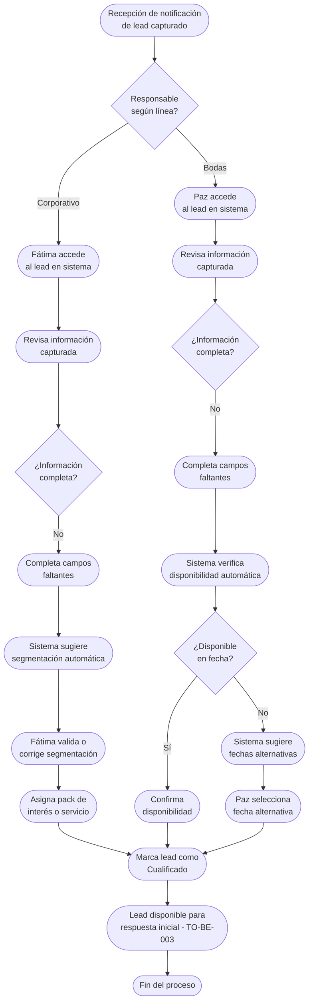

# Proceso TO-BE-002: Registro y cualificación de leads

## 1. Objetivo y alcance (del proceso)

**Actor principal**: Fátima (Corporativo) / Paz (Bodas)

**Evento disparador**: Recepción de notificación de nuevo lead capturado (TO-BE-001)

**Propósito**: Registrar de forma estructurada toda la información del lead, verificar disponibilidad (bodas), segmentar automáticamente (corporativo), y asignar responsable según línea de negocio, garantizando que ningún lead quede sin cualificar

**Scope funcional**: Desde la recepción de notificación de lead capturado hasta su cualificación completa con toda la información estructurada y asignación de responsable

**Criterios de éxito**: 
- 100% de leads cualificados en < 4 horas desde captura
- Información completa registrada (sin campos críticos faltantes)
- Verificación de disponibilidad automática para bodas
- Segmentación correcta para corporativo
- Asignación de responsable automática según línea de negocio

**Frecuencia**: Por cada lead capturado (variable según volumen)

**Duración objetivo**: < 15 minutos por lead (tiempo de cualificación manual)

**Supuestos/restricciones**: 
- Lead ya capturado en sistema (TO-BE-001)
- Disponibilidad de bodas requiere consulta a calendario/fechas reservadas
- Segmentación corporativo requiere información del lead o interacción

## 2. Contexto y actores

**Participantes:**
- **Fátima**: Responsable de cualificación de leads Corporativo
- **Paz**: Responsable de cualificación de leads Bodas
- **Javi (CEO)**: Puede intervenir en casos especiales o leads de alta prioridad
- **Sistema centralizado**: Proporciona información del lead, verifica disponibilidad, sugiere segmentación

**Stakeholders clave:** 
- Equipo comercial (necesita leads cualificados para seguimiento)
- Clientes potenciales (esperan respuesta rápida)

**Dependencias:** 
- TO-BE-001: Lead debe estar capturado previamente
- Sistema de calendario/fechas reservadas (para verificación disponibilidad bodas)
- Base de datos de packs/servicios (para segmentación corporativo)

**Gobernanza:** 
- Fátima gestiona cualificación de leads Corporativo
- Paz gestiona cualificación de leads Bodas
- Javi puede intervenir en casos especiales

### 2.1 Dependencias entre procesos TO-BE

**Procesos prerequisito:** 
- TO-BE-001: Captación automática de leads (debe existir lead capturado)

**Procesos dependientes:** 
- TO-BE-003: Respuesta automática inicial (requiere lead cualificado)
- TO-BE-004: Agendamiento de reuniones (requiere lead cualificado)

**Orden de implementación sugerido:** Segundo (después de captación automática)

## 3. Transformación AS-IS → TO-BE (trazabilidad)

### 3.1 Procesos AS-IS relacionados

**Procesos AS-IS de referencia:** AS-IS-001: Captación unificada de leads (Corporativo y Bodas)

**Tipo de transformación:** Reimaginación con estructuración y automatización

### 3.2 Análisis del estado actual (procesos AS-IS relacionados)

En el proceso AS-IS, después de captar el lead, se evalúa y segmenta de forma manual. Para Corporativo, se segmenta según packs por sectores (3 packs para colegios, 4 packs para empresas) o presupuesto del cliente. Para Bodas, Paz comprueba disponibilidad en Google Sheets "Bodas actualizadas" de forma manual. El lead queda registrado de forma manual/dispersa, sin estructura clara ni verificación sistemática de información completa. No hay proceso estructurado de cualificación que garantice que todos los datos necesarios estén registrados.

### 3.3 Problemas y oportunidades identificadas

**Dolores principales:**
1. Falta de centralización - no hay base de datos unificada para buscar y seguir leads eficientemente _(Fuente: AS-IS-001 P2)_
2. Proceso lento y propenso a errores - en periodos de mucho trabajo o vacaciones se acumula y se traspapele información _(Fuente: AS-IS-001 P5)_
3. Formulario web incompleto - no especifica que novios deben indicar ciudad o día de boda, resultando en consultas genéricas "precio???" que alargan el proceso una semana _(Fuente: AS-IS-001 P6)_
4. Verificación de disponibilidad manual - Paz debe consultar Google Sheets manualmente para bodas _(Fuente: AS-IS-001 flujo actual)_

**Causas raíz:** 
- Falta de estructura en el registro de información del lead
- Verificación de disponibilidad no automatizada
- No hay validación de información completa
- Segmentación requiere intervención manual sin guía del sistema

**Oportunidades no explotadas:** 
- Verificación automática de disponibilidad desde calendario integrado
- Segmentación automática sugerida por el sistema según datos del lead
- Validación de campos críticos antes de pasar a siguiente etapa
- Búsqueda avanzada por múltiples criterios una vez cualificado

**Riesgo de mantener AS-IS:** 
- Leads con información incompleta que requieren múltiples interacciones
- Errores en verificación de disponibilidad
- Segmentación incorrecta que afecta propuesta comercial
- Dificultad para buscar y gestionar leads cualificados

### 3.4 Estrategia de transformación

**Principios de rediseño aplicados:**
- Estructuración completa de información del lead con validación de campos críticos
- Automatización de verificación de disponibilidad desde calendario integrado
- Segmentación automática sugerida por el sistema con posibilidad de corrección manual
- Asignación automática de responsable según línea de negocio
- Búsqueda avanzada una vez cualificado

**Justificación del nuevo diseño:** 
Este proceso TO-BE estructura completamente la información del lead, automatiza la verificación de disponibilidad y sugiere segmentación, garantizando que todos los datos necesarios estén registrados antes de pasar a la siguiente etapa. Esto acelera el proceso comercial y reduce errores.

**Fuentes:** 
- `02-discovery/0201-interviews/020101-interview-01/minute-01.md` (Sección 5)
- `02-discovery/0202-prd/020201-context/company-info.md` (Canales de Venta, Segmentación)
- `02-discovery/0202-prd/020202-as-is/processes/AS-IS-001-captacion-leads-unificada/AS-IS-001-captacion-leads-unificada.md`

## 4. Proceso TO-BE

### **4.1 Descripción detallada**

El proceso inicia cuando el responsable (Fátima para Corporativo, Paz para Bodas) recibe la notificación de nuevo lead capturado. Accede al lead en el sistema y completa la cualificación:

**Para Corporativo (Fátima):**
1. Revisa información capturada automáticamente
2. Completa campos faltantes si es necesario (empresa, sector, presupuesto estimado)
3. El sistema sugiere segmentación automática según:
   - Sector (colegio → 3 packs posibles, empresa → 4 packs posibles)
   - Presupuesto mencionado
   - Palabras clave en la consulta
4. Fátima valida o corrige la segmentación sugerida
5. Asigna pack de interés o servicio específico
6. Marca lead como "Cualificado" y listo para respuesta inicial

**Para Bodas (Paz):**
1. Revisa información capturada automáticamente
2. Completa campos faltantes si es necesario (nombre novios, fecha boda, ubicación)
3. El sistema verifica automáticamente disponibilidad en la fecha solicitada consultando:
   - Calendario de fechas reservadas
   - Fechas bloqueadas
4. Paz confirma disponibilidad o indica conflicto
5. Si hay conflicto, el sistema sugiere fechas alternativas disponibles
6. Marca lead como "Cualificado" y listo para respuesta inicial

Una vez cualificado, el lead queda disponible para:
- Respuesta automática inicial (TO-BE-003)
- Agendamiento de reunión (TO-BE-004)
- Búsqueda avanzada por múltiples criterios

### **4.2 Diagrama de flujo**

### **4.3 Flujo principal (happy path)**

| # | Actor | Actividad | Sistema/Herramienta | Reglas de Negocio | Tiempo |
|---|-------|-----------|-------------------|-------------------|--------|
| 1 | Sistema | Notifica a responsable (Fátima/Paz) de nuevo lead capturado | Sistema de notificaciones | Notificación incluye enlace directo al lead | < 1 min |
| 2 | Fátima/Paz | Accede al lead en el sistema desde notificación | Dashboard del sistema | Lead visible con toda la información capturada | < 1 min |
| 3 | Fátima/Paz | Revisa información capturada automáticamente | Sistema centralizado | Información organizada por secciones (datos contacto, consulta, canal origen) | < 2 min |
| 4 | Fátima/Paz | Completa campos faltantes si es necesario | Formulario de cualificación | Campos críticos marcados como obligatorios Validación en tiempo real | < 5 min |
| 5 | Sistema | Para Corporativo: sugiere segmentación automática según sector, presupuesto, palabras clave | Motor de segmentación | Sugerencia basada en reglas configuradas Fátima puede corregir | < 1 min |
| 5b | Sistema | Para Bodas: verifica disponibilidad automática en fecha solicitada | Calendario integrado / Fechas reservadas | Consulta automática a calendario Muestra disponibilidad o conflictos | < 30 seg |
| 6 | Fátima | Valida o corrige segmentación sugerida, asigna pack de interés | Sistema centralizado | Puede seleccionar de lista de packs/servicios Puede añadir notas | < 3 min |
| 6b | Paz | Confirma disponibilidad o selecciona fecha alternativa si hay conflicto | Sistema centralizado | Si hay conflicto, sistema muestra fechas alternativas disponibles Paz selecciona o indica no disponible | < 2 min |
| 7 | Fátima/Paz | Marca lead como "Cualificado" | Sistema centralizado | Cambio de estado automático Lead disponible para siguiente etapa | < 1 min |

### **4.5 Puntos de decisión y variantes**

- **Información completa vs incompleta**: Si faltan campos críticos, el responsable debe completarlos antes de cualificar
- **Segmentación automática vs manual**: El sistema sugiere pero el responsable puede corregir
- **Disponibilidad en fecha solicitada**: Si no disponible, sistema sugiere alternativas o se marca como no disponible
- **Línea de negocio no detectada**: Si no se detectó automáticamente, el responsable asigna manualmente

### **4.6 Excepciones y manejo de errores**

- **Información crítica faltante**: Sistema no permite marcar como cualificado hasta completar campos obligatorios
- **Fecha de boda no especificada**: Para bodas, si no hay fecha, se marca como "pendiente fecha" y se notifica al cliente
- **Segmentación no clara**: Si el sistema no puede sugerir segmentación, Fátima debe asignar manualmente
- **Conflicto de disponibilidad no resuelto**: Si no hay fechas alternativas y no disponible, se marca como "no disponible" y se notifica al cliente

### **4.7 Riesgos del proceso y mitigaciones**

| Riesgo | Probabilidad | Impacto | Mitigación |
|--------|--------------|---------|------------|
| Información incompleta que pasa a siguiente etapa | Media | Alto | Validación obligatoria de campos críticos antes de cualificar |
| Segmentación incorrecta que afecta propuesta | Media | Medio | Sugerencia automática con posibilidad de corrección manual, revisión por responsable |
| Error en verificación de disponibilidad | Baja | Alto | Doble verificación manual por Paz, integración correcta con calendario |
| Lead cualificado pero no procesado en tiempo | Media | Medio | Recordatorios automáticos si lead no cualificado en < 4 horas |

### **4.8 Preguntas abiertas**

- ¿Cuáles son los campos críticos obligatorios para cada línea de negocio?
- ¿Qué nivel de automatización se requiere en la segmentación? ¿Solo sugerencia o asignación automática?
- ¿Cómo manejar leads con información muy incompleta? ¿Se contacta al cliente para completar?
- ¿Se requiere límite de tiempo para cualificación? ¿Cuál sería el SLA objetivo?

### **4.9 Ideas adicionales**

- Chatbot o agente virtual para completar información faltante directamente con el cliente
- Análisis de calidad del lead (scoring) basado en información disponible
- Integración con bases de datos externas para enriquecer información del lead (empresas, sectores)
- Predicción automática de probabilidad de conversión según datos del lead

---

*GEN-BY:PROMPT-to-be · hash:tobe002_registro_cualificacion_20260120 · 2026-01-20T00:00:00Z*
