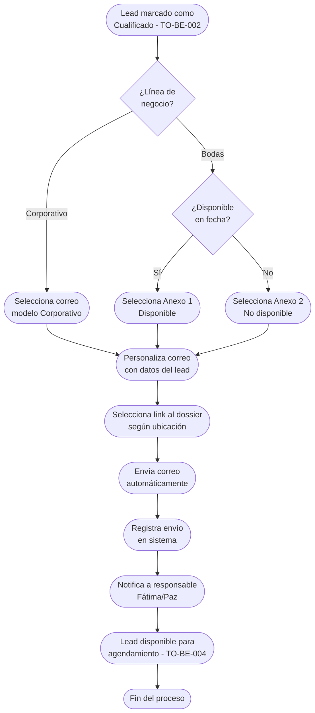

# Proceso TO-BE-003: Respuesta automática inicial a leads

## 1. Objetivo y alcance (del proceso)

**Actor principal**: Sistema centralizado (con supervisión de Fátima/Paz)

**Evento disparador**: Lead cualificado (TO-BE-002) listo para respuesta inicial

**Propósito**: Enviar automáticamente correo modelo personalizado (Anexo 1, 2 o 3 según disponibilidad) con información relevante y link al dossier según ubicación, garantizando respuesta inmediata a todos los leads cualificados

**Scope funcional**: Desde lead cualificado hasta envío automático de correo modelo personalizado con información relevante

**Criterios de éxito**: 
- 100% de leads cualificados reciben respuesta automática en < 5 minutos
- Correo modelo correcto según disponibilidad (Anexo 1 disponible, Anexo 2 no disponible, Anexo 3 recordatorio)
- Personalización correcta con datos del lead (nombre, fecha boda, ubicación)
- Link al dossier correcto según ubicación

**Frecuencia**: Por cada lead cualificado

**Duración objetivo**: < 5 minutos desde cualificación hasta envío

**Supuestos/restricciones**: 
- Lead ya cualificado (TO-BE-002)
- Disponibilidad verificada para bodas
- Plantillas de correo modelo (Anexo 1, 2, 3) configuradas en sistema
- Dossiers por ubicación disponibles

## 2. Contexto y actores

**Participantes:**
- **Sistema centralizado**: Genera y envía correo automático personalizado
- **Fátima/Paz**: Supervisión, pueden desactivar envío automático si es necesario
- **Cliente potencial**: Recibe correo modelo personalizado

**Stakeholders clave:** 
- Clientes potenciales (esperan respuesta rápida)
- Equipo comercial (necesita que todos los leads reciban respuesta)

**Dependencias:** 
- TO-BE-002: Lead debe estar cualificado
- Plantillas de correo modelo (Anexo 1, 2, 3)
- Base de datos de dossiers por ubicación
- Sistema de envío de emails

**Gobernanza:** 
- Sistema envía automáticamente tras cualificación
- Fátima/Paz pueden desactivar envío automático para casos especiales

### 2.1 Dependencias entre procesos TO-BE

**Procesos prerequisito:** 
- TO-BE-002: Registro y cualificación de leads (lead debe estar cualificado)

**Procesos dependientes:** 
- TO-BE-004: Agendamiento de reuniones (puede iniciarse después de respuesta inicial)

**Orden de implementación sugerido:** Tercero (después de cualificación)

## 3. Transformación AS-IS → TO-BE (trazabilidad)

### 3.1 Procesos AS-IS relacionados

**Procesos AS-IS de referencia:** AS-IS-001: Captación unificada de leads (Corporativo y Bodas)

**Tipo de transformación:** Reimaginación con automatización completa

### 3.2 Análisis del estado actual (procesos AS-IS relacionados)

En el proceso AS-IS, después de verificar disponibilidad, Paz rellena manualmente correo modelo (Anexo 1) con nombre novios, fecha boda, disponibilidad y link del dossier según ubicación, y lo envía manualmente. Este proceso es lento, propenso a olvidos, y muchas veces son los propios clientes quienes recuerdan que no han recibido respuesta. No hay automatización ni garantía de que todos los leads reciban respuesta.

### 3.3 Problemas y oportunidades identificadas

**Dolores principales:**
1. Olvidos frecuentes de respuesta - muchas veces son los propios clientes quienes recuerdan que no han recibido respuesta _(Fuente: AS-IS-001 P4)_
2. Proceso lento y propenso a errores - en periodos de mucho trabajo o vacaciones se acumula y se traspapele información _(Fuente: AS-IS-001 P5)_
3. Dependencia de memoria del equipo - proceso muy dependiente de que el equipo se acuerde de seguirlo _(Fuente: AS-IS-001 P7)_

**Causas raíz:** 
- Proceso manual de rellenado y envío de correos modelo
- No hay automatización que garantice respuesta a todos los leads
- Dependencia de memoria humana para recordar enviar correos

**Oportunidades no explotadas:** 
- Automatización completa del envío de correos modelo
- Personalización automática con datos del lead
- Selección automática del correo modelo correcto según disponibilidad
- Selección automática del link al dossier según ubicación

**Riesgo de mantener AS-IS:** 
- Pérdida de leads por falta de respuesta
- Mala experiencia del cliente (esperan respuesta rápida)
- Riesgo reputacional

### 3.4 Estrategia de transformación

**Principios de rediseño aplicados:**
- Automatización completa del envío de correos modelo
- Personalización automática con datos del lead cualificado
- Selección automática del correo modelo correcto según disponibilidad
- Selección automática del link al dossier según ubicación

**Justificación del nuevo diseño:** 
Este proceso TO-BE automatiza completamente el envío de correos modelo, garantizando que todos los leads cualificados reciban respuesta inmediata (< 5 minutos) con información personalizada y relevante. Esto elimina olvidos y mejora significativamente la experiencia del cliente.

**Fuentes:** 
- `02-discovery/0201-interviews/020101-interview-01/minute-01.md` (Sección 5)
- `02-discovery/0202-prd/020201-context/company-info.md` (Canales de Captación)
- `02-discovery/0202-prd/020202-as-is/processes/AS-IS-001-captacion-leads-unificada/AS-IS-001-captacion-leads-unificada.md`

## 4. Proceso TO-BE

### **4.1 Descripción detallada**

El proceso inicia automáticamente cuando un lead es marcado como "Cualificado" (TO-BE-002). El sistema:

1. **Selecciona el correo modelo correcto** según disponibilidad:
   - **Anexo 1**: Disponible (para bodas con fecha disponible)
   - **Anexo 2**: No disponible (para bodas con fecha no disponible)
   - **Anexo 3**: Recordatorio (para leads que no han respondido)

2. **Personaliza el correo** con datos del lead:
   - Nombre del cliente/novios
   - Fecha de boda (si aplica)
   - Ubicación
   - Información específica según línea de negocio

3. **Selecciona el link al dossier** correcto según ubicación del cliente

4. **Envía el correo automáticamente** al email del lead

5. **Registra el envío** en el sistema con timestamp y tipo de correo enviado

6. **Notifica al responsable** (Fátima/Paz) que se ha enviado respuesta automática

El proceso es completamente automático, pero Fátima/Paz pueden desactivar el envío automático para casos especiales si es necesario.

### **4.2 Diagrama de flujo**

### **4.3 Flujo principal (happy path)**

| # | Actor | Actividad | Sistema/Herramienta | Reglas de Negocio | Tiempo |
|---|-------|-----------|-------------------|-------------------|--------|
| 1 | Sistema | Detecta lead marcado como "Cualificado" | Sistema centralizado | Trigger automático al cambiar estado a "Cualificado" | < 1 min |
| 2 | Sistema | Selecciona correo modelo correcto según disponibilidad y línea de negocio | Motor de selección de plantillas | Bodas: Anexo 1 (disponible) o Anexo 2 (no disponible) Corporativo: Correo modelo específico | < 30 seg |
| 3 | Sistema | Personaliza correo con datos del lead (nombre, fecha, ubicación, etc.) | Motor de personalización | Reemplaza variables en plantilla con datos del lead Validación de datos antes de personalizar | < 30 seg |
| 4 | Sistema | Selecciona link al dossier correcto según ubicación del cliente | Base de datos de dossiers | Mapeo ubicación → link al dossier Si no hay dossier para ubicación, usa genérico | < 30 seg |
| 5 | Sistema | Envía correo automáticamente al email del lead | Sistema de envío de emails | Envío inmediato tras personalización Validación de email antes de enviar | < 1 min |
| 6 | Sistema | Registra envío en sistema con timestamp, tipo de correo, destinatario | Base de datos | Registro para trazabilidad y análisis Historial de comunicaciones con lead | < 10 seg |
| 7 | Sistema | Notifica a responsable (Fátima/Paz) que se ha enviado respuesta automática | Sistema de notificaciones | Notificación incluye resumen del correo enviado Enlace al lead para seguimiento | < 1 min |

### **4.5 Puntos de decisión y variantes**

- **Disponibilidad en fecha (bodas)**: Determina si se envía Anexo 1 (disponible) o Anexo 2 (no disponible)
- **Línea de negocio**: Diferentes plantillas y contenido para Corporativo vs Bodas
- **Ubicación sin dossier**: Si no hay dossier específico para la ubicación, se usa dossier genérico
- **Desactivación manual**: Fátima/Paz pueden desactivar envío automático para casos especiales

### **4.6 Excepciones y manejo de errores**

- **Email inválido o faltante**: Si el email no es válido o falta, se marca lead como "email inválido" y se notifica al responsable para corrección
- **Error en envío de correo**: Si falla el envío, se reintenta automáticamente 3 veces, si sigue fallando se notifica al responsable
- **Datos faltantes para personalización**: Si faltan datos críticos para personalizar, se usa plantilla genérica y se notifica al responsable
- **Dossier no disponible para ubicación**: Se usa dossier genérico y se notifica al responsable

### **4.7 Riesgos del proceso y mitigaciones**

| Riesgo | Probabilidad | Impacto | Mitigación |
|--------|--------------|---------|------------|
| Correo enviado con información incorrecta | Baja | Alto | Validación de datos antes de personalizar, revisión de plantillas, posibilidad de desactivar envío automático |
| Correo no llega al cliente (spam) | Media | Medio | Configuración correcta de SPF/DKIM, monitoreo de tasa de entrega, notificación si no se entrega |
| Selección incorrecta de correo modelo | Baja | Medio | Validación de disponibilidad antes de seleccionar, posibilidad de corrección manual |
| Envío duplicado | Baja | Bajo | Control de envíos previos, no reenvía si ya se envió respuesta recientemente |

### **4.8 Preguntas abiertas**

- ¿Se requiere límite de tiempo entre envíos? ¿Cuánto tiempo debe pasar antes de reenviar Anexo 3 (recordatorio)?
- ¿Qué hacer si el cliente responde antes de que se envíe el correo automático?
- ¿Se requiere personalización adicional según tipo de cliente o sector (corporativo)?
- ¿Qué hacer con leads que no tienen email válido?

### **4.9 Ideas adicionales**

- Seguimiento de apertura de correos (tracking de emails abiertos)
- A/B testing de diferentes versiones de correos modelo para optimizar conversión
- Personalización avanzada con IA según perfil del cliente
- Integración con CRM para seguimiento de respuestas del cliente

---

*GEN-BY:PROMPT-to-be · hash:tobe003_respuesta_automatica_20260120 · 2026-01-20T00:00:00Z*
