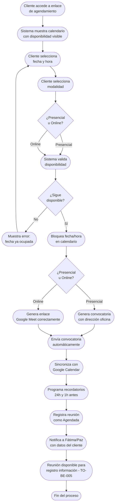

# Proceso TO-BE-004: Agendamiento de reuniones con clientes

## 1. Objetivo y alcance (del proceso)

**Actor principal**: Cliente potencial (con supervisión de Fátima/Paz)

**Evento disparador**: Cliente accede al enlace de agendamiento desde correo inicial o portal

**Propósito**: Permitir al cliente elegir fecha/hora disponible para reunión, modalidad (presencial/online), con generación automática de convocatoria y recordatorios, eliminando olvidos de convocatorias y solapamientos

**Scope funcional**: Desde acceso del cliente al sistema de agendamiento hasta confirmación de reunión agendada con convocatoria generada

**Criterios de éxito**: 
- 100% de reuniones agendadas tienen convocatoria generada automáticamente
- 0% de olvidos de convocatorias
- 0% de solapamientos de reuniones
- Recordatorios automáticos enviados 24h y 1h antes de la reunión
- Tiempo de agendamiento < 2 minutos para el cliente

**Frecuencia**: Por cada lead que solicita reunión

**Duración objetivo**: < 2 minutos (tiempo del cliente para agendar)

**Supuestos/restricciones**: 
- Lead cualificado (TO-BE-002)
- Calendario de disponibilidad configurado (horarios laborales, días disponibles)
- Integración con Google Calendar para sincronización correcta
- Opción de reunión presencial u online disponible

## 2. Contexto y actores

**Participantes:**
- **Cliente potencial**: Accede al sistema de agendamiento y selecciona fecha/hora
- **Fátima/Paz**: Supervisión, pueden ajustar disponibilidad si es necesario
- **Sistema centralizado**: Muestra disponibilidad, genera convocatoria, envía recordatorios
- **Google Calendar**: Sincronización de fechas y generación de enlaces Meet (si online)

**Stakeholders clave:** 
- Clientes potenciales (necesitan agendar reunión fácilmente)
- Equipo comercial (necesita reuniones agendadas sin olvidos)

**Dependencias:** 
- TO-BE-002: Lead debe estar cualificado
- Calendario de disponibilidad configurado
- Integración con Google Calendar
- Sistema de notificaciones

**Gobernanza:** 
- Cliente puede agendar autónomamente
- Fátima/Paz pueden ajustar disponibilidad o cancelar reuniones

### 2.1 Dependencias entre procesos TO-BE

**Procesos prerequisito:** 
- TO-BE-002: Registro y cualificación de leads
- TO-BE-003: Respuesta automática inicial (puede incluir link de agendamiento)

**Procesos dependientes:** 
- TO-BE-005: Registro de información durante reunión (requiere reunión agendada)

**Orden de implementación sugerido:** Cuarto (después de respuesta inicial)

## 3. Transformación AS-IS → TO-BE (trazabilidad)

### 3.1 Procesos AS-IS relacionados

**Procesos AS-IS de referencia:** AS-IS-002: Primera reunión y propuesta/presupuesto (Corporativo y Bodas)

**Tipo de transformación:** Reimaginación con automatización y autoservicio

### 3.2 Análisis del estado actual (procesos AS-IS relacionados)

En el proceso AS-IS, la coordinación de reunión se hace por email (lento, problemas de comunicación) o WhatsApp (rápido, se envía convocatoria Google Meet). Google Calendar es errático y pone automáticamente llamada Google Meet sin solicitud, generando confusión sobre si la reunión es presencial u online. Hay olvidos frecuentes de convocatorias, resultando en solapamiento de reuniones, olvidos de citas, o incluso dos parejas a la misma hora. No hay sistema de recordatorios automáticos.

### 3.3 Problemas y oportunidades identificadas

**Dolores principales:**
1. Google Calendar errático - pone automáticamente llamada Google Meet sin solicitud, genera confusión sobre si reunión es presencial u online _(Fuente: AS-IS-002 P1)_
2. Olvidos frecuentes de convocatorias - no se manda convocatoria Google Meet porque se olvida, resultando en solapamiento de reuniones, olvidos de citas, o incluso dos parejas a la misma hora _(Fuente: AS-IS-002 P2)_
3. Proceso de coordinación lento - por email es muy lento y con problemas de comunicación, especialmente cuando no se tiene acceso al teléfono _(Fuente: AS-IS-002 P4)_

**Causas raíz:** 
- Coordinación manual por email o WhatsApp
- Google Calendar con comportamientos erráticos
- Falta de sistema de recordatorios automáticos
- No hay visibilidad clara de disponibilidad para el cliente

**Oportunidades no explotadas:** 
- Agendamiento autónomo por parte del cliente
- Calendario integrado con disponibilidad visible
- Generación automática de convocatorias
- Recordatorios automáticos antes de la reunión
- Integración correcta con Google Calendar

**Riesgo de mantener AS-IS:** 
- Olvidos de reuniones que afectan experiencia del cliente
- Solapamientos que generan confusión
- Proceso lento que retrasa el ciclo comercial

### 3.4 Estrategia de transformación

**Principios de rediseño aplicados:**
- Agendamiento autónomo por parte del cliente (autoservicio)
- Calendario integrado con disponibilidad visible en tiempo real
- Generación automática de convocatorias según modalidad elegida
- Recordatorios automáticos para cliente y equipo
- Integración correcta con Google Calendar sin comportamientos erráticos

**Justificación del nuevo diseño:** 
Este proceso TO-BE permite al cliente agendar reunión autónomamente, eliminando la coordinación manual lenta y propensa a olvidos. El sistema muestra disponibilidad en tiempo real, genera automáticamente la convocatoria según modalidad elegida, y envía recordatorios, garantizando que no haya olvidos ni solapamientos.

**Fuentes:** 
- `02-discovery/0201-interviews/020101-interview-01/minute-01.md` (Sección 6)
- `02-discovery/0202-prd/020201-context/company-info.md` (Fase 2: Contacto y Propuesta)
- `02-discovery/0202-prd/020202-as-is/processes/AS-IS-002-primera-reunion-propuesta/AS-IS-002-primera-reunion-propuesta.md`

## 4. Proceso TO-BE

### **4.1 Descripción detallada**

El proceso inicia cuando el cliente accede al enlace de agendamiento (desde correo inicial o portal). El sistema muestra:

1. **Calendario con disponibilidad visible** en tiempo real:
   - Horarios disponibles según configuración (horarios laborales, días disponibles)
   - Fechas bloqueadas (reuniones ya agendadas, días no laborales)
   - Diferencia clara entre disponibilidad presencial y online

2. **Cliente selecciona**:
   - Fecha disponible
   - Hora disponible
   - Modalidad (presencial u online)

3. **Sistema valida** que la fecha/hora seleccionada sigue disponible (evita solapamientos)

4. **Sistema genera automáticamente**:
   - Convocatoria con detalles de la reunión
   - Si presencial: dirección de oficina, fecha, hora
   - Si online: enlace Google Meet generado correctamente (sin comportamientos erráticos)

5. **Sistema envía convocatoria** automáticamente:
   - Email al cliente con todos los detalles
   - Notificación a Fátima/Paz con datos del cliente y motivo de reunión
   - Sincronización con Google Calendar (sin comportamientos erráticos)

6. **Sistema programa recordatorios automáticos**:
   - 24 horas antes de la reunión
   - 1 hora antes de la reunión
   - Incluye datos de contacto del cliente y enlace a la reunión

7. **Sistema registra la reunión** en el sistema con estado "Agendada"

### **4.2 Diagrama de flujo**

### **4.3 Flujo principal (happy path)**

| # | Actor | Actividad | Sistema/Herramienta | Reglas de Negocio | Tiempo |
|---|-------|-----------|-------------------|-------------------|--------|
| 1 | Cliente | Accede al enlace de agendamiento desde correo o portal | Portal de cliente / Enlace de agendamiento | Enlace único por lead, válido por tiempo limitado | < 30 seg |
| 2 | Sistema | Muestra calendario con disponibilidad visible en tiempo real | Calendario integrado | Muestra solo horarios disponibles Fechas bloqueadas no seleccionables Diferencia clara presencial/online | < 5 seg |
| 3 | Cliente | Selecciona fecha, hora y modalidad (presencial/online) | Interfaz de calendario | Validación en tiempo real de disponibilidad Prevención de solapamientos | < 1 min |
| 4 | Sistema | Valida que fecha/hora seleccionada sigue disponible | Sistema de validación | Verificación inmediata antes de confirmar Si no disponible, muestra error y calendario actualizado | < 5 seg |
| 5 | Sistema | Bloquea fecha/hora en calendario para evitar solapamientos | Calendario integrado | Bloqueo inmediato tras validación Reserva temporal hasta confirmación | < 5 seg |
| 6 | Sistema | Genera convocatoria según modalidad elegida | Motor de generación de convocatorias | Presencial: dirección oficina, fecha, hora Online: enlace Google Meet generado correctamente | < 30 seg |
| 7 | Sistema | Envía convocatoria automáticamente al cliente y notifica a Fátima/Paz | Sistema de envío de emails / Notificaciones | Email al cliente con todos los detalles Notificación a responsable con datos del cliente | < 1 min |
| 8 | Sistema | Sincroniza con Google Calendar correctamente | Integración Google Calendar | Crea evento en Google Calendar Si online, añade enlace Meet correctamente Sin comportamientos erráticos | < 30 seg |
| 9 | Sistema | Programa recordatorios automáticos (24h y 1h antes) | Sistema de recordatorios | Recordatorios incluyen datos de contacto del cliente y enlace a reunión | < 10 seg |
| 10 | Sistema | Registra reunión en sistema con estado "Agendada" | Base de datos | Reunión vinculada al lead Estado visible para seguimiento | < 10 seg |

### **4.5 Puntos de decisión y variantes**

- **Modalidad presencial vs online**: Diferentes convocatorias (dirección vs enlace Meet)
- **Disponibilidad en tiempo real**: Si fecha/hora ya no está disponible, cliente debe seleccionar otra
- **Cancelación**: Cliente o Fátima/Paz pueden cancelar, liberando la fecha automáticamente
- **Reagendamiento**: Cliente puede reagendar antes de la reunión, liberando fecha anterior

### **4.6 Excepciones y manejo de errores**

- **Fecha/hora ya no disponible**: Sistema muestra error y calendario actualizado, cliente selecciona otra opción
- **Error en generación de enlace Meet**: Sistema notifica a Fátima/Paz para generación manual, pero mantiene reunión agendada
- **Error en sincronización Google Calendar**: Sistema reintenta automáticamente, si falla notifica a Fátima/Paz
- **Cliente no confirma**: Si cliente no confirma en tiempo límite, se libera la reserva temporal

### **4.7 Riesgos del proceso y mitigaciones**

| Riesgo | Probabilidad | Impacto | Mitigación |
|--------|--------------|---------|------------|
| Solapamiento de reuniones | Baja | Alto | Validación en tiempo real, bloqueo inmediato tras selección, calendario sincronizado |
| Olvido de convocatoria | Baja | Medio | Generación automática, recordatorios programados, notificación a responsable |
| Error en enlace Google Meet | Baja | Medio | Validación de enlace generado, notificación si falla, posibilidad de generación manual |
| Cliente no asiste sin avisar | Media | Bajo | Recordatorios automáticos, seguimiento post-reunión, política de cancelación |

### **4.8 Preguntas abiertas**

- ¿Cuánto tiempo de antelación se requiere para agendar reunión? ¿Hay límite mínimo?
- ¿Se permite reagendamiento? ¿Cuántas veces y con qué antelación?
- ¿Qué hacer si cliente no asiste sin avisar? ¿Se programa nueva reunión automáticamente?
- ¿Se requiere confirmación del cliente antes de la reunión o solo recordatorios?

### **4.9 Ideas adicionales**

- Integración con sistemas de videollamada alternativos (Zoom, Teams) además de Google Meet
- Pre-agendamiento: cliente puede solicitar fechas preferidas y sistema confirma disponibilidad
- Recordatorios por SMS además de email
- Portal de cliente donde puede ver todas sus reuniones agendadas y reagendar si es necesario

---

*GEN-BY:PROMPT-to-be · hash:tobe004_agendamiento_reuniones_20260120 · 2026-01-20T00:00:00Z*
