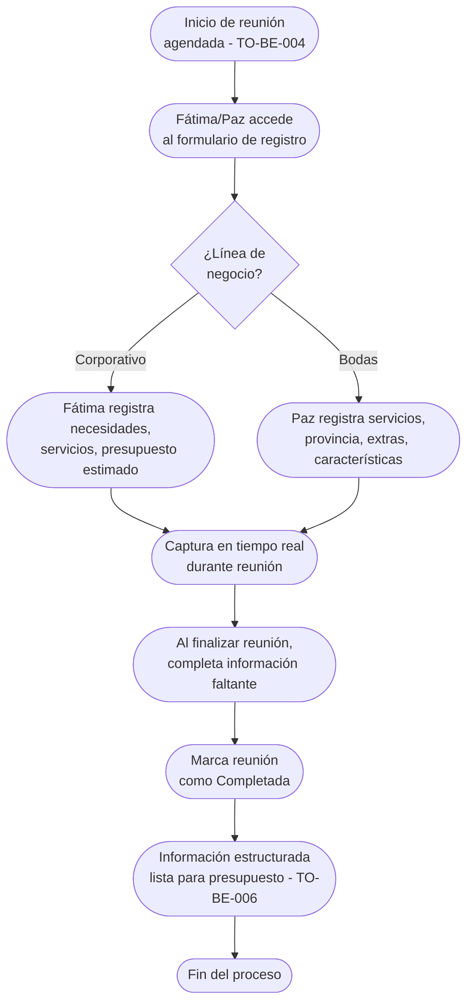

# Proceso TO-BE-005: Registro de información durante reunión

## 1. Objetivo y alcance (del proceso)

**Actor principal**: Fátima (Corporativo) / Paz (Bodas)

**Evento disparador**: Inicio de reunión agendada con cliente (TO-BE-004)

**Propósito**: Capturar en tiempo real servicios de interés, necesidades del cliente, preferencias y acuerdos durante la reunión, permitiendo generación inmediata de presupuesto al finalizar

**Scope funcional**: Desde inicio de reunión hasta registro completo de información capturada y disponibilidad para generación de presupuesto

**Criterios de éxito**: 
- 100% de información relevante capturada durante reunión
- Registro en tiempo real (no post-reunión)
- Información estructurada lista para generación automática de presupuesto
- Tiempo de registro < 5 minutos adicionales durante reunión

**Frecuencia**: Por cada reunión agendada

**Duración objetivo**: Durante reunión (20 min Corporativo, variable Bodas) + < 5 min registro

**Supuestos/restricciones**: 
- Reunión agendada (TO-BE-004)
- Acceso a sistema durante reunión (tablet, laptop, móvil)
- Información capturada debe ser estructurada para generación automática

## 2. Contexto y actores

**Participantes:**
- **Fátima/Paz**: Captura información durante reunión
- **Cliente potencial**: Proporciona información sobre necesidades
- **Sistema centralizado**: Proporciona formulario estructurado para captura

**Stakeholders clave:** 
- Equipo comercial (necesita información completa para presupuesto)
- Cliente (espera presupuesto rápido después de reunión)

**Dependencias:** 
- TO-BE-004: Reunión debe estar agendada
- Sistema de captura estructurada

**Gobernanza:** 
- Fátima gestiona reuniones Corporativo
- Paz gestiona reuniones Bodas

### 2.1 Dependencias entre procesos TO-BE

**Procesos prerequisito:** 
- TO-BE-004: Agendamiento de reuniones (reunión debe estar agendada)

**Procesos dependientes:** 
- TO-BE-006: Generación automática de presupuestos (requiere información capturada)

**Orden de implementación sugerido:** Quinto (después de agendamiento)

## 3. Transformación AS-IS → TO-BE (trazabilidad)

### 3.1 Procesos AS-IS relacionados

**Procesos AS-IS de referencia:** AS-IS-002: Primera reunión y propuesta/presupuesto (Corporativo y Bodas)

**Tipo de transformación:** Reimaginación con captura estructurada en tiempo real

### 3.2 Análisis del estado actual (procesos AS-IS relacionados)

En el proceso AS-IS, durante la reunión se toman notas de todo lo discutido, pero no se registran servicios de interés mientras ocurre la reunión. Al finalizar reunión, se queda en que Paz manda presupuesto (normalmente al día siguiente, pero se olvida). No hay registro estructurado durante la reunión que permita generar presupuesto inmediatamente.

### 3.3 Problemas y oportunidades identificadas

**Dolores principales:**
1. Falta de registro durante reunión - no se registran servicios de interés mientras ocurre la reunión _(Fuente: AS-IS-002 P6)_
2. Olvidos de envío de presupuesto - reuniones a última hora o fuera horario laboral, Paz deja presupuesto para mañana siguiente pero se olvida de enviarlo _(Fuente: AS-IS-002 P3)_

**Causas raíz:** 
- Registro no estructurado durante reunión
- Información capturada no está lista para generación automática
- Dependencia de memoria para recordar detalles después de reunión

**Oportunidades no explotadas:** 
- Captura estructurada en tiempo real durante reunión
- Formulario guiado que facilita registro de servicios de interés
- Información lista para generación automática inmediata

**Riesgo de mantener AS-IS:** 
- Olvidos de detalles importantes
- Retraso en generación de presupuesto
- Información incompleta o incorrecta

### 3.4 Estrategia de transformación

**Principios de rediseño aplicados:**
- Captura estructurada en tiempo real durante reunión
- Formulario guiado que facilita registro sin interrumpir reunión
- Información lista para generación automática inmediata
- Eliminación de dependencia de memoria post-reunión

**Justificación del nuevo diseño:** 
Este proceso TO-BE permite capturar información estructurada durante la reunión mediante formulario guiado, garantizando que toda la información relevante quede registrada y lista para generación automática de presupuesto inmediatamente después de la reunión, eliminando olvidos.

**Fuentes:** 
- `02-discovery/0201-interviews/020101-interview-01/minute-01.md` (Sección 6)
- `02-discovery/0202-prd/020202-as-is/processes/AS-IS-002-primera-reunion-propuesta/AS-IS-002-primera-reunion-propuesta.md`

## 4. Proceso TO-BE

### **4.1 Descripción detallada**

El proceso inicia cuando comienza la reunión agendada. Fátima (Corporativo) o Paz (Bodas) accede al sistema y abre el formulario de registro de reunión vinculado al lead. Durante la reunión:

**Para Corporativo (Fátima):**
1. Registra necesidades del cliente según se discuten
2. Selecciona servicios de interés (packs, servicios adicionales)
3. Registra presupuesto estimado mencionado por cliente
4. Toma notas de requerimientos especiales
5. Registra referencias visuales mencionadas

**Para Bodas (Paz):**
1. Registra servicios de interés (fotografía 1/2 fotógrafos, vídeo, dron)
2. Selecciona provincia y extras (transporte, tiempo extra)
3. Registra características especiales de la boda
4. Toma notas de preferencias y acuerdos
5. Confirma número de profesionales recomendados

El formulario está diseñado para ser usado durante la reunión sin interrumpir la conversación, con campos predefinidos y selección rápida. Al finalizar la reunión, Fátima/Paz completa cualquier información faltante y marca la reunión como "Completada". La información queda estructurada y lista para generación automática de presupuesto (TO-BE-006).

### **4.2 Diagrama de flujo**

### **4.3 Flujo principal (happy path)**

| # | Actor | Actividad | Sistema/Herramienta | Reglas de Negocio | Tiempo |
|---|-------|-----------|-------------------|-------------------|--------|
| 1 | Fátima/Paz | Accede al formulario de registro de reunión vinculado al lead | Sistema centralizado | Formulario pre-cargado con datos del lead Acceso desde tablet/laptop/móvil | < 1 min |
| 2 | Fátima/Paz | Durante reunión, registra información según se discute | Formulario estructurado | Campos predefinidos para selección rápida No interrumpe conversación Captura en tiempo real | Durante reunión |
| 3 | Fátima (Corporativo) | Selecciona servicios de interés, registra presupuesto estimado, toma notas | Formulario Corporativo | Selección de packs/servicios Campo de presupuesto estimado Notas libres | < 3 min |
| 3b | Paz (Bodas) | Selecciona servicios (fotografía, vídeo, dron), provincia, extras | Formulario Bodas | Selección rápida de servicios Provincia predefinida Extras opcionales | < 3 min |
| 4 | Fátima/Paz | Al finalizar reunión, completa información faltante si es necesario | Formulario estructurado | Validación de campos críticos Completar antes de finalizar | < 2 min |
| 5 | Fátima/Paz | Marca reunión como "Completada" | Sistema centralizado | Cambio de estado automático Información estructurada guardada | < 1 min |
| 6 | Sistema | Información queda disponible para generación automática de presupuesto | Base de datos | Datos estructurados listos para TO-BE-006 Notificación a responsable | < 10 seg |

### **4.5 Puntos de decisión y variantes**

- **Información completa vs incompleta**: Si falta información crítica, sistema no permite marcar como completada hasta completar
- **Servicios no estándar**: Si cliente solicita servicios no predefinidos, se pueden añadir como notas libres
- **Presupuesto no mencionado**: Si cliente no menciona presupuesto, campo queda vacío pero no bloquea

### **4.6 Excepciones y manejo de errores**

- **Reunión cancelada o no asistida**: Si cliente no asiste, se marca reunión como "No asistida" y se programa nueva
- **Información crítica faltante**: Sistema valida campos críticos antes de permitir marcar como completada
- **Error técnico durante reunión**: Si falla el sistema, Fátima/Paz puede tomar notas manuales y registrar después

### **4.7 Riesgos del proceso y mitigaciones**

| Riesgo | Probabilidad | Impacto | Mitigación |
|--------|--------------|---------|------------|
| Interrupción de reunión por registro | Media | Medio | Formulario diseñado para uso rápido, campos predefinidos, no requiere atención constante |
| Información no capturada por olvido | Media | Alto | Formulario guiado con campos obligatorios, validación antes de finalizar |
| Error en registro de información | Baja | Alto | Validación de campos, posibilidad de edición post-reunión, revisión antes de generar presupuesto |

### **4.8 Preguntas abiertas**

- ¿Qué campos son obligatorios vs opcionales durante la reunión?
- ¿Se permite edición de información después de marcar como completada?
- ¿Qué hacer si cliente menciona información contradictoria durante reunión?
- ¿Se requiere grabación de audio/video de la reunión para referencia?

### **4.9 Ideas adicionales**

- Integración con reconocimiento de voz para captura automática de notas
- Plantillas predefinidas según tipo de cliente o sector
- Sugerencias automáticas de servicios según información capturada
- Análisis de sentimiento durante reunión para priorización

---

*GEN-BY:PROMPT-to-be · hash:tobe005_registro_informacion_reunion_20260120 · 2026-01-20T00:00:00Z*
