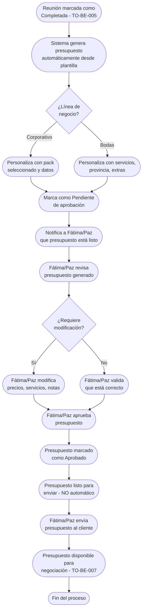

# Proceso TO-BE-006: Generación automática de presupuestos

## 1. Objetivo y alcance (del proceso)

**Actor principal**: Sistema centralizado (con aprobación de Fátima/Paz antes de enviar)

**Evento disparador**: Reunión completada con información capturada (TO-BE-005)

**Propósito**: Crear automáticamente presupuesto desde plantillas configuradas (packs por sector, servicios bodas) con personalización según datos capturados en reunión, permitiendo a ONGAKU modificar y aprobar antes de enviar al cliente

**Scope funcional**: Desde información de reunión completada hasta presupuesto aprobado por ONGAKU y listo para enviar (no se envía automáticamente)

**Criterios de éxito**: 
- 100% de presupuestos generados automáticamente desde plantillas
- Tiempo de generación < 5 minutos desde reunión completada
- ONGAKU puede modificar presupuesto generado antes de aprobar
- 0% de presupuestos enviados sin aprobación de ONGAKU
- Personalización correcta con datos capturados en reunión

**Frecuencia**: Por cada reunión completada

**Duración objetivo**: < 5 minutos (generación automática) + tiempo de revisión/aprobación de ONGAKU

**Supuestos/restricciones**: 
- Información de reunión capturada (TO-BE-005)
- Plantillas de presupuesto configuradas (packs por sector, servicios bodas)
- Precios actualizados en sistema
- ONGAKU debe aprobar antes de enviar (no automático)

## 2. Contexto y actores

**Participantes:**
- **Sistema centralizado**: Genera presupuesto automáticamente desde plantillas
- **Fátima/Paz**: Revisa, modifica si es necesario y aprueba presupuesto antes de enviar
- **Cliente potencial**: Recibe presupuesto solo tras aprobación de ONGAKU

**Stakeholders clave:** 
- Equipo comercial (necesita presupuestos generados rápidamente)
- Cliente (espera presupuesto después de reunión)
- Administración (necesita control de precios y aprobaciones)

**Dependencias:** 
- TO-BE-005: Información de reunión debe estar capturada
- Plantillas de presupuesto configuradas
- Base de datos de precios actualizados

**Gobernanza:** 
- Sistema genera automáticamente como propuesta
- Fátima/Paz pueden modificar y deben aprobar antes de enviar
- No se envía automáticamente sin aprobación

### 2.1 Dependencias entre procesos TO-BE

**Procesos prerequisito:** 
- TO-BE-005: Registro de información durante reunión (información debe estar capturada)

**Procesos dependientes:** 
- TO-BE-007: Negociación de presupuestos (requiere presupuesto generado y aprobado)

**Orden de implementación sugerido:** Sexto (después de registro de información)

## 3. Transformación AS-IS → TO-BE (trazabilidad)

### 3.1 Procesos AS-IS relacionados

**Procesos AS-IS de referencia:** AS-IS-002: Primera reunión y propuesta/presupuesto (Corporativo y Bodas)

**Tipo de transformación:** Reimaginación con automatización y control de aprobación

### 3.2 Análisis del estado actual (procesos AS-IS relacionados)

En el proceso AS-IS, la generación de presupuestos es completamente manual. Al finalizar reunión, se queda en que Paz manda presupuesto (normalmente al día siguiente, pero se olvida). El proceso es lento, propenso a errores, requiere múltiples pasos manuales. No hay generación automática ni control de aprobación antes de enviar.

### 3.3 Problemas y oportunidades identificadas

**Dolores principales:**
1. Generación manual de propuestas/presupuestos - proceso lento, propenso a errores, requiere múltiples pasos _(Fuente: AS-IS-002 P5)_
2. Olvidos de envío de presupuesto - reuniones a última hora o fuera horario laboral, Paz deja presupuesto para mañana siguiente pero se olvida de enviarlo _(Fuente: AS-IS-002 P3)_

**Causas raíz:** 
- Generación completamente manual desde cero
- No hay plantillas que faciliten el proceso
- Dependencia de memoria para recordar generar y enviar
- No hay control de aprobación antes de enviar

**Oportunidades no explotadas:** 
- Generación automática desde plantillas configuradas
- Personalización automática con datos capturados en reunión
- Control de aprobación antes de enviar
- Notificación automática cuando presupuesto está listo para revisión

**Riesgo de mantener AS-IS:** 
- Olvidos frecuentes de envío de presupuesto
- Errores en precios o servicios
- Retraso en respuesta al cliente
- Pérdida de oportunidades comerciales

### 3.4 Estrategia de transformación

**Principios de rediseño aplicados:**
- Generación automática desde plantillas configuradas
- Personalización automática con datos capturados en reunión
- Control de aprobación por ONGAKU antes de enviar (no automático)
- Posibilidad de modificación por ONGAKU antes de aprobar
- Notificaciones automáticas cuando presupuesto está listo

**Justificación del nuevo diseño:** 
Este proceso TO-BE genera automáticamente el presupuesto desde plantillas, acelerando significativamente el proceso y eliminando errores manuales. Sin embargo, mantiene el control de ONGAKU mediante aprobación obligatoria antes de enviar, permitiendo modificación si es necesario. Esto combina eficiencia con control.

**Fuentes:** 
- `02-discovery/0201-interviews/020101-interview-01/minute-01.md` (Sección 6)
- `02-discovery/0202-prd/020202-as-is/processes/AS-IS-002-primera-reunion-propuesta/AS-IS-002-primera-reunion-propuesta.md`

## 4. Proceso TO-BE

### **4.1 Descripción detallada**

El proceso inicia automáticamente cuando una reunión es marcada como "Completada" (TO-BE-005). El sistema:

1. **Genera automáticamente el presupuesto** desde plantillas configuradas:
   - **Corporativo**: Según pack seleccionado (3 packs para colegios, 4 packs para empresas) o servicios personalizados
   - **Bodas**: Según servicios seleccionados (fotografía 1/2 fotógrafos, vídeo, dron), provincia, extras (transporte, tiempo extra)

2. **Personaliza el presupuesto** con datos capturados en reunión:
   - Datos del cliente/novios
   - Servicios seleccionados
   - Extras y características especiales
   - Precios según configuración actualizada

3. **Marca el presupuesto como "Pendiente de aprobación"** y notifica a Fátima/Paz

4. **Fátima/Paz revisa el presupuesto generado**:
   - Puede modificar precios si es necesario
   - Puede ajustar servicios o extras
   - Puede añadir notas o condiciones especiales
   - Valida que todo esté correcto

5. **Fátima/Paz aprueba el presupuesto**:
   - Marca como "Aprobado"
   - Presupuesto queda listo para enviar al cliente
   - **NO se envía automáticamente** - requiere acción explícita de envío

6. **Fátima/Paz envía el presupuesto al cliente** cuando esté listo (proceso separado, no automático)

### **4.2 Diagrama de flujo**

### **4.3 Flujo principal (happy path)**

| # | Actor | Actividad | Sistema/Herramienta | Reglas de Negocio | Tiempo |
|---|-------|-----------|-------------------|-------------------|--------|
| 1 | Sistema | Detecta reunión marcada como "Completada" | Sistema centralizado | Trigger automático al cambiar estado a "Completada" | < 1 min |
| 2 | Sistema | Genera presupuesto automáticamente desde plantilla según línea de negocio | Motor de generación de presupuestos | Corporativo: según pack seleccionado Bodas: según servicios seleccionados Usa precios actualizados en sistema | < 2 min |
| 3 | Sistema | Personaliza presupuesto con datos capturados en reunión (cliente, servicios, extras) | Motor de personalización | Reemplaza variables en plantilla con datos de reunión Calcula totales automáticamente | < 1 min |
| 4 | Sistema | Marca presupuesto como "Pendiente de aprobación" | Base de datos | Estado visible para Fátima/Paz No se puede enviar sin aprobar | < 10 seg |
| 5 | Sistema | Notifica a Fátima/Paz que presupuesto está listo para revisión | Sistema de notificaciones | Notificación incluye enlace directo al presupuesto Resumen de servicios y precio total | < 1 min |
| 6 | Fátima/Paz | Revisa presupuesto generado | Dashboard del sistema | Presupuesto visible con todos los detalles Puede ver plantilla usada y datos personalizados | < 5 min |
| 7 | Fátima/Paz | Modifica presupuesto si es necesario (precios, servicios, notas) | Editor de presupuesto | Puede modificar cualquier campo Sistema recalcula totales automáticamente | < 10 min |
| 8 | Fátima/Paz | Aprueba presupuesto | Sistema centralizado | Cambio de estado a "Aprobado" Presupuesto queda listo para enviar **NO se envía automáticamente** | < 1 min |
| 9 | Fátima/Paz | Envía presupuesto al cliente cuando esté listo | Sistema de envío | Acción explícita de envío Presupuesto enviado por email o portal | < 1 min |

### **4.5 Puntos de decisión y variantes**

- **Modificación necesaria vs no necesaria**: Fátima/Paz puede modificar antes de aprobar o aprobar directamente si está correcto
- **Aprobación vs rechazo**: Si presupuesto no es correcto, puede rechazarse y regenerarse
- **Envío inmediato vs diferido**: Presupuesto aprobado puede enviarse inmediatamente o más tarde

### **4.6 Excepciones y manejo de errores**

- **Datos faltantes para generación**: Si faltan datos críticos, sistema marca como "Datos incompletos" y notifica a Fátima/Paz para completar
- **Plantilla no encontrada**: Si no hay plantilla para el caso, sistema notifica a Fátima/Paz para generación manual
- **Precios no actualizados**: Sistema alerta si precios usados no están actualizados
- **Error en cálculo**: Si hay error en cálculo de totales, sistema alerta y permite corrección manual

### **4.7 Riesgos del proceso y mitigaciones**

| Riesgo | Probabilidad | Impacto | Mitigación |
|--------|--------------|---------|------------|
| Presupuesto enviado sin aprobación | Baja | Alto | Control obligatorio de aprobación, no se puede enviar sin estado "Aprobado" |
| Error en precios o servicios | Media | Alto | Revisión obligatoria por Fátima/Paz antes de aprobar, posibilidad de modificación |
| Presupuesto generado incorrectamente | Baja | Medio | Validación de datos antes de generar, revisión por responsable antes de aprobar |
| Retraso en aprobación | Media | Medio | Notificaciones automáticas, recordatorios si no se aprueba en tiempo razonable |

### **4.8 Preguntas abiertas**

- ¿Cuánto tiempo tiene Fátima/Paz para aprobar presupuesto? ¿Hay SLA objetivo?
- ¿Se requiere aprobación de múltiples personas para presupuestos de alto valor?
- ¿Qué hacer si presupuesto generado no es adecuado? ¿Se puede regenerar automáticamente?
- ¿Se requiere historial de versiones si se modifica el presupuesto?

### **4.9 Ideas adicionales**

- Sugerencias automáticas de precios según historial de proyectos similares
- Análisis de rentabilidad del presupuesto antes de aprobar
- Plantillas personalizadas por tipo de cliente o sector
- Integración con sistema de facturación para sincronización de precios

---

*GEN-BY:PROMPT-to-be · hash:tobe006_generacion_automatica_presupuestos_20260120 · 2026-01-20T00:00:00Z*
