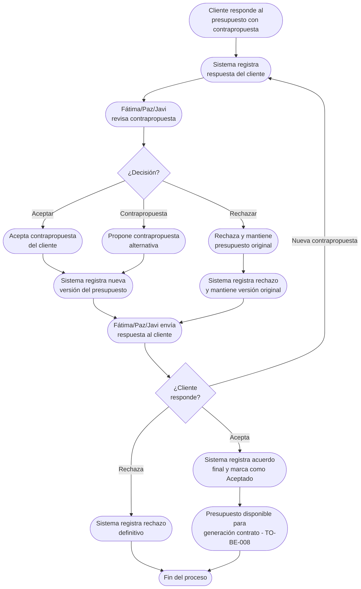

# Proceso TO-BE-007: Negociación de presupuestos

## 1. Objetivo y alcance (del proceso)

**Actor principal**: Fátima/Paz/Javi (negociación) / Cliente (contrapropuestas)

**Evento disparador**: Cliente responde al presupuesto enviado con contrapropuesta o solicitud de ajustes

**Propósito**: Gestionar contrapropuestas, ajustes de precio, modificaciones de servicios, con registro de todas las versiones y acuerdos alcanzados

**Scope funcional**: Desde respuesta del cliente al presupuesto hasta acuerdo final o rechazo

**Criterios de éxito**: 
- 100% de versiones de presupuesto registradas
- Trazabilidad completa de negociación
- Acuerdos alcanzados documentados
- Tiempo de respuesta a contrapropuestas < 24 horas

**Frecuencia**: Por cada presupuesto enviado que requiere negociación

**Duración objetivo**: Variable según complejidad de negociación

**Supuestos/restricciones**: 
- Presupuesto enviado al cliente (TO-BE-006)
- Cliente puede responder con contrapropuesta o aceptar
- Negociación puede ser por email, teléfono o portal

## 2. Contexto y actores

**Participantes:**
- **Fátima/Paz/Javi**: Negocian presupuesto con cliente
- **Cliente**: Propone contrapropuestas o solicita ajustes
- **Sistema centralizado**: Registra todas las versiones y acuerdos

**Stakeholders clave:** 
- Equipo comercial (necesita cerrar negociación)
- Cliente (espera respuesta rápida a contrapropuestas)
- Administración (necesita visibilidad de negociaciones)

**Dependencias:** 
- TO-BE-006: Presupuesto debe estar enviado
- Sistema de registro de versiones

**Gobernanza:** 
- Fátima gestiona negociación Corporativo
- Paz/Javi/Fátima gestionan negociación Bodas
- Javi puede intervenir en negociaciones complejas

### 2.1 Dependencias entre procesos TO-BE

**Procesos prerequisito:** 
- TO-BE-006: Generación automática de presupuestos (presupuesto debe estar enviado)

**Procesos dependientes:** 
- TO-BE-008: Generación automática de contratos (requiere presupuesto aceptado)

**Orden de implementación sugerido:** Séptimo (después de generación de presupuestos)

## 3. Transformación AS-IS → TO-BE (trazabilidad)

### 3.1 Procesos AS-IS relacionados

**Procesos AS-IS de referencia:** AS-IS-002: Primera reunión y propuesta/presupuesto (Corporativo y Bodas)

**Tipo de transformación:** Reimaginación con registro estructurado

### 3.2 Análisis del estado actual (procesos AS-IS relacionados)

En el proceso AS-IS, el presupuesto se negocia en persona o por teléfono (Javi, Fátima o Paz). No hay registro estructurado de las versiones del presupuesto ni de los acuerdos alcanzados. La negociación queda en memoria o emails dispersos, sin trazabilidad clara.

### 3.3 Problemas y oportunidades identificadas

**Dolores principales:**
1. Falta de registro estructurado de negociaciones - acuerdos quedan en memoria o emails dispersos _(Fuente: AS-IS-002 flujo actual)_

**Causas raíz:** 
- Negociación por teléfono o en persona sin registro estructurado
- No hay sistema para registrar versiones del presupuesto
- Acuerdos no quedan documentados claramente

**Oportunidades no explotadas:** 
- Registro estructurado de todas las versiones del presupuesto
- Trazabilidad completa de negociación
- Portal donde cliente puede ver versiones y hacer contrapropuestas
- Documentación automática de acuerdos alcanzados

**Riesgo de mantener AS-IS:** 
- Pérdida de información de negociación
- Malentendidos sobre acuerdos alcanzados
- Dificultad para rastrear cambios en presupuesto

### 3.4 Estrategia de transformación

**Principios de rediseño aplicados:**
- Registro estructurado de todas las versiones del presupuesto
- Trazabilidad completa de negociación
- Portal donde cliente puede ver versiones y hacer contrapropuestas
- Documentación automática de acuerdos alcanzados

**Justificación del nuevo diseño:** 
Este proceso TO-BE estructura completamente la negociación, registrando todas las versiones del presupuesto y los acuerdos alcanzados, garantizando trazabilidad y evitando malentendidos.

**Fuentes:** 
- `02-discovery/0201-interviews/020101-interview-01/minute-01.md` (Sección 6)
- `02-discovery/0202-prd/020202-as-is/processes/AS-IS-002-primera-reunion-propuesta/AS-IS-002-primera-reunion-propuesta.md`

## 4. Proceso TO-BE

### **4.1 Descripción detallada**

El proceso inicia cuando el cliente responde al presupuesto enviado con contrapropuesta o solicitud de ajustes. El sistema:

1. **Registra la respuesta del cliente**:
   - Contrapropuesta de precio
   - Solicitud de modificación de servicios
   - Solicitud de ajustes o extras

2. **Fátima/Paz/Javi revisa la contrapropuesta** y decide:
   - Aceptar contrapropuesta
   - Rechazar y mantener presupuesto original
   - Proponer contrapropuesta alternativa

3. **Sistema registra nueva versión del presupuesto**:
   - Versión anterior queda archivada
   - Nueva versión con cambios propuestos
   - Comparación automática entre versiones

4. **Fátima/Paz/Javi envía respuesta al cliente**:
   - Nueva versión del presupuesto
   - Explicación de cambios si aplica

5. **Proceso se repite** hasta que:
   - Cliente acepta presupuesto
   - ONGAKU rechaza definitivamente
   - Cliente rechaza definitivamente

6. **Cuando hay acuerdo**, sistema registra:
   - Versión final aceptada
   - Acuerdos alcanzados documentados
   - Presupuesto marcado como "Aceptado"

### **4.2 Diagrama de flujo**

### **4.3 Flujo principal (happy path)**

| # | Actor | Actividad | Sistema/Herramienta | Reglas de Negocio | Tiempo |
|---|-------|-----------|-------------------|-------------------|--------|
| 1 | Cliente | Responde al presupuesto con contrapropuesta o solicitud de ajustes | Portal de cliente / Email | Puede hacer contrapropuesta de precio o modificar servicios | Variable |
| 2 | Sistema | Registra respuesta del cliente | Base de datos | Registra tipo de contrapropuesta, cambios solicitados, fecha | < 5 min |
| 3 | Fátima/Paz/Javi | Revisa contrapropuesta del cliente | Dashboard del sistema | Ve comparación automática entre versión original y contrapropuesta | < 30 min |
| 4 | Fátima/Paz/Javi | Decide: aceptar, rechazar o proponer alternativa | Sistema centralizado | Decisión registrada con justificación | < 1 hora |
| 5 | Sistema | Registra nueva versión del presupuesto si hay cambios | Sistema de versiones | Versión anterior archivada, nueva versión creada, comparación automática | < 5 min |
| 6 | Fátima/Paz/Javi | Envía respuesta al cliente con nueva versión o decisión | Sistema de envío | Email o portal con nueva versión y explicación | < 1 hora |
| 7 | Cliente | Responde: acepta, rechaza o nueva contrapropuesta | Portal / Email | Proceso se repite hasta acuerdo o rechazo definitivo | Variable |
| 8 | Sistema | Cuando hay acuerdo, registra versión final aceptada y acuerdos alcanzados | Base de datos | Presupuesto marcado como "Aceptado", acuerdos documentados | < 5 min |

### **4.5 Puntos de decisión y variantes**

- **Aceptar vs rechazar vs contrapropuesta**: Fátima/Paz/Javi puede aceptar, rechazar o proponer alternativa
- **Múltiples rondas de negociación**: Proceso puede repetirse varias veces hasta acuerdo o rechazo
- **Negociación por teléfono**: Si negociación es por teléfono, Fátima/Paz/Javi registra acuerdos manualmente en sistema

### **4.6 Excepciones y manejo de errores**

- **Cliente no responde**: Si cliente no responde en tiempo razonable, sistema puede enviar recordatorio
- **Contrapropuesta fuera de límites**: Si contrapropuesta está fuera de límites aceptables, sistema puede alertar
- **Error en registro de versión**: Si hay error, se puede corregir manualmente y regenerar versión

### **4.7 Riesgos del proceso y mitigaciones**

| Riesgo | Probabilidad | Impacto | Mitigación |
|--------|--------------|---------|------------|
| Pérdida de información de negociación | Media | Alto | Registro estructurado obligatorio, todas las versiones archivadas |
| Malentendidos sobre acuerdos | Media | Alto | Documentación clara de acuerdos alcanzados, confirmación por cliente |
| Negociación se alarga demasiado | Media | Medio | Límites de tiempo, recordatorios automáticos, escalación si es necesario |

### **4.8 Preguntas abiertas**

- ¿Cuántas rondas de negociación se permiten antes de considerar rechazo?
- ¿Se requiere confirmación explícita del cliente para acuerdos alcanzados por teléfono?
- ¿Qué hacer si cliente acepta pero luego cambia de opinión?
- ¿Se requiere aprobación de múltiples personas para contrapropuestas de alto valor?

### **4.9 Ideas adicionales**

- Portal donde cliente puede ver todas las versiones del presupuesto y comparar
- Notificaciones automáticas cuando cliente responde a presupuesto
- Análisis de rentabilidad de contrapropuestas antes de aceptar
- Plantillas de respuesta para contrapropuestas comunes

---

*GEN-BY:PROMPT-to-be · hash:tobe007_negociacion_presupuestos_20260120 · 2026-01-20T00:00:00Z*
