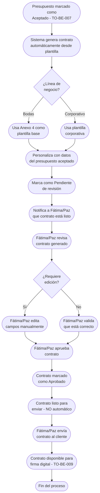

# Proceso TO-BE-008: Generación automática de contratos

## 1. Objetivo y alcance (del proceso)

**Actor principal**: Sistema centralizado (con edición manual por ONGAKU antes de enviar)

**Evento disparador**: Presupuesto aceptado por cliente (TO-BE-007)

**Propósito**: Crear automáticamente contrato personalizado desde plantilla, rellenando datos del cliente, condiciones del servicio, precio y condiciones excepcionales, permitiendo edición manual por parte de ONGAKU antes de enviar

**Scope funcional**: Desde presupuesto aceptado hasta contrato editado y listo para enviar (no se envía automáticamente)

**Criterios de éxito**: 
- 100% de contratos generados automáticamente desde plantilla
- Tiempo de generación < 2 minutos desde presupuesto aceptado
- ONGAKU puede editar manualmente antes de enviar
- Personalización correcta con datos del presupuesto aceptado
- 0% de contratos enviados sin revisión de ONGAKU

**Frecuencia**: Por cada presupuesto aceptado

**Duración objetivo**: < 2 minutos (generación automática) + tiempo de edición/revisión de ONGAKU

**Supuestos/restricciones**: 
- Presupuesto aceptado (TO-BE-007)
- Plantilla de contrato configurada (Anexo 4 para bodas, plantilla corporativa)
- ONGAKU debe revisar y puede editar antes de enviar

## 2. Contexto y actores

**Participantes:**
- **Sistema centralizado**: Genera contrato automáticamente desde plantilla
- **Fátima/Paz**: Revisa y edita contrato si es necesario antes de enviar
- **Cliente**: Recibe contrato solo tras revisión y aprobación de ONGAKU

**Stakeholders clave:** 
- Equipo comercial (necesita contratos generados rápidamente)
- Cliente (espera contrato después de aceptar presupuesto)
- Administración (necesita contratos correctos y completos)

**Dependencias:** 
- TO-BE-007: Presupuesto debe estar aceptado
- Plantillas de contrato configuradas
- Datos del cliente y servicios del presupuesto aceptado

**Gobernanza:** 
- Sistema genera automáticamente desde plantilla
- Fátima/Paz pueden editar manualmente antes de enviar
- No se envía automáticamente sin revisión

### 2.1 Dependencias entre procesos TO-BE

**Procesos prerequisito:** 
- TO-BE-007: Negociación de presupuestos (presupuesto debe estar aceptado)

**Procesos dependientes:** 
- TO-BE-009: Gestión de firmas digitales (requiere contrato generado y aprobado)

**Orden de implementación sugerido:** Octavo (después de negociación)

## 3. Transformación AS-IS → TO-BE (trazabilidad)

### 3.1 Procesos AS-IS relacionados

**Procesos AS-IS de referencia:** AS-IS-003: Gestión de contratos y firma (Corporativo y Bodas)

**Tipo de transformación:** Reimaginación con automatización y edición manual

### 3.2 Análisis del estado actual (procesos AS-IS relacionados)

En el proceso AS-IS, se edita manualmente Modelo de Contrato (Anexo 4 para bodas) cambiando palabras resaltadas. Este proceso es muy lento, propenso a errores, y a veces se pasa por alto cambiar algunas palabras. No hay generación automática ni control de cambios.

### 3.3 Problemas y oportunidades identificadas

**Dolores principales:**
1. Edición manual muy lenta - coger Modelo de Contrato y cambiar palabras resaltadas es lento y propenso a errores _(Fuente: AS-IS-003 P1)_
2. Olvidos de cambios - a veces se pasa por alto cambiar algunas palabras en el contrato _(Fuente: AS-IS-003 P2)_

**Causas raíz:** 
- Edición completamente manual desde documento Word/PDF
- No hay generación automática desde plantilla
- Dependencia de memoria para recordar todos los cambios necesarios

**Oportunidades no explotadas:** 
- Generación automática desde plantilla con datos del presupuesto
- Edición manual permitida para casos especiales
- Validación de campos obligatorios antes de enviar

**Riesgo de mantener AS-IS:** 
- Errores en contratos por olvidos de cambios
- Proceso lento que retrasa firma
- Contratos incompletos o incorrectos

### 3.4 Estrategia de transformación

**Principios de rediseño aplicados:**
- Generación automática desde plantilla con datos del presupuesto aceptado
- Personalización automática de campos (datos cliente, servicios, precio, condiciones)
- Edición manual permitida por ONGAKU para casos especiales
- Validación de campos obligatorios antes de enviar

**Justificación del nuevo diseño:** 
Este proceso TO-BE genera automáticamente el contrato desde plantilla, acelerando significativamente el proceso y eliminando olvidos de cambios. Sin embargo, mantiene la flexibilidad de edición manual por ONGAKU para casos especiales, combinando eficiencia con control.

**Fuentes:** 
- `02-discovery/0201-interviews/020101-interview-01/minute-01.md` (Sección 7)
- `02-discovery/0202-prd/020202-as-is/processes/AS-IS-003-gestion-contratos-firma/AS-IS-003-gestion-contratos-firma.md`

## 4. Proceso TO-BE

### **4.1 Descripción detallada**

El proceso inicia automáticamente cuando un presupuesto es marcado como "Aceptado" (TO-BE-007). El sistema:

1. **Genera automáticamente el contrato** desde plantilla configurada:
   - **Bodas**: Usa Anexo 4 como plantilla base
   - **Corporativo**: Usa plantilla corporativa

2. **Personaliza el contrato** con datos del presupuesto aceptado:
   - Datos del cliente/novios
   - Condiciones del servicio (servicios contratados)
   - Precio acordado
   - Condiciones excepcionales (apartado 4 en bodas si las hay)

3. **Marca el contrato como "Pendiente de revisión"** y notifica a Fátima/Paz

4. **Fátima/Paz revisa el contrato generado**:
   - Puede editar cualquier campo si es necesario
   - Puede añadir o modificar condiciones excepcionales
   - Valida que todos los campos estén correctos

5. **Fátima/Paz aprueba el contrato**:
   - Marca como "Aprobado"
   - Contrato queda listo para enviar al cliente
   - **NO se envía automáticamente** - requiere acción explícita de envío

6. **Fátima/Paz envía el contrato al cliente** cuando esté listo (proceso separado, no automático)

### **4.2 Diagrama de flujo**

### **4.3 Flujo principal (happy path)**

| # | Actor | Actividad | Sistema/Herramienta | Reglas de Negocio | Tiempo |
|---|-------|-----------|-------------------|-------------------|--------|
| 1 | Sistema | Detecta presupuesto marcado como "Aceptado" | Sistema centralizado | Trigger automático al cambiar estado a "Aceptado" | < 1 min |
| 2 | Sistema | Genera contrato automáticamente desde plantilla según línea de negocio | Motor de generación de contratos | Bodas: Anexo 4 Corporativo: Plantilla corporativa Usa datos del presupuesto aceptado | < 1 min |
| 3 | Sistema | Personaliza contrato con datos del presupuesto aceptado (cliente, servicios, precio, condiciones) | Motor de personalización | Reemplaza variables en plantilla con datos del presupuesto Incluye condiciones excepcionales si las hay | < 30 seg |
| 4 | Sistema | Marca contrato como "Pendiente de revisión" | Base de datos | Estado visible para Fátima/Paz No se puede enviar sin aprobar | < 10 seg |
| 5 | Sistema | Notifica a Fátima/Paz que contrato está listo para revisión | Sistema de notificaciones | Notificación incluye enlace directo al contrato Resumen de datos personalizados | < 1 min |
| 6 | Fátima/Paz | Revisa contrato generado | Editor de contratos | Contrato visible con todos los campos Puede ver plantilla usada y datos personalizados | < 5 min |
| 7 | Fátima/Paz | Edita contrato manualmente si es necesario (campos, condiciones, cláusulas) | Editor de contratos | Puede modificar cualquier campo Puede añadir o modificar condiciones excepcionales | < 15 min |
| 8 | Fátima/Paz | Aprueba contrato | Sistema centralizado | Cambio de estado a "Aprobado" Contrato queda listo para enviar **NO se envía automáticamente** | < 1 min |
| 9 | Fátima/Paz | Envía contrato al cliente cuando esté listo | Sistema de envío | Acción explícita de envío Contrato enviado por email o portal | < 1 min |

### **4.5 Puntos de decisión y variantes**

- **Edición necesaria vs no necesaria**: Fátima/Paz puede editar antes de aprobar o aprobar directamente si está correcto
- **Condiciones excepcionales**: Si hay condiciones excepcionales, se añaden en apartado 4 (bodas) o secciones correspondientes
- **Aprobación vs rechazo**: Si contrato no es correcto, puede rechazarse y regenerarse

### **4.6 Excepciones y manejo de errores**

- **Datos faltantes para generación**: Si faltan datos críticos, sistema marca como "Datos incompletos" y notifica a Fátima/Paz para completar
- **Plantilla no encontrada**: Si no hay plantilla para el caso, sistema notifica a Fátima/Paz para generación manual
- **Error en personalización**: Si hay error en personalización, Fátima/Paz puede corregir manualmente

### **4.7 Riesgos del proceso y mitigaciones**

| Riesgo | Probabilidad | Impacto | Mitigación |
|--------|--------------|---------|------------|
| Contrato enviado sin revisión | Baja | Alto | Control obligatorio de aprobación, no se puede enviar sin estado "Aprobado" |
| Error en datos personalizados | Media | Alto | Revisión obligatoria por Fátima/Paz antes de aprobar, posibilidad de edición manual |
| Contrato generado incorrectamente | Baja | Medio | Validación de datos antes de generar, revisión por responsable antes de aprobar |

### **4.8 Preguntas abiertas**

- ¿Qué campos son editables vs bloqueados después de generación?
- ¿Se requiere historial de versiones si se edita el contrato?
- ¿Qué hacer si contrato generado no es adecuado? ¿Se puede regenerar automáticamente?
- ¿Se requiere aprobación de múltiples personas para contratos de alto valor?

### **4.9 Ideas adicionales**

- Validación automática de campos obligatorios antes de aprobar
- Comparación automática entre plantilla y contrato generado para detectar cambios
- Plantillas personalizadas por tipo de cliente o sector
- Integración con sistema legal para validación de cláusulas

---

*GEN-BY:PROMPT-to-be · hash:tobe008_generacion_automatica_contratos_20260120 · 2026-01-20T00:00:00Z*
