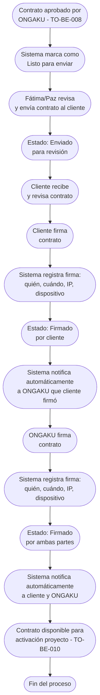

# Proceso TO-BE-009: Gestión de firmas digitales

## 1. Objetivo y alcance (del proceso)

**Actor principal**: Fátima/Paz (aprobación y envío) / Cliente y ONGAKU (firmas)

**Evento disparador**: Contrato aprobado por ONGAKU (TO-BE-008)

**Propósito**: El contrato se envía para revisión solo tras aprobación de ONGAKU (no automáticamente). Seguimiento de estado de firmas (pendiente cliente, pendiente ONGAKU, completado), notificaciones automáticas en cada etapa, trazabilidad completa

**Scope funcional**: Desde contrato aprobado por ONGAKU hasta contrato firmado por ambas partes

**Criterios de éxito**: 
- 100% de contratos enviados solo tras aprobación de ONGAKU (no automático)
- 100% de firmas con seguimiento de estado
- Notificaciones automáticas en cada etapa
- Trazabilidad completa de quién firmó cuándo
- 0% de olvidos de firma

**Frecuencia**: Por cada contrato aprobado

**Duración objetivo**: Variable según tiempo de respuesta de cliente y ONGAKU

**Supuestos/restricciones**: 
- Contrato aprobado por ONGAKU (TO-BE-008)
- Sistema de firma digital integrado
- Notificaciones automáticas configuradas

## 2. Contexto y actores

**Participantes:**
- **Fátima/Paz**: Aprueban y envían contrato al cliente
- **Cliente**: Revisa y firma contrato
- **ONGAKU**: Firma contrato después de cliente
- **Sistema centralizado**: Gestiona envío, seguimiento de firmas, notificaciones

**Stakeholders clave:** 
- Equipo comercial (necesita contratos firmados)
- Cliente (espera proceso de firma claro)
- Administración (necesita contratos firmados para activar proyecto)

**Dependencias:** 
- TO-BE-008: Contrato debe estar aprobado
- Sistema de firma digital
- Sistema de notificaciones

**Gobernanza:** 
- Fátima/Paz envían contrato solo tras aprobación (no automático)
- Cliente firma primero
- ONGAKU firma después de cliente

### 2.1 Dependencias entre procesos TO-BE

**Procesos prerequisito:** 
- TO-BE-008: Generación automática de contratos (contrato debe estar aprobado)

**Procesos dependientes:** 
- TO-BE-010: Activación automática de proyectos (requiere contrato firmado)

**Orden de implementación sugerido:** Noveno (después de generación de contratos)

## 3. Transformación AS-IS → TO-BE (trazabilidad)

### 3.1 Procesos AS-IS relacionados

**Procesos AS-IS de referencia:** AS-IS-003: Gestión de contratos y firma (Corporativo y Bodas)

**Tipo de transformación:** Reimaginación con seguimiento y notificaciones automáticas

### 3.2 Análisis del estado actual (procesos AS-IS relacionados)

En el proceso AS-IS, se envía contrato sin firmar a novios para revisión. Cuando novios aceptan, se firma por ONGAKU y se manda contrato firmado por ONGAKU a novios para que ellos lo firmen. Hay olvidos frecuentes de firma - se olvida que los novios firmen y nunca firman, o se olvida firmar directamente por parte de ONGAKU. No hay seguimiento de estado ni notificaciones automáticas.

### 3.3 Problemas y oportunidades identificadas

**Dolores principales:**
1. Olvidos de firma - se olvida que los novios firmen y nunca firman, o se olvida firmar directamente por parte de ONGAKU _(Fuente: AS-IS-003 P3)_
2. Falta de seguimiento de estado - no hay visibilidad clara del estado de las firmas (pendiente cliente, pendiente ONGAKU, completado) _(Fuente: AS-IS-003 P4)_
3. Proceso no automatizado - requiere intervención manual en cada paso, sin notificaciones automáticas _(Fuente: AS-IS-003 P5)_
4. Falta de trazabilidad - no queda registro claro de quién firmó cuándo y en qué orden _(Fuente: AS-IS-003 P6)_

**Causas raíz:** 
- Envío automático sin control
- Falta de seguimiento de estado de firmas
- No hay notificaciones automáticas
- Dependencia de memoria para recordar firmar

**Oportunidades no explotadas:** 
- Envío solo tras aprobación de ONGAKU (no automático)
- Seguimiento automático de estado de firmas
- Notificaciones automáticas en cada etapa
- Trazabilidad completa de firmas

**Riesgo de mantener AS-IS:** 
- Olvidos de firma que bloquean activación de proyectos
- Falta de visibilidad del estado
- Retrasos en activación de proyectos

### 3.4 Estrategia de transformación

**Principios de rediseño aplicados:**
- Envío solo tras aprobación explícita de ONGAKU (no automático)
- Seguimiento automático de estado de firmas
- Notificaciones automáticas en cada etapa
- Trazabilidad completa de quién firmó cuándo

**Justificación del nuevo diseño:** 
Este proceso TO-BE garantiza que el contrato solo se envía tras aprobación de ONGAKU (no automáticamente), y proporciona seguimiento completo del estado de firmas con notificaciones automáticas, eliminando olvidos y proporcionando visibilidad clara.

**Fuentes:** 
- `02-discovery/0201-interviews/020101-interview-01/minute-01.md` (Sección 7)
- `02-discovery/0202-prd/020202-as-is/processes/AS-IS-003-gestion-contratos-firma/AS-IS-003-gestion-contratos-firma.md`

## 4. Proceso TO-BE

### **4.1 Descripción detallada**

El proceso inicia cuando un contrato es aprobado por ONGAKU (TO-BE-008). El sistema:

1. **Marca el contrato como "Listo para enviar"** (NO se envía automáticamente)

2. **Fátima/Paz revisa y envía el contrato al cliente**:
   - Acción explícita de envío
   - Contrato enviado por email o portal
   - Estado cambia a "Enviado para revisión"

3. **Cliente recibe contrato y lo revisa**:
   - Contrato disponible en portal o email
   - Cliente puede revisar antes de firmar

4. **Cliente firma el contrato**:
   - Firma digital en portal o mediante enlace
   - Sistema registra: quién firmó, cuándo, IP, dispositivo
   - Estado cambia a "Firmado por cliente"

5. **Sistema notifica automáticamente a ONGAKU** que cliente ha firmado

6. **ONGAKU firma el contrato**:
   - Fátima/Paz accede al contrato y firma
   - Sistema registra: quién firmó, cuándo, IP, dispositivo
   - Estado cambia a "Firmado por ambas partes"

7. **Sistema notifica automáticamente** a cliente y ONGAKU que contrato está completamente firmado

8. **Contrato queda disponible** para activación de proyecto (TO-BE-010)

### **4.2 Diagrama de flujo**

### **4.3 Flujo principal (happy path)**

| # | Actor | Actividad | Sistema/Herramienta | Reglas de Negocio | Tiempo |
|---|-------|-----------|-------------------|-------------------|--------|
| 1 | Sistema | Marca contrato como "Listo para enviar" tras aprobación | Sistema centralizado | **NO se envía automáticamente** Requiere acción explícita de Fátima/Paz | < 1 min |
| 2 | Fátima/Paz | Revisa contrato y lo envía al cliente | Sistema de envío | Acción explícita de envío Contrato enviado por email o portal | < 5 min |
| 3 | Sistema | Cambia estado a "Enviado para revisión" y notifica al cliente | Sistema de notificaciones | Cliente recibe notificación con enlace al contrato | < 1 min |
| 4 | Cliente | Revisa contrato en portal o email | Portal de cliente / Email | Contrato visible con opción de firmar | Variable |
| 5 | Cliente | Firma contrato digitalmente | Sistema de firma digital | Firma mediante portal o enlace Registro automático de firma | < 5 min |
| 6 | Sistema | Registra firma del cliente (quién, cuándo, IP, dispositivo) y cambia estado a "Firmado por cliente" | Base de datos / Sistema de firma | Trazabilidad completa de firma Estado visible para seguimiento | < 1 min |
| 7 | Sistema | Notifica automáticamente a ONGAKU que cliente ha firmado | Sistema de notificaciones | Notificación incluye enlace para firmar Recordatorio si no se firma en tiempo razonable | < 1 min |
| 8 | ONGAKU (Fátima/Paz) | Firma contrato digitalmente | Sistema de firma digital | Firma mediante sistema Registro automático de firma | < 5 min |
| 9 | Sistema | Registra firma de ONGAKU (quién, cuándo, IP, dispositivo) y cambia estado a "Firmado por ambas partes" | Base de datos / Sistema de firma | Trazabilidad completa de firma Estado visible para seguimiento | < 1 min |
| 10 | Sistema | Notifica automáticamente a cliente y ONGAKU que contrato está completamente firmado | Sistema de notificaciones | Notificación a ambas partes Contrato disponible para descarga | < 1 min |

### **4.5 Puntos de decisión y variantes**

- **Cliente no firma**: Si cliente no firma en tiempo razonable, sistema puede enviar recordatorios automáticos
- **ONGAKU no firma**: Si ONGAKU no firma después de cliente, sistema envía recordatorios automáticos
- **Rechazo del cliente**: Si cliente rechaza contrato, estado cambia a "Rechazado" y se notifica a ONGAKU

### **4.6 Excepciones y manejo de errores**

- **Error en firma digital**: Si falla la firma, sistema permite reintentar o firma manual alternativa
- **Cliente no recibe contrato**: Si cliente no recibe, sistema puede reenviar automáticamente
- **Contrato expirado**: Si contrato no se firma en tiempo límite, puede expirar y requerir regeneración

### **4.7 Riesgos del proceso y mitigaciones**

| Riesgo | Probabilidad | Impacto | Mitigación |
|--------|--------------|---------|------------|
| Olvido de firma por cliente | Media | Alto | Notificaciones automáticas, recordatorios programados, seguimiento de estado |
| Olvido de firma por ONGAKU | Media | Alto | Notificaciones automáticas cuando cliente firma, recordatorios si no se firma |
| Contrato no se firma nunca | Baja | Alto | Seguimiento de estado, alertas si no se firma en tiempo razonable, escalación |
| Error en registro de firma | Baja | Alto | Validación de firma, trazabilidad completa, posibilidad de verificación manual |

### **4.8 Preguntas abiertas**

- ¿Cuánto tiempo tiene el cliente para firmar antes de enviar recordatorios?
- ¿Cuánto tiempo tiene ONGAKU para firmar después de que cliente firma?
- ¿Qué hacer si contrato no se firma nunca? ¿Se cancela el proyecto?
- ¿Se requiere firma física alternativa si falla la firma digital?

### **4.9 Ideas adicionales**

- Portal donde cliente puede ver estado de firma en tiempo real
- Notificaciones por SMS además de email
- Integración con sistemas de firma digital externos (DocuSign, etc.)
- Análisis de tiempo promedio de firma para optimizar proceso

---

*GEN-BY:PROMPT-to-be · hash:tobe009_gestion_firmas_digitales_20260120 · 2026-01-20T00:00:00Z*
