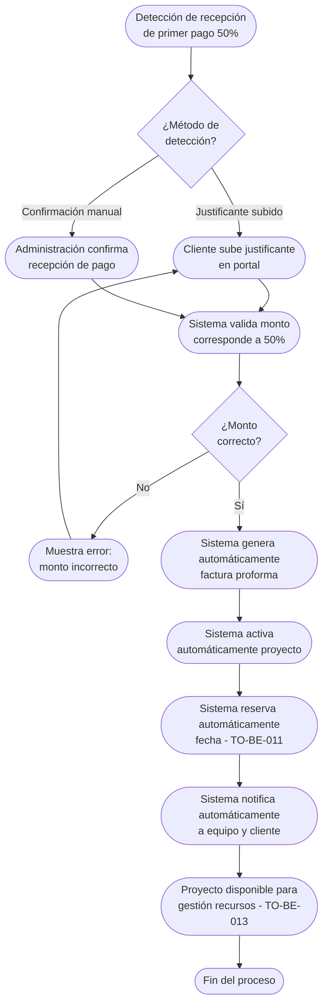

# Proceso TO-BE-010: Activación automática de proyectos tras pago

## 1. Objetivo y alcance (del proceso)

**Actor principal**: Sistema centralizado (con notificación a equipo)

**Evento disparador**: Detección automática de recepción de primer pago (50%) tras contrato firmado

**Propósito**: Detectar automáticamente recepción de primer pago (50%), generar automáticamente factura, activar el proyecto, reservar automáticamente fecha, notificar al equipo y cliente

**Scope funcional**: Desde detección de pago recibido hasta proyecto activado y fecha reservada

**Criterios de éxito**: 
- 100% de proyectos activados automáticamente al recibir pago
- Tiempo de activación < 5 minutos desde recepción de pago
- Factura generada automáticamente
- Fecha reservada automáticamente
- Notificaciones enviadas a equipo y cliente

**Frecuencia**: Por cada contrato firmado que recibe primer pago

**Duración objetivo**: < 5 minutos (proceso automático)

**Supuestos/restricciones**: 
- Contrato firmado por ambas partes (TO-BE-009)
- Pago se gestiona fuera del sistema (sin pasarela de pago integrada)
- Sistema detecta pago mediante justificante subido o confirmación manual

## 2. Contexto y actores

**Participantes:**
- **Sistema centralizado**: Detecta pago, genera factura, activa proyecto
- **Administración**: Confirma recepción de pago si es necesario
- **Cliente**: Realiza pago fuera del sistema
- **Equipo de proyecto**: Recibe notificación de activación

**Stakeholders clave:** 
- Equipo de proyecto (necesita saber que proyecto está activo)
- Cliente (espera confirmación de pago y activación)
- Administración (necesita factura generada)

**Dependencias:** 
- TO-BE-009: Contrato debe estar firmado
- TO-BE-011: Reserva automática de fechas (se activa en este proceso)
- Sistema de detección de pagos (justificantes o confirmación manual)

**Gobernanza:** 
- Sistema activa automáticamente al detectar pago
- Administración puede confirmar pago manualmente si es necesario

### 2.1 Dependencias entre procesos TO-BE

**Procesos prerequisito:** 
- TO-BE-009: Gestión de firmas digitales (contrato debe estar firmado)

**Procesos dependientes:** 
- TO-BE-011: Reserva automática de fechas (se ejecuta en este proceso)
- TO-BE-012: Registro de tiempo por proyecto (requiere proyecto activado)
- TO-BE-013: Gestión de recursos de producción (requiere proyecto activado)

**Orden de implementación sugerido:** Décimo (después de firma de contrato)

## 3. Transformación AS-IS → TO-BE (trazabilidad)

### 3.1 Procesos AS-IS relacionados

**Procesos AS-IS de referencia:** AS-IS-004: Primer pago y reserva de fecha (Corporativo y Bodas)

**Tipo de transformación:** Reimaginación con automatización completa

### 3.2 Análisis del estado actual (procesos AS-IS relacionados)

En el proceso AS-IS, el justificante de pago se envía al email corporativo y requiere procesamiento manual. La activación del proyecto tras pago requiere intervención manual. No hay automatización ni detección automática de pagos.

### 3.3 Problemas y oportunidades identificadas

**Dolores principales:**
1. Proceso manual de gestión de justificantes - justificantes enviados por email, requieren procesamiento manual _(Fuente: AS-IS-004 P1)_
2. Falta de automatización en activación de proyecto - activación tras pago requiere intervención manual _(Fuente: AS-IS-004 P2)_
3. Falta de visibilidad de estado de pago - no hay seguimiento automático de pagos pendientes o recibidos _(Fuente: AS-IS-004 P4)_

**Causas raíz:** 
- Procesamiento manual de justificantes
- Activación manual del proyecto
- No hay detección automática de pagos

**Oportunidades no explotadas:** 
- Detección automática de recepción de pago
- Generación automática de factura
- Activación automática del proyecto
- Notificaciones automáticas

**Riesgo de mantener AS-IS:** 
- Retrasos en activación de proyectos
- Olvidos de activación
- Falta de visibilidad del estado

### 3.4 Estrategia de transformación

**Principios de rediseño aplicados:**
- Detección automática de recepción de pago (justificante subido o confirmación manual)
- Generación automática de factura
- Activación automática del proyecto
- Notificaciones automáticas a equipo y cliente

**Justificación del nuevo diseño:** 
Este proceso TO-BE automatiza completamente la activación del proyecto al detectar el pago, eliminando intervención manual y garantizando que todos los proyectos se activen inmediatamente tras recibir el pago.

**Fuentes:** 
- `02-discovery/0201-interviews/020101-interview-01/minute-01.md` (Sección 8)
- `02-discovery/0202-prd/020202-as-is/processes/AS-IS-004-primer-pago-reserva/AS-IS-004-primer-pago-reserva.md`

## 4. Proceso TO-BE

### **4.1 Descripción detallada**

El proceso inicia cuando se detecta la recepción del primer pago (50%). El sistema:

1. **Detecta automáticamente la recepción de pago**:
   - Cliente sube justificante de pago en portal
   - Administración confirma recepción de pago manualmente
   - Sistema valida que el monto corresponde al 50% del presupuesto

2. **Genera automáticamente la factura proforma**:
   - Número de factura automático
   - Monto: 50% del presupuesto
   - Datos del cliente
   - Concepto: nombre proyecto/boda y fecha

3. **Activa automáticamente el proyecto**:
   - Estado cambia a "Activo"
   - Proyecto disponible para gestión de recursos y tiempo
   - Fecha de activación registrada

4. **Reserva automáticamente la fecha** (TO-BE-011):
   - Bloquea fecha en calendario
   - Integra con Google Calendar
   - Notifica reserva confirmada

5. **Notifica automáticamente**:
   - Al equipo de proyecto: proyecto activado, fecha reservada
   - Al cliente: pago recibido, factura generada, proyecto activado

6. **Registra la activación** en el sistema con timestamp y datos del pago

### **4.2 Diagrama de flujo**

### **4.3 Flujo principal (happy path)**

| # | Actor | Actividad | Sistema/Herramienta | Reglas de Negocio | Tiempo |
|---|-------|-----------|-------------------|-------------------|--------|
| 1 | Cliente/Administración | Sube justificante de pago o confirma recepción | Portal de cliente / Dashboard administración | Justificante debe ser válido Monto debe corresponder a 50% | < 5 min |
| 2 | Sistema | Valida que monto corresponde al 50% del presupuesto | Sistema de validación | Compara monto recibido con 50% del presupuesto Si no coincide, muestra error | < 1 min |
| 3 | Sistema | Genera automáticamente factura proforma | Motor de generación de facturas | Número automático, monto 50%, datos cliente, concepto | < 1 min |
| 4 | Sistema | Activa automáticamente el proyecto | Sistema de activación | Estado cambia a "Activo" Fecha de activación registrada | < 1 min |
| 5 | Sistema | Reserva automáticamente la fecha (TO-BE-011) | Sistema de reserva de fechas | Bloquea fecha en calendario Integra con Google Calendar | < 1 min |
| 6 | Sistema | Notifica automáticamente al equipo de proyecto | Sistema de notificaciones | Notificación incluye: proyecto activado, fecha reservada, datos cliente | < 1 min |
| 7 | Sistema | Notifica automáticamente al cliente | Sistema de notificaciones | Notificación incluye: pago recibido, factura generada, proyecto activado | < 1 min |
| 8 | Sistema | Registra activación en sistema | Base de datos | Timestamp, datos del pago, factura generada, fecha reservada | < 10 seg |

### **4.5 Puntos de decisión y variantes**

- **Monto correcto vs incorrecto**: Si monto no corresponde a 50%, sistema muestra error y requiere corrección
- **Justificante válido vs inválido**: Si justificante no es válido, sistema requiere nuevo justificante
- **Fecha ya reservada**: Si fecha ya está reservada, sistema notifica conflicto y requiere resolución

### **4.6 Excepciones y manejo de errores**

- **Monto incorrecto**: Sistema muestra error y requiere corrección antes de activar
- **Justificante inválido**: Sistema requiere nuevo justificante válido
- **Fecha no disponible**: Si fecha ya está reservada, sistema notifica conflicto y requiere resolución
- **Error en generación de factura**: Si falla generación, sistema notifica a administración para generación manual

### **4.7 Riesgos del proceso y mitigaciones**

| Riesgo | Probabilidad | Impacto | Mitigación |
|--------|--------------|---------|------------|
| Pago no detectado | Media | Alto | Múltiples métodos de detección (justificante, confirmación manual), notificaciones si no se detecta |
| Proyecto no se activa | Baja | Alto | Activación automática, notificaciones, seguimiento de estado |
| Fecha no se reserva | Baja | Alto | Reserva automática integrada, validación de disponibilidad, notificaciones si falla |

### **4.8 Preguntas abiertas**

- ¿Qué hacer si cliente paga monto diferente al 50%? ¿Se acepta o se rechaza?
- ¿Cuánto tiempo tiene cliente para subir justificante después de realizar pago?
- ¿Se requiere confirmación de administración para todos los pagos o solo casos especiales?
- ¿Qué hacer si fecha ya está reservada cuando se activa proyecto?

### **4.9 Ideas adicionales**

- Integración con sistema bancario para detección automática de pagos
- Notificaciones por SMS además de email
- Portal donde cliente puede ver estado de pago y activación en tiempo real
- Análisis de tiempo promedio desde pago hasta activación

---

*GEN-BY:PROMPT-to-be · hash:tobe010_activacion_automatica_proyectos_20260120 · 2026-01-20T00:00:00Z*
