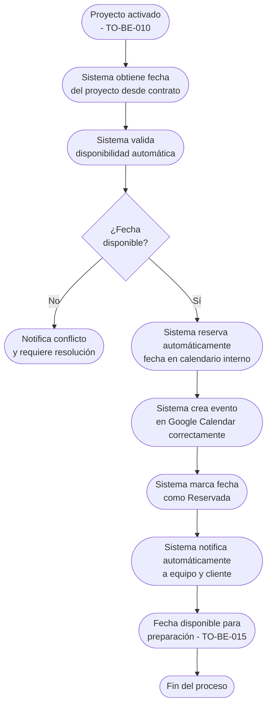

# Proceso TO-BE-011: Reserva automática de fechas

## 1. Objetivo y alcance (del proceso)

**Actor principal**: Sistema centralizado

**Evento disparador**: Activación automática de proyecto tras pago (TO-BE-010) o reserva manual de fecha

**Propósito**: Bloquear automáticamente fecha en calendario al recibir pago, integrar con Google Calendar correctamente, notificar reserva confirmada, gestionar conflictos de disponibilidad

**Scope funcional**: Desde activación de proyecto hasta fecha reservada y bloqueada en calendario

**Criterios de éxito**: 
- 100% de fechas reservadas automáticamente al activar proyecto
- Integración correcta con Google Calendar sin comportamientos erráticos
- 0% de solapamientos de fechas
- Notificación automática de reserva confirmada

**Frecuencia**: Por cada proyecto activado

**Duración objetivo**: < 1 minuto (proceso automático)

**Supuestos/restricciones**: 
- Proyecto activado (TO-BE-010)
- Fecha del proyecto/boda definida en contrato
- Integración con Google Calendar configurada correctamente

## 2. Contexto y actores

**Participantes:**
- **Sistema centralizado**: Reserva fecha automáticamente
- **Google Calendar**: Sincronización de fechas
- **Equipo de proyecto**: Recibe notificación de fecha reservada
- **Cliente**: Recibe confirmación de fecha reservada

**Stakeholders clave:** 
- Equipo de proyecto (necesita saber fecha reservada)
- Cliente (espera confirmación de fecha)
- Administración (necesita visibilidad de fechas reservadas)

**Dependencias:** 
- TO-BE-010: Proyecto debe estar activado
- Integración con Google Calendar
- Fecha del proyecto definida en contrato

**Gobernanza:** 
- Sistema reserva automáticamente
- Administración puede ajustar fechas si es necesario

### 2.1 Dependencias entre procesos TO-BE

**Procesos prerequisito:** 
- TO-BE-010: Activación automática de proyectos (proyecto debe estar activado)

**Procesos dependientes:** 
- TO-BE-015: Preparación de bodas (requiere fecha reservada)
- TO-BE-016: Gestión del día de la boda (requiere fecha reservada)

**Orden de implementación sugerido:** Undécimo (después de activación)

## 3. Transformación AS-IS → TO-BE (trazabilidad)

### 3.1 Procesos AS-IS relacionados

**Procesos AS-IS de referencia:** AS-IS-004: Primer pago y reserva de fecha (Corporativo y Bodas)

**Tipo de transformación:** Reimaginación con automatización e integración correcta

### 3.2 Análisis del estado actual (procesos AS-IS relacionados)

En el proceso AS-IS, Google Calendar tiene problemas - reserva de fechas puede tener errores de sincronización. La fecha queda reservada/bloqueada pero sin integración correcta ni notificaciones automáticas.

### 3.3 Problemas y oportunidades identificadas

**Dolores principales:**
1. Google Calendar con problemas - reserva de fechas puede tener errores de sincronización _(Fuente: AS-IS-004 P3)_

**Causas raíz:** 
- Integración incorrecta con Google Calendar
- Comportamientos erráticos en sincronización
- No hay validación de disponibilidad antes de reservar

**Oportunidades no explotadas:** 
- Integración correcta con Google Calendar
- Validación automática de disponibilidad
- Notificaciones automáticas de reserva
- Gestión automática de conflictos

**Riesgo de mantener AS-IS:** 
- Errores en reserva de fechas
- Solapamientos no detectados
- Falta de visibilidad de fechas reservadas

### 3.4 Estrategia de transformación

**Principios de rediseño aplicados:**
- Reserva automática al activar proyecto
- Integración correcta con Google Calendar sin comportamientos erráticos
- Validación automática de disponibilidad antes de reservar
- Notificaciones automáticas de reserva confirmada

**Justificación del nuevo diseño:** 
Este proceso TO-BE automatiza completamente la reserva de fechas con integración correcta de Google Calendar, eliminando errores de sincronización y garantizando que todas las fechas se reserven correctamente.

**Fuentes:** 
- `02-discovery/0201-interviews/020101-interview-01/minute-01.md` (Sección 6, 8)
- `02-discovery/0202-prd/020202-as-is/processes/AS-IS-004-primer-pago-reserva/AS-IS-004-primer-pago-reserva.md`

## 4. Proceso TO-BE

### **4.1 Descripción detallada**

El proceso inicia automáticamente cuando un proyecto se activa (TO-BE-010). El sistema:

1. **Obtiene la fecha del proyecto** desde el contrato firmado

2. **Valida disponibilidad automáticamente**:
   - Consulta calendario de fechas reservadas
   - Verifica que fecha no esté ya bloqueada
   - Si hay conflicto, notifica y requiere resolución

3. **Reserva automáticamente la fecha**:
   - Bloquea fecha en calendario interno
   - Crea evento en Google Calendar correctamente (sin comportamientos erráticos)
   - Marca fecha como "Reservada"

4. **Notifica automáticamente**:
   - Al equipo de proyecto: fecha reservada confirmada
   - Al cliente: fecha reservada confirmada

5. **Registra la reserva** en el sistema con timestamp y datos del proyecto

### **4.2 Diagrama de flujo**

### **4.3 Flujo principal (happy path)**

| # | Actor | Actividad | Sistema/Herramienta | Reglas de Negocio | Tiempo |
|---|-------|-----------|-------------------|-------------------|--------|
| 1 | Sistema | Obtiene fecha del proyecto desde contrato firmado | Sistema centralizado | Fecha definida en contrato Extracción automática | < 10 seg |
| 2 | Sistema | Valida disponibilidad automática consultando calendario | Sistema de validación | Consulta fechas reservadas Verifica que fecha no esté bloqueada | < 30 seg |
| 3 | Sistema | Si fecha disponible, reserva automáticamente bloqueando fecha en calendario interno | Calendario interno | Bloqueo inmediato Fecha marcada como "Reservada" | < 30 seg |
| 4 | Sistema | Crea evento en Google Calendar correctamente (sin comportamientos erráticos) | Integración Google Calendar | Evento creado con detalles del proyecto Sincronización correcta sin errores | < 30 seg |
| 5 | Sistema | Marca fecha como "Reservada" en sistema | Base de datos | Estado visible para seguimiento Fecha vinculada al proyecto | < 10 seg |
| 6 | Sistema | Notifica automáticamente al equipo de proyecto | Sistema de notificaciones | Notificación incluye: fecha reservada, proyecto, cliente | < 1 min |
| 7 | Sistema | Notifica automáticamente al cliente | Sistema de notificaciones | Notificación incluye: fecha reservada confirmada | < 1 min |

### **4.5 Puntos de decisión y variantes**

- **Fecha disponible vs no disponible**: Si fecha no está disponible, sistema notifica conflicto y requiere resolución
- **Integración Google Calendar exitosa vs fallida**: Si falla integración, sistema notifica pero mantiene reserva en calendario interno

### **4.6 Excepciones y manejo de errores**

- **Fecha ya reservada**: Si fecha ya está reservada, sistema notifica conflicto y requiere resolución manual
- **Error en integración Google Calendar**: Si falla integración, sistema mantiene reserva en calendario interno y notifica para sincronización manual
- **Fecha no definida en contrato**: Si fecha no está definida, sistema notifica y requiere definir fecha antes de reservar

### **4.7 Riesgos del proceso y mitigaciones**

| Riesgo | Probabilidad | Impacto | Mitigación |
|--------|--------------|---------|------------|
| Fecha no se reserva | Baja | Alto | Reserva automática, validación de disponibilidad, notificaciones si falla |
| Solapamiento de fechas | Baja | Alto | Validación automática antes de reservar, consulta de fechas reservadas |
| Error en integración Google Calendar | Media | Medio | Reserva en calendario interno como respaldo, notificaciones si falla integración |

### **4.8 Preguntas abiertas**

- ¿Qué hacer si fecha ya está reservada? ¿Se permite solapamiento en casos especiales?
- ¿Se requiere confirmación manual de reserva o es completamente automática?
- ¿Qué hacer si fecha cambia después de reservar? ¿Se puede reagendar automáticamente?

### **4.9 Ideas adicionales**

- Vista de calendario con todas las fechas reservadas visible para equipo
- Alertas automáticas si hay solapamientos potenciales
- Integración con múltiples calendarios (Google, Outlook, etc.)
- Análisis de disponibilidad para optimizar asignación de fechas

---

*GEN-BY:PROMPT-to-be · hash:tobe011_reserva_automatica_fechas_20260120 · 2026-01-20T00:00:00Z*
