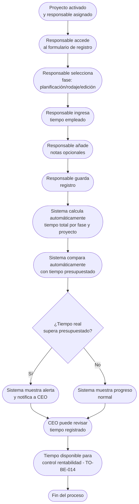

# Proceso TO-BE-012: Registro de tiempo por proyecto

## 1. Objetivo y alcance (del proceso)

**Actor principal**: Responsable del proyecto

**Evento disparador**: Proyecto activado (TO-BE-010) y responsable asignado

**Propósito**: Capturar facilitada de tiempo empleado por responsable de proyecto, con desglose por fase (planificación, rodaje, edición), comparación automática con tiempo presupuestado

**Scope funcional**: Desde activación del proyecto hasta cierre, registro continuo de tiempo empleado

**Criterios de éxito**: 
- 100% de tiempo empleado registrado por fase
- Comparación automática con tiempo presupuestado
- Alertas cuando tiempo real supera presupuestado
- Tiempo de registro < 2 minutos por sesión

**Frecuencia**: Continua durante ejecución del proyecto

**Duración objetivo**: < 2 minutos por registro de tiempo

**Supuestos/restricciones**: 
- Proyecto activado (TO-BE-010)
- Responsable asignado
- Tiempo presupuestado definido en presupuesto

## 2. Contexto y actores

**Participantes:**
- **Responsable del proyecto**: Registra tiempo empleado
- **Sistema centralizado**: Facilita registro y compara con presupuestado
- **CEO (Javi)**: Revisa tiempo empleado para control de rentabilidad

**Stakeholders clave:** 
- Responsable del proyecto (necesita registrar tiempo fácilmente)
- CEO (necesita visibilidad de tiempo para control de rentabilidad)
- Administración (necesita datos para análisis)

**Dependencias:** 
- TO-BE-010: Proyecto debe estar activado
- Tiempo presupuestado definido en presupuesto
- TO-BE-014: Control de rentabilidad (usa tiempo registrado)

**Gobernanza:** 
- Responsable registra tiempo durante ejecución
- CEO puede revisar tiempo registrado

### 2.1 Dependencias entre procesos TO-BE

**Procesos prerequisito:** 
- TO-BE-010: Activación automática de proyectos (proyecto debe estar activado)

**Procesos dependientes:** 
- TO-BE-014: Control de rentabilidad en tiempo real (usa tiempo registrado)

**Orden de implementación sugerido:** Duodécimo (después de activación)

## 3. Transformación AS-IS → TO-BE (trazabilidad)

### 3.1 Procesos AS-IS relacionados

**Procesos AS-IS de referencia:** AS-IS-005: Producción y postproducción corporativa

**Tipo de transformación:** Reimaginación con registro facilitado

### 3.2 Análisis del estado actual (procesos AS-IS relacionados)

En el proceso AS-IS, el responsable registra tiempo empleado manualmente durante ejecución, pero es propenso a olvidos. No hay comparación automática con tiempo presupuestado ni alertas cuando se supera.

### 3.3 Problemas y oportunidades identificadas

**Dolores principales:**
1. Registro manual de tiempos - responsable debe registrar tiempo empleado manualmente, propenso a olvidos _(Fuente: AS-IS-005 P2)_
2. Control de rentabilidad limitado - aunque ONGAKU no trabaja por horas, es fundamental conocer tiempo real vs presupuestado pero no hay sistema claro _(Fuente: AS-IS-005 P5)_

**Causas raíz:** 
- Registro completamente manual
- No hay facilitación del proceso
- No hay comparación automática
- Dependencia de memoria para recordar registrar

**Oportunidades no explotadas:** 
- Registro facilitado con formulario rápido
- Desglose por fase para análisis detallado
- Comparación automática con tiempo presupuestado
- Alertas cuando se supera tiempo presupuestado

**Riesgo de mantener AS-IS:** 
- Olvidos de registro de tiempo
- Falta de visibilidad de rentabilidad
- Dificultad para evaluar si proyectos están bien presupuestados

### 3.4 Estrategia de transformación

**Principios de rediseño aplicados:**
- Registro facilitado con formulario rápido y campos predefinidos
- Desglose por fase (planificación, rodaje, edición) para análisis detallado
- Comparación automática con tiempo presupuestado
- Alertas automáticas cuando tiempo real supera presupuestado

**Justificación del nuevo diseño:** 
Este proceso TO-BE facilita el registro de tiempo mediante formulario rápido con campos predefinidos, permitiendo desglose por fase y comparación automática con tiempo presupuestado, mejorando el control de rentabilidad.

**Fuentes:** 
- `02-discovery/0201-interviews/020101-interview-01/minute-01.md` (Sección 3)
- `02-discovery/0202-prd/020202-as-is/processes/AS-IS-005-produccion-postproduccion-corporativa/AS-IS-005-produccion-postproduccion-corporativa.md`

## 4. Proceso TO-BE

### **4.1 Descripción detallada**

El proceso inicia cuando el proyecto está activado y el responsable está asignado. Durante la ejecución del proyecto:

1. **Responsable accede al formulario de registro de tiempo**:
   - Formulario rápido con campos predefinidos
   - Acceso desde dashboard del proyecto
   - Registro por sesión de trabajo

2. **Responsable registra tiempo empleado**:
   - Selecciona fase (planificación, rodaje, edición)
   - Ingresa tiempo empleado (horas, minutos)
   - Añade notas opcionales sobre la actividad
   - Guarda registro

3. **Sistema calcula automáticamente**:
   - Tiempo total empleado por fase
   - Tiempo total empleado en proyecto
   - Comparación con tiempo presupuestado
   - Diferencia (positiva o negativa)

4. **Sistema muestra alertas automáticas**:
   - Si tiempo real supera presupuestado
   - Si se acerca al límite presupuestado
   - Visualización de progreso

5. **CEO puede revisar tiempo registrado**:
   - Dashboard con tiempo por fase
   - Comparación con presupuestado
   - Análisis de rentabilidad

### **4.2 Diagrama de flujo**

### **4.3 Flujo principal (happy path)**

| # | Actor | Actividad | Sistema/Herramienta | Reglas de Negocio | Tiempo |
|---|-------|-----------|-------------------|-------------------|--------|
| 1 | Responsable | Accede al formulario de registro de tiempo desde dashboard del proyecto | Dashboard del proyecto | Formulario rápido con campos predefinidos Acceso fácil durante ejecución | < 30 seg |
| 2 | Responsable | Selecciona fase (planificación, rodaje, edición) | Formulario de registro | Selección rápida de fase Puede registrar múltiples fases en misma sesión | < 10 seg |
| 3 | Responsable | Ingresa tiempo empleado (horas, minutos) | Formulario de registro | Validación de formato Tiempo mínimo/máximo razonable | < 30 seg |
| 4 | Responsable | Añade notas opcionales sobre la actividad | Formulario de registro | Campo opcional para contexto Máximo de caracteres | < 1 min |
| 5 | Responsable | Guarda registro | Sistema centralizado | Registro guardado con timestamp Vinculado al proyecto y fase | < 10 seg |
| 6 | Sistema | Calcula automáticamente tiempo total por fase y proyecto | Motor de cálculo | Suma de todos los registros por fase Total general del proyecto | < 10 seg |
| 7 | Sistema | Compara automáticamente con tiempo presupuestado | Sistema de comparación | Compara tiempo real vs presupuestado Calcula diferencia (positiva o negativa) | < 10 seg |
| 8 | Sistema | Muestra alertas si tiempo real supera presupuestado | Sistema de alertas | Alerta visual en dashboard Notificación a CEO si supera umbral | < 10 seg |
| 9 | CEO | Revisa tiempo registrado en dashboard | Dashboard de rentabilidad | Visualización de tiempo por fase Comparación con presupuestado Análisis de rentabilidad | Variable |

### **4.5 Puntos de decisión y variantes**

- **Registro diario vs acumulado**: Responsable puede registrar diariamente o acumular y registrar al final
- **Múltiples fases en misma sesión**: Puede registrar tiempo para múltiples fases en una sola sesión
- **Corrección de registros**: Puede corregir registros anteriores si hay error

### **4.6 Excepciones y manejo de errores**

- **Tiempo no registrado**: Si responsable no registra tiempo, sistema puede enviar recordatorios
- **Error en registro**: Si hay error, responsable puede corregir registro anterior
- **Tiempo presupuestado no definido**: Si no hay tiempo presupuestado, sistema no puede comparar pero permite registro

### **4.7 Riesgos del proceso y mitigaciones**

| Riesgo | Probabilidad | Impacto | Mitigación |
|--------|--------------|---------|------------|
| Olvido de registro de tiempo | Media | Medio | Formulario rápido, recordatorios automáticos, registro acumulado permitido |
| Error en tiempo registrado | Baja | Medio | Posibilidad de corrección, validación de formato, revisión por CEO |
| Tiempo no se registra nunca | Baja | Alto | Recordatorios automáticos, seguimiento de proyectos sin tiempo registrado |

### **4.8 Preguntas abiertas**

- ¿Con qué frecuencia debe registrarse el tiempo? ¿Diario, semanal, al final?
- ¿Se requiere registro en tiempo real o puede ser acumulado?
- ¿Qué hacer si responsable no registra tiempo? ¿Se bloquea proyecto?
- ¿Se requiere aprobación del tiempo registrado o es automático?

### **4.9 Ideas adicionales**

- Registro automático de tiempo mediante tracking de actividad (opcional)
- Integración con herramientas de edición para detectar tiempo de trabajo
- Análisis predictivo de tiempo restante basado en tiempo empleado
- Reportes automáticos de tiempo por proyecto para CEO

---

*GEN-BY:PROMPT-to-be · hash:tobe012_registro_tiempo_proyecto_20260120 · 2026-01-20T00:00:00Z*
