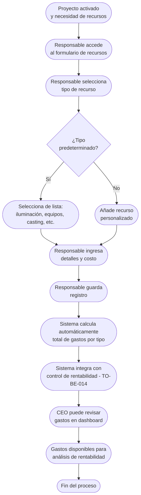

# Proceso TO-BE-013: Gestión de recursos de producción

## 1. Objetivo y alcance (del proceso)

**Actor principal**: Responsable del proyecto

**Evento disparador**: Proyecto activado (TO-BE-010) y necesidad de recursos

**Propósito**: Registro centralizado de recursos necesarios (iluminación, equipos, casting, localización, transporte, alojamiento), seguimiento de gastos, integración con control de rentabilidad

**Scope funcional**: Desde activación del proyecto hasta cierre, registro y seguimiento de recursos y gastos

**Criterios de éxito**: 
- 100% de recursos registrados centralizadamente
- Seguimiento de gastos en tiempo real
- Integración con control de rentabilidad
- Tiempo de registro < 3 minutos por recurso

**Frecuencia**: Continua durante ejecución del proyecto

**Duración objetivo**: < 3 minutos por registro de recurso

**Supuestos/restricciones**: 
- Proyecto activado (TO-BE-010)
- Responsable asignado
- TO-BE-014: Control de rentabilidad (usa gastos registrados)

## 2. Contexto y actores

**Participantes:**
- **Responsable del proyecto**: Registra recursos y gastos
- **Sistema centralizado**: Centraliza registro y calcula gastos
- **CEO (Javi)**: Revisa gastos para control de rentabilidad
- **Administración**: Gestiona pagos a proveedores

**Stakeholders clave:** 
- Responsable del proyecto (necesita registrar recursos fácilmente)
- CEO (necesita visibilidad de gastos para rentabilidad)
- Administración (necesita datos para pagos)

**Dependencias:** 
- TO-BE-010: Proyecto debe estar activado
- TO-BE-014: Control de rentabilidad (usa gastos registrados)

**Gobernanza:** 
- Responsable registra recursos durante ejecución
- CEO puede revisar gastos

### 2.1 Dependencias entre procesos TO-BE

**Procesos prerequisito:** 
- TO-BE-010: Activación automática de proyectos (proyecto debe estar activado)

**Procesos dependientes:** 
- TO-BE-014: Control de rentabilidad en tiempo real (usa gastos registrados)

**Orden de implementación sugerido:** Decimotercero (después de activación)

## 3. Transformación AS-IS → TO-BE (trazabilidad)

### 3.1 Procesos AS-IS relacionados

**Procesos AS-IS de referencia:** AS-IS-005: Producción y postproducción corporativa

**Tipo de transformación:** Reimaginación con centralización

### 3.2 Análisis del estado actual (procesos AS-IS relacionados)

En el proceso AS-IS, la gestión de recursos (iluminación con gaffer, alquiler de equipos, casting, localización, alquiler de coches, reserva de hotel, compra de billetes) no está centralizada. No hay seguimiento de gastos ni integración con control de rentabilidad.

### 3.3 Problemas y oportunidades identificadas

**Dolores principales:**
1. Falta de trazabilidad de recursos - gestión de recursos no está centralizada _(Fuente: AS-IS-005 P3)_

**Causas raíz:** 
- Recursos gestionados de forma dispersa
- No hay registro centralizado
- No hay seguimiento de gastos
- No hay integración con control de rentabilidad

**Oportunidades no explotadas:** 
- Registro centralizado de recursos
- Seguimiento de gastos en tiempo real
- Integración con control de rentabilidad
- Elementos predeterminados con posibilidad de añadir otros

**Riesgo de mantener AS-IS:** 
- Falta de visibilidad de gastos
- Dificultad para controlar rentabilidad
- Recursos no registrados

### 3.4 Estrategia de transformación

**Principios de rediseño aplicados:**
- Registro centralizado de recursos
- Elementos predeterminados (iluminación, equipos, casting, localización, transporte, alojamiento) con posibilidad de añadir otros
- Seguimiento de gastos en tiempo real
- Integración con control de rentabilidad

**Justificación del nuevo diseño:** 
Este proceso TO-BE centraliza completamente la gestión de recursos, permitiendo registro estructurado con elementos predeterminados pero flexibilidad para añadir otros, y seguimiento de gastos en tiempo real para control de rentabilidad.

**Fuentes:** 
- `02-discovery/0201-interviews/020101-interview-01/minute-01.md` (Sección 3)
- `02-discovery/0202-prd/020202-as-is/processes/AS-IS-005-produccion-postproduccion-corporativa/AS-IS-005-produccion-postproduccion-corporativa.md`

## 4. Proceso TO-BE

### **4.1 Descripción detallada**

El proceso inicia cuando el proyecto está activado y el responsable necesita registrar recursos. Durante la ejecución:

1. **Responsable accede al formulario de recursos**:
   - Formulario con elementos predeterminados
   - Posibilidad de añadir recursos personalizados
   - Acceso desde dashboard del proyecto

2. **Responsable registra recurso**:
   - Selecciona tipo de recurso (iluminación, equipos, casting, localización, transporte, alojamiento, otros)
   - Ingresa detalles del recurso
   - Ingresa costo/gasto
   - Añade notas opcionales
   - Guarda registro

3. **Sistema calcula automáticamente**:
   - Total de gastos por tipo de recurso
   - Total de gastos del proyecto
   - Integración con control de rentabilidad (TO-BE-014)

4. **CEO puede revisar gastos**:
   - Dashboard con gastos por tipo
   - Comparación con presupuesto
   - Análisis de rentabilidad

### **4.2 Diagrama de flujo**

### **4.3 Flujo principal (happy path)**

| # | Actor | Actividad | Sistema/Herramienta | Reglas de Negocio | Tiempo |
|---|-------|-----------|-------------------|-------------------|--------|
| 1 | Responsable | Accede al formulario de recursos desde dashboard del proyecto | Dashboard del proyecto | Formulario con elementos predeterminados Acceso fácil durante ejecución | < 30 seg |
| 2 | Responsable | Selecciona tipo de recurso (iluminación, equipos, casting, localización, transporte, alojamiento, otros) | Formulario de recursos | Elementos predeterminados con posibilidad de añadir otros Selección rápida | < 30 seg |
| 3 | Responsable | Ingresa detalles del recurso y costo/gasto | Formulario de recursos | Validación de formato de costo Campos obligatorios: tipo, costo | < 2 min |
| 4 | Responsable | Añade notas opcionales | Formulario de recursos | Campo opcional para contexto Máximo de caracteres | < 1 min |
| 5 | Responsable | Guarda registro | Sistema centralizado | Registro guardado con timestamp Vinculado al proyecto y tipo de recurso | < 10 seg |
| 6 | Sistema | Calcula automáticamente total de gastos por tipo y proyecto | Motor de cálculo | Suma de todos los gastos por tipo Total general del proyecto | < 10 seg |
| 7 | Sistema | Integra con control de rentabilidad (TO-BE-014) | Sistema de integración | Gastos disponibles para análisis de rentabilidad Comparación con ingresos previstos | < 10 seg |
| 8 | CEO | Revisa gastos en dashboard | Dashboard de rentabilidad | Visualización de gastos por tipo Comparación con presupuesto Análisis de rentabilidad | Variable |

### **4.5 Puntos de decisión y variantes**

- **Recurso predeterminado vs personalizado**: Puede seleccionar de lista o añadir recurso personalizado
- **Gasto único vs recurrente**: Puede registrar gasto único o recurrente
- **Corrección de gastos**: Puede corregir gastos anteriores si hay error

### **4.6 Excepciones y manejo de errores**

- **Gasto no registrado**: Si responsable no registra gasto, sistema puede enviar recordatorios
- **Error en registro**: Si hay error, responsable puede corregir registro anterior
- **Gasto fuera de presupuesto**: Si gasto supera presupuesto, sistema puede alertar

### **4.7 Riesgos del proceso y mitigaciones**

| Riesgo | Probabilidad | Impacto | Mitigación |
|--------|--------------|---------|------------|
| Gastos no registrados | Media | Alto | Formulario fácil, recordatorios automáticos, integración con facturas |
| Error en gasto registrado | Baja | Medio | Posibilidad de corrección, validación de formato, revisión por CEO |
| Gastos no se registran nunca | Baja | Alto | Recordatorios automáticos, seguimiento de proyectos sin gastos registrados |

### **4.8 Preguntas abiertas**

- ¿Se requiere aprobación de gastos antes de registrar o es automático?
- ¿Qué hacer si gasto supera presupuesto? ¿Se bloquea o se alerta?
- ¿Se requiere justificante de gasto (factura) para registrar?
- ¿Se requiere categorización adicional de gastos?

### **4.9 Ideas adicionales**

- Integración con facturas de proveedores para registro automático
- Análisis predictivo de gastos basado en proyectos similares
- Alertas automáticas cuando gastos se acercan al presupuesto
- Reportes automáticos de gastos por proyecto para CEO

---

*GEN-BY:PROMPT-to-be · hash:tobe013_gestion_recursos_produccion_20260120 · 2026-01-20T00:00:00Z*
