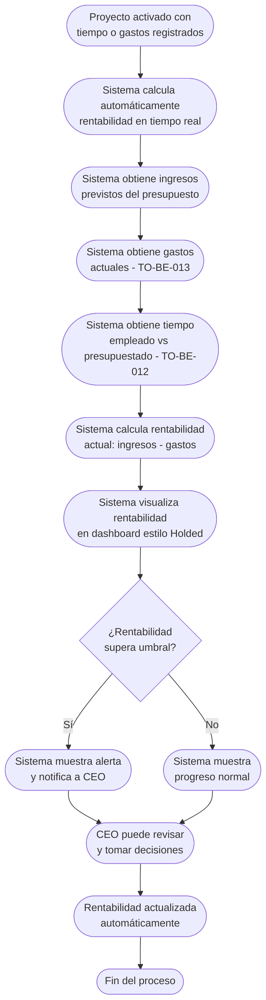

# Proceso TO-BE-014: Control de rentabilidad en tiempo real

## 1. Objetivo y alcance (del proceso)

**Actor principal**: CEO (Javi) / Responsable del proyecto

**Evento disparador**: Proyecto activado (TO-BE-010) con tiempo y gastos registrados

**Propósito**: Visualización continua de ingresos previstos vs gastos actuales por proyecto, alertas cuando se supera umbral de rentabilidad, métricas de éxito del proyecto

**Scope funcional**: Desde activación del proyecto hasta cierre, visualización continua de rentabilidad

**Criterios de éxito**: 
- 100% de proyectos con visibilidad de rentabilidad en tiempo real
- Alertas automáticas cuando se supera umbral
- Métricas de éxito del proyecto visibles
- Tiempo de actualización < 1 minuto

**Frecuencia**: Continua durante ejecución del proyecto

**Duración objetivo**: Visualización instantánea (actualización automática)

**Supuestos/restricciones**: 
- Proyecto activado (TO-BE-010)
- Ingresos previstos definidos en presupuesto
- Tiempo y gastos registrados (TO-BE-012, TO-BE-013)

## 2. Contexto y actores

**Participantes:**
- **CEO (Javi)**: Revisa rentabilidad para toma de decisiones
- **Responsable del proyecto**: Ve rentabilidad de su proyecto
- **Sistema centralizado**: Calcula y visualiza rentabilidad en tiempo real

**Stakeholders clave:** 
- CEO (necesita visibilidad de rentabilidad para decisiones)
- Responsable del proyecto (necesita saber si proyecto es rentable)
- Administración (necesita datos para análisis)

**Dependencias:** 
- TO-BE-010: Proyecto debe estar activado
- TO-BE-012: Tiempo registrado
- TO-BE-013: Gastos registrados
- Ingresos previstos del presupuesto

**Gobernanza:** 
- CEO puede revisar rentabilidad de todos los proyectos
- Responsable puede ver rentabilidad de su proyecto

### 2.1 Dependencias entre procesos TO-BE

**Procesos prerequisito:** 
- TO-BE-010: Activación automática de proyectos
- TO-BE-012: Registro de tiempo por proyecto
- TO-BE-013: Gestión de recursos de producción

**Procesos dependientes:** Ninguno (proceso de visualización y control)

**Orden de implementación sugerido:** Decimocuarto (después de registro de tiempo y gastos)

## 3. Transformación AS-IS → TO-BE (trazabilidad)

### 3.1 Procesos AS-IS relacionados

**Procesos AS-IS de referencia:** AS-IS-005: Producción y postproducción corporativa

**Tipo de transformación:** Reimaginación con visualización en tiempo real

### 3.2 Análisis del estado actual (procesos AS-IS relacionados)

En el proceso AS-IS, no se puede ver rentabilidad en tiempo real - solo al final. Se visualiza ingresos previstos vs gastos finales (estilo Holded) pero no durante ejecución. No hay alertas ni métricas de éxito del proyecto.

### 3.3 Problemas y oportunidades identificadas

**Dolores principales:**
1. Falta de visibilidad de rentabilidad en tiempo real - no se puede ver ingresos vs gastos durante ejecución, solo al final _(Fuente: AS-IS-005 P1)_
2. Control de rentabilidad limitado - aunque ONGAKU no trabaja por horas, es fundamental conocer tiempo real vs presupuestado pero no hay sistema claro _(Fuente: AS-IS-005 P5)_

**Causas raíz:** 
- Visualización solo al final del proyecto
- No hay cálculo en tiempo real
- No hay alertas cuando se supera umbral
- No hay métricas de éxito

**Oportunidades no explotadas:** 
- Visualización en tiempo real de rentabilidad
- Alertas automáticas cuando se supera umbral
- Métricas de éxito del proyecto
- Comparación con proyectos similares

**Riesgo de mantener AS-IS:** 
- Falta de visibilidad durante ejecución
- No se detectan problemas de rentabilidad a tiempo
- Dificultad para tomar decisiones correctivas

### 3.4 Estrategia de transformación

**Principios de rediseño aplicados:**
- Visualización continua en tiempo real de ingresos vs gastos
- Actualización automática cuando se registran tiempo o gastos
- Alertas automáticas cuando se supera umbral de rentabilidad
- Métricas de éxito del proyecto visibles

**Justificación del nuevo diseño:** 
Este proceso TO-BE proporciona visibilidad continua de rentabilidad en tiempo real, permitiendo detectar problemas a tiempo y tomar decisiones correctivas, mejorando significativamente el control de rentabilidad.

**Fuentes:** 
- `02-discovery/0201-interviews/020101-interview-01/minute-01.md` (Sección 3)
- `02-discovery/0202-prd/020202-as-is/processes/AS-IS-005-produccion-postproduccion-corporativa/AS-IS-005-produccion-postproduccion-corporativa.md`

## 4. Proceso TO-BE

### **4.1 Descripción detallada**

El proceso inicia cuando el proyecto está activado y hay tiempo o gastos registrados. El sistema:

1. **Calcula automáticamente rentabilidad en tiempo real**:
   - Ingresos previstos (del presupuesto)
   - Gastos actuales (de TO-BE-013)
   - Tiempo empleado vs presupuestado (de TO-BE-012)
   - Rentabilidad actual (ingresos - gastos)

2. **Visualiza rentabilidad en dashboard**:
   - Gráfico de ingresos vs gastos (estilo Holded)
   - Indicador de rentabilidad (positiva/negativa)
   - Progreso del proyecto
   - Métricas de éxito

3. **Muestra alertas automáticas**:
   - Si gastos superan umbral de rentabilidad
   - Si tiempo empleado supera presupuestado
   - Si rentabilidad es negativa

4. **Actualiza automáticamente**:
   - Cada vez que se registra tiempo o gasto
   - Visualización siempre actualizada

5. **CEO puede revisar**:
   - Rentabilidad de todos los proyectos
   - Comparación entre proyectos
   - Análisis de tendencias

### **4.2 Diagrama de flujo**

### **4.3 Flujo principal (happy path)**

| # | Actor | Actividad | Sistema/Herramienta | Reglas de Negocio | Tiempo |
|---|-------|-----------|-------------------|-------------------|--------|
| 1 | Sistema | Obtiene ingresos previstos del presupuesto | Base de datos | Ingresos del presupuesto aceptado Actualizado si hay cambios | < 10 seg |
| 2 | Sistema | Obtiene gastos actuales registrados (TO-BE-013) | Base de datos | Suma de todos los gastos registrados Actualizado en tiempo real | < 10 seg |
| 3 | Sistema | Obtiene tiempo empleado vs presupuestado (TO-BE-012) | Base de datos | Tiempo real vs tiempo presupuestado Actualizado en tiempo real | < 10 seg |
| 4 | Sistema | Calcula rentabilidad actual (ingresos - gastos) | Motor de cálculo | Rentabilidad = Ingresos previstos - Gastos actuales Actualizado automáticamente | < 10 seg |
| 5 | Sistema | Visualiza rentabilidad en dashboard estilo Holded | Dashboard de rentabilidad | Gráfico de ingresos vs gastos Indicador de rentabilidad Progreso del proyecto | Instantáneo |
| 6 | Sistema | Evalúa si rentabilidad supera umbral configurado | Sistema de evaluación | Umbral configurable Comparación automática | < 10 seg |
| 7 | Sistema | Si supera umbral, muestra alerta y notifica a CEO | Sistema de alertas | Alerta visual en dashboard Notificación a CEO Incluye detalles del problema | < 1 min |
| 8 | CEO | Revisa rentabilidad en dashboard | Dashboard de rentabilidad | Visualización de todos los proyectos Comparación entre proyectos Análisis de tendencias | Variable |
| 9 | Sistema | Actualiza automáticamente cada vez que se registra tiempo o gasto | Sistema de actualización | Actualización en tiempo real Visualización siempre actualizada | < 1 min |

### **4.5 Puntos de decisión y variantes**

- **Rentabilidad positiva vs negativa**: Si rentabilidad es negativa, sistema muestra alerta
- **Tiempo supera presupuestado**: Si tiempo empleado supera presupuestado, sistema muestra alerta
- **Gastos superan umbral**: Si gastos superan umbral configurado, sistema muestra alerta

### **4.6 Excepciones y manejo de errores**

- **Datos faltantes**: Si faltan datos (ingresos, gastos, tiempo), sistema muestra advertencia
- **Error en cálculo**: Si hay error en cálculo, sistema notifica y permite corrección manual
- **Proyecto sin presupuesto**: Si no hay presupuesto, sistema no puede calcular rentabilidad pero permite registro de gastos

### **4.7 Riesgos del proceso y mitigaciones**

| Riesgo | Probabilidad | Impacto | Mitigación |
|--------|--------------|---------|------------|
| Datos incorrectos afectan rentabilidad | Media | Alto | Validación de datos, revisión por CEO, posibilidad de corrección |
| Alertas no se detectan | Baja | Medio | Notificaciones automáticas, dashboard visible, recordatorios |
| Rentabilidad no se actualiza | Baja | Medio | Actualización automática, validación de integración, monitoreo |

### **4.8 Preguntas abiertas**

- ¿Cuál es el umbral de rentabilidad que debe configurarse? ¿Es configurable por proyecto?
- ¿Se requiere aprobación de CEO para continuar si rentabilidad es negativa?
- ¿Qué métricas de éxito son más importantes? ¿Rentabilidad, tiempo, calidad?
- ¿Se requiere comparación con proyectos similares para análisis?

### **4.9 Ideas adicionales**

- Análisis predictivo de rentabilidad basado en progreso actual
- Comparación automática con proyectos similares
- Alertas proactivas antes de que rentabilidad se vuelva negativa
- Reportes automáticos de rentabilidad por proyecto para CEO

---

*GEN-BY:PROMPT-to-be · hash:tobe014_control_rentabilidad_tiempo_real_20260120 · 2026-01-20T00:00:00Z*
