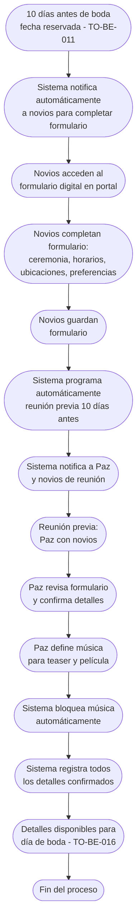

# Proceso TO-BE-015: Preparación de bodas (formulario y reunión previa)

## 1. Objetivo y alcance (del proceso)

**Actor principal**: Paz (responsable línea Bodas) / Novios (completar formulario)

**Evento disparador**: Fecha de boda reservada (TO-BE-011) y aproximación a 10 días antes de la boda

**Propósito**: Digitalizar formulario de novios con acceso desde portal, coordinar reunión previa 10 días antes, definir y bloquear música para teaser y película, confirmar horarios y detalles logísticos

**Scope funcional**: Desde fecha reservada hasta reunión previa completada con todos los detalles confirmados

**Criterios de éxito**: 
- 100% de novios completan formulario digital
- Reunión previa agendada 10 días antes de boda
- Música definida y bloqueada antes de boda
- Horarios y detalles logísticos confirmados
- Tiempo de completar formulario < 15 minutos

**Frecuencia**: Por cada boda reservada

**Duración objetivo**: < 15 minutos (formulario) + 1 hora (reunión previa)

**Supuestos/restricciones**: 
- Fecha de boda reservada (TO-BE-011)
- Portal de cliente disponible para novios
- Reunión previa debe ser al menos 10 días antes de boda

## 2. Contexto y actores

**Participantes:**
- **Novios**: Completan formulario digital y asisten a reunión previa
- **Paz**: Coordina reunión previa y confirma detalles
- **Sistema centralizado**: Proporciona formulario digital y gestiona música

**Stakeholders clave:** 
- Novios (necesitan preparar boda)
- Equipo de producción (necesita detalles para día de boda)
- Paz (coordina preparación)

**Dependencias:** 
- TO-BE-011: Fecha debe estar reservada
- Portal de cliente disponible
- TO-BE-016: Gestión del día de la boda (requiere detalles de preparación)

**Gobernanza:** 
- Paz coordina reunión previa
- Novios completan formulario digital
- Música queda bloqueada sin cambios posteriores

### 2.1 Dependencias entre procesos TO-BE

**Procesos prerequisito:** 
- TO-BE-011: Reserva automática de fechas (fecha debe estar reservada)

**Procesos dependientes:** 
- TO-BE-016: Gestión del día de la boda (requiere detalles de preparación)

**Orden de implementación sugerido:** Decimoquinto (después de reserva de fechas)

## 3. Transformación AS-IS → TO-BE (trazabilidad)

### 3.1 Procesos AS-IS relacionados

**Procesos AS-IS de referencia:** AS-IS-006: Producción y postproducción boda

**Tipo de transformación:** Reimaginación con digitalización

### 3.2 Análisis del estado actual (procesos AS-IS relacionados)

En el proceso AS-IS, el formulario de novios es manual y la reunión previa requiere coordinación manual. La definición de música se hace en reunión previa pero proceso es manual. No hay digitalización ni bloqueo automático de música.

### 3.3 Problemas y oportunidades identificadas

**Dolores principales:**
1. Gestión manual de detalles previos - formulario de novios y reunión previa requieren coordinación manual _(Fuente: AS-IS-006 P1)_
2. Gestión manual de música - definición de música en reunión previa, sin cambios posteriores, pero proceso manual _(Fuente: AS-IS-006 P5)_

**Causas raíz:** 
- Formulario manual
- Coordinación manual de reunión
- No hay digitalización
- No hay bloqueo automático de música

**Oportunidades no explotadas:** 
- Digitalización del formulario con acceso desde portal
- Coordinación automática de reunión previa
- Bloqueo automático de música después de definir
- Confirmación digital de horarios

**Riesgo de mantener AS-IS:** 
- Información incompleta o incorrecta
- Olvidos de detalles importantes
- Música no queda bloqueada correctamente

### 3.4 Estrategia de transformación

**Principios de rediseño aplicados:**
- Digitalización completa del formulario con acceso desde portal
- Coordinación automática de reunión previa 10 días antes
- Bloqueo automático de música después de definir
- Confirmación digital de horarios y detalles

**Justificación del nuevo diseño:** 
Este proceso TO-BE digitaliza completamente la preparación de bodas, permitiendo a novios completar formulario desde portal y coordinando automáticamente reunión previa, mejorando la captura de información y garantizando que música quede bloqueada.

**Fuentes:** 
- `02-discovery/0201-interviews/020101-interview-01/minute-01.md` (Bodas)
- `02-discovery/0202-prd/020201-context/company-info.md` (Fase 5 Bodas)
- `02-discovery/0202-prd/020202-as-is/processes/AS-IS-006-produccion-postproduccion-boda/AS-IS-006-produccion-postproduccion-boda.md`

## 4. Proceso TO-BE

### **4.1 Descripción detallada**

El proceso inicia cuando la fecha de boda está reservada y se aproxima a 10 días antes. El sistema:

1. **Notifica automáticamente a novios** (10 días antes de boda):
   - Recordatorio para completar formulario
   - Enlace al formulario digital en portal
   - Recordatorio de reunión previa

2. **Novios completan formulario digital**:
   - Acceso desde portal de cliente
   - Formulario estructurado con campos:
     - Detalles de ceremonia (hora, ubicación)
     - Horarios (inicio, ceremonia, fiesta)
     - Ubicaciones (domicilio novios, ceremonia, fiesta)
     - Preferencias y características especiales
   - Guardan formulario

3. **Sistema programa automáticamente reunión previa**:
   - 10 días antes de boda
   - Notifica a Paz y novios
   - Genera convocatoria

4. **Reunión previa (Paz con novios)**:
   - Paz revisa formulario completado
   - Confirma horarios y detalles
   - Define música para teaser y película
   - Sistema bloquea música automáticamente (sin cambios posteriores)

5. **Sistema registra todos los detalles**:
   - Formulario completado
   - Música definida y bloqueada
   - Horarios confirmados
   - Detalles logísticos

### **4.2 Diagrama de flujo**

### **4.3 Flujo principal (happy path)**

| # | Actor | Actividad | Sistema/Herramienta | Reglas de Negocio | Tiempo |
|---|-------|-----------|-------------------|-------------------|--------|
| 1 | Sistema | Notifica automáticamente a novios 10 días antes de boda para completar formulario | Sistema de notificaciones | Notificación incluye enlace al formulario Recordatorio de reunión previa | < 1 min |
| 2 | Novios | Acceden al formulario digital desde portal de cliente | Portal de cliente | Formulario estructurado con campos predefinidos Acceso fácil desde portal | < 2 min |
| 3 | Novios | Completan formulario con detalles de ceremonia, horarios, ubicaciones, preferencias | Formulario digital | Campos obligatorios marcados Validación en tiempo real | < 15 min |
| 4 | Novios | Guardan formulario | Sistema centralizado | Formulario guardado con timestamp Vinculado a boda | < 1 min |
| 5 | Sistema | Programa automáticamente reunión previa 10 días antes de boda | Sistema de agendamiento | Reunión agendada automáticamente Notificación a Paz y novios | < 1 min |
| 6 | Paz | Revisa formulario completado antes de reunión | Dashboard del sistema | Formulario visible con todos los detalles Paz puede preparar reunión | < 10 min |
| 7 | Paz y Novios | Reunión previa: confirman detalles, definen música | Reunión presencial/online | Paz confirma horarios y detalles Define música para teaser y película | 1 hora |
| 8 | Paz | Registra música definida en sistema | Sistema de gestión de música | Música registrada para teaser y película Sistema bloquea automáticamente | < 5 min |
| 9 | Sistema | Bloquea música automáticamente (sin cambios posteriores) | Sistema de bloqueo | Música queda bloqueada No se puede modificar después | < 1 min |
| 10 | Sistema | Registra todos los detalles confirmados | Base de datos | Formulario, música, horarios, detalles logísticos Disponible para día de boda | < 1 min |

### **4.5 Puntos de decisión y variantes**

- **Formulario completo vs incompleto**: Si formulario no está completo, sistema puede enviar recordatorios
- **Reunión presencial vs online**: Reunión puede ser presencial u online según preferencia
- **Música no definida**: Si música no se define en reunión, sistema puede enviar recordatorio

### **4.6 Excepciones y manejo de errores**

- **Formulario no completado**: Si novios no completan formulario, sistema envía recordatorios y Paz puede completar en reunión
- **Reunión no realizada**: Si reunión no se realiza, sistema notifica y requiere reagendamiento
- **Música no definida**: Si música no se define, sistema bloquea pero requiere definición antes de boda

### **4.7 Riesgos del proceso y mitigaciones**

| Riesgo | Probabilidad | Impacto | Mitigación |
|--------|--------------|---------|------------|
| Formulario no completado | Media | Medio | Recordatorios automáticos, Paz puede completar en reunión |
| Reunión no realizada | Baja | Alto | Notificaciones automáticas, reagendamiento automático |
| Música no definida | Baja | Medio | Bloqueo automático, recordatorios, definición obligatoria antes de boda |

### **4.8 Preguntas abiertas**

- ¿Qué hacer si novios no completan formulario? ¿Se puede completar en reunión?
- ¿Se requiere confirmación explícita de novios para música definida?
- ¿Qué hacer si detalles cambian después de reunión previa? ¿Se puede modificar?
- ¿Se requiere firma digital de novios para confirmar detalles?

### **4.9 Ideas adicionales**

- Integración con servicios de música (Spotify, etc.) para selección directa
- Vista previa de horarios en calendario visual
- Notificaciones por SMS además de email
- Portal donde novios pueden ver todos los detalles confirmados

---

*GEN-BY:PROMPT-to-be · hash:tobe015_preparacion_bodas_20260120 · 2026-01-20T00:00:00Z*
