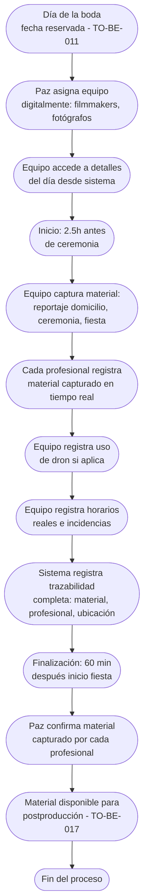

# Proceso TO-BE-016: Gestión del día de la boda

## 1. Objetivo y alcance (del proceso)

**Actor principal**: Paz (coordinación) / Equipo de producción (filmmakers, fotógrafos)

**Evento disparador**: Día de la boda (fecha reservada - TO-BE-011)

**Propósito**: Asignar equipo (filmmakers, fotógrafos), registrar horarios reales, incidencias, material capturado por cada profesional, uso de dron, trazabilidad completa del material generado

**Scope funcional**: Desde inicio del día de boda (2.5h antes ceremonia) hasta finalización de cobertura (60 min después inicio fiesta)

**Criterios de éxito**: 
- 100% de equipo asignado y confirmado
- 100% de material capturado registrado con trazabilidad
- Horarios reales registrados
- Incidencias documentadas
- Tiempo de registro < 5 minutos por profesional

**Frecuencia**: Por cada boda

**Duración objetivo**: Durante día de boda (variable según boda)

**Supuestos/restricciones**: 
- Fecha de boda reservada (TO-BE-011)
- Detalles de preparación completados (TO-BE-015)
- Equipo de producción disponible

## 2. Contexto y actores

**Participantes:**
- **Paz**: Coordina equipo y supervisa día de boda
- **Equipo de producción**: Filmmakers, fotógrafos que capturan material
- **Sistema centralizado**: Registra asignaciones, horarios, material

**Stakeholders clave:** 
- Equipo de producción (necesita saber asignaciones)
- Paz (coordina y supervisa)
- Novios (esperan cobertura completa)

**Dependencias:** 
- TO-BE-011: Fecha debe estar reservada
- TO-BE-015: Detalles de preparación deben estar completados
- TO-BE-017: Seguimiento de postproducción (requiere material registrado)

**Gobernanza:** 
- Paz coordina y asigna equipo
- Equipo registra material capturado

### 2.1 Dependencias entre procesos TO-BE

**Procesos prerequisito:** 
- TO-BE-011: Reserva automática de fechas
- TO-BE-015: Preparación de bodas

**Procesos dependientes:** 
- TO-BE-017: Seguimiento de postproducción de bodas (requiere material registrado)
- TO-BE-025: Almacenamiento automático de archivos (requiere material capturado)

**Orden de implementación sugerido:** Decimosexto (después de preparación)

## 3. Transformación AS-IS → TO-BE (trazabilidad)

### 3.1 Procesos AS-IS relacionados

**Procesos AS-IS de referencia:** AS-IS-006: Producción y postproducción boda

**Tipo de transformación:** Reimaginación con trazabilidad completa

### 3.2 Análisis del estado actual (procesos AS-IS relacionados)

En el proceso AS-IS, el día de la boda se gestiona manualmente. No hay registro claro de qué material se generó, dónde está, quién lo tiene. No hay trazabilidad del material generado por cada profesional.

### 3.3 Problemas y oportunidades identificadas

**Dolores principales:**
1. Falta de trazabilidad del material generado - no hay registro claro de qué material se generó, dónde está, quién lo tiene _(Fuente: AS-IS-006 P2)_

**Causas raíz:** 
- Gestión manual del día de boda
- No hay registro de material por profesional
- No hay trazabilidad de ubicación de material

**Oportunidades no explotadas:** 
- Asignación digital de equipo
- Registro de material por profesional
- Trazabilidad completa de material generado
- Registro de horarios reales e incidencias

**Riesgo de mantener AS-IS:** 
- Pérdida de material
- Falta de trazabilidad
- Dificultad para gestionar postproducción

### 3.4 Estrategia de transformación

**Principios de rediseño aplicados:**
- Asignación digital de equipo con confirmación
- Registro de material por profesional durante día de boda
- Trazabilidad completa de material generado
- Registro de horarios reales e incidencias

**Justificación del nuevo diseño:** 
Este proceso TO-BE digitaliza completamente la gestión del día de boda, permitiendo asignación de equipo, registro de material por profesional y trazabilidad completa, mejorando significativamente la gestión de postproducción.

**Fuentes:** 
- `02-discovery/0201-interviews/020101-interview-01/minute-01.md` (Bodas)
- `02-discovery/0202-prd/020201-context/company-info.md` (Fase 6 Bodas)
- `02-discovery/0202-prd/020202-as-is/processes/AS-IS-006-produccion-postproduccion-boda/AS-IS-006-produccion-postproduccion-boda.md`

## 4. Proceso TO-BE

### **4.1 Descripción detallada**

El proceso inicia el día de la boda. El sistema:

1. **Paz asigna equipo digitalmente**:
   - Filmmakers (1 o 2)
   - Fotógrafos (1 o 2)
   - Confirmación de asistencia
   - Asignación visible para equipo

2. **Equipo accede a detalles del día**:
   - Horarios (inicio 2.5h antes ceremonia)
   - Ubicaciones (domicilio novios, ceremonia, fiesta)
   - Detalles especiales
   - Música bloqueada

3. **Durante día de boda, equipo registra material capturado**:
   - Cada profesional registra material que captura
   - Registro de uso de dron
   - Registro de horarios reales
   - Registro de incidencias

4. **Sistema registra trazabilidad completa**:
   - Material por profesional
   - Ubicación de material
   - Estado de material (capturado, en proceso, listo)
   - Timestamp de captura

5. **Al finalizar día, Paz confirma**:
   - Material capturado por cada profesional
   - Incidencias registradas
   - Material listo para postproducción

### **4.2 Diagrama de flujo**

### **4.3 Flujo principal (happy path)**

| # | Actor | Actividad | Sistema/Herramienta | Reglas de Negocio | Tiempo |
|---|-------|-----------|-------------------|-------------------|--------|
| 1 | Paz | Asigna equipo digitalmente (filmmakers, fotógrafos) | Sistema de asignación | Asignación visible para equipo Confirmación de asistencia | < 10 min |
| 2 | Equipo | Accede a detalles del día desde sistema (horarios, ubicaciones, detalles) | Portal del equipo | Detalles visibles: inicio 2.5h antes, ubicaciones, música bloqueada | < 5 min |
| 3 | Equipo | Inicio: 2.5 horas antes de ceremonia, reportaje en domicilio de novios | Día de boda | Horario de inicio según plan Reportaje en domicilio | Variable |
| 4 | Equipo | Captura material: ceremonia, fiesta (hasta 60 min después inicio fiesta) | Día de boda | Cobertura completa según plan Uso de dron si condiciones permiten | Variable |
| 5 | Cada profesional | Registra material capturado en tiempo real (vídeo, fotos) | Sistema de registro móvil | Registro rápido: tipo de material, cantidad, timestamp | < 5 min |
| 6 | Equipo | Registra uso de dron si aplica | Sistema de registro | Registro de uso de dron Condiciones que permitieron uso | < 2 min |
| 7 | Equipo | Registra horarios reales e incidencias | Sistema de registro | Horarios reales vs planificados Incidencias documentadas | < 5 min |
| 8 | Sistema | Registra trazabilidad completa (material, profesional, ubicación, estado) | Base de datos | Trazabilidad completa de cada material Vinculado a profesional y boda | < 1 min |
| 9 | Paz | Confirma material capturado por cada profesional al finalizar día | Dashboard del sistema | Revisión de material registrado Confirmación de completitud | < 15 min |

### **4.5 Puntos de decisión y variantes**

- **Uso de dron**: Si condiciones no permiten, no se usa dron
- **Incidencias**: Si hay incidencias, se registran para referencia
- **Material adicional**: Si se captura material adicional, se registra

### **4.6 Excepciones y manejo de errores**

- **Equipo no asiste**: Si profesional no asiste, Paz reasigna o ajusta cobertura
- **Material no registrado**: Si material no se registra, Paz puede registrar manualmente después
- **Incidencias críticas**: Si hay incidencias críticas, se registran y notifican inmediatamente

### **4.7 Riesgos del proceso y mitigaciones**

| Riesgo | Probabilidad | Impacto | Mitigación |
|--------|--------------|---------|------------|
| Material no registrado | Media | Alto | Registro en tiempo real, confirmación por Paz, registro manual si es necesario |
| Falta de trazabilidad | Baja | Alto | Registro automático de trazabilidad, vinculación material-profesional |
| Equipo no asiste | Baja | Alto | Confirmación de asistencia, reasignación automática si es necesario |

### **4.8 Preguntas abiertas**

- ¿Se requiere registro en tiempo real o puede ser al final del día?
- ¿Qué hacer si material no se registra? ¿Se puede registrar después?
- ¿Se requiere confirmación de novios sobre material capturado?
- ¿Qué hacer si hay incidencias críticas durante boda?

### **4.9 Ideas adicionales**

- App móvil para registro rápido de material durante boda
- Integración con cámaras para detección automática de material capturado
- Notificaciones automáticas a Paz cuando material se registra
- Vista en tiempo real de material capturado por cada profesional

---

*GEN-BY:PROMPT-to-be · hash:tobe016_gestion_dia_boda_20260120 · 2026-01-20T00:00:00Z*
