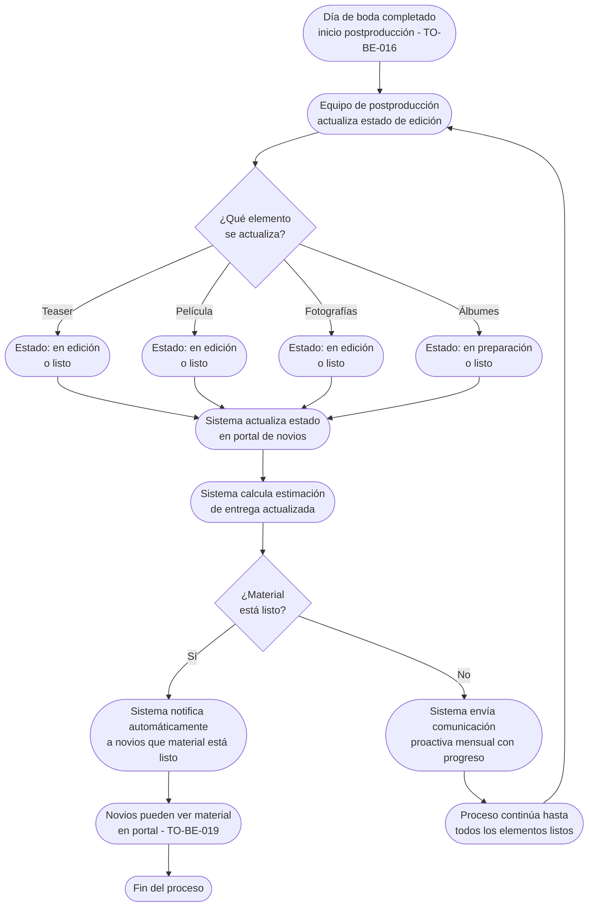

# Proceso TO-BE-017: Seguimiento de postproducción de bodas

## 1. Objetivo y alcance (del proceso)

**Actor principal**: Equipo de postproducción / Novios (visibilidad)

**Evento disparador**: Día de boda completado (TO-BE-016) y inicio de postproducción

**Propósito**: Visibilidad del estado de edición (teaser, película, fotografías, álbumes) para novios, comunicación proactiva de progreso, estimaciones de entrega, notificaciones automáticas

**Scope funcional**: Desde inicio de postproducción hasta primera entrega (4-6 meses desde boda)

**Criterios de éxito**: 
- 100% de novios con visibilidad del estado de postproducción
- Comunicación proactiva cada mes durante postproducción
- Estimaciones de entrega actualizadas
- Notificaciones automáticas cuando material está listo
- Reducción de consultas de novios sobre estado

**Frecuencia**: Continua durante postproducción (4-6 meses)

**Duración objetivo**: 4-6 meses desde fecha de boda

**Supuestos/restricciones**: 
- Día de boda completado (TO-BE-016)
- Material capturado disponible
- Plazo estándar: 4-6 meses desde boda

## 2. Contexto y actores

**Participantes:**
- **Equipo de postproducción**: Actualiza estado de edición
- **Novios**: Ven estado de postproducción en portal
- **Sistema centralizado**: Gestiona visibilidad y notificaciones
- **Paz**: Supervisa postproducción

**Stakeholders clave:** 
- Novios (esperan visibilidad del estado)
- Equipo de postproducción (necesita actualizar estado)
- Paz (coordina postproducción)

**Dependencias:** 
- TO-BE-016: Día de boda debe estar completado
- Material capturado disponible
- TO-BE-019: Entrega de material para revisión (requiere material editado)

**Gobernanza:** 
- Equipo de postproducción actualiza estado
- Paz supervisa y comunica con novios

### 2.1 Dependencias entre procesos TO-BE

**Procesos prerequisito:** 
- TO-BE-016: Gestión del día de la boda (material debe estar capturado)

**Procesos dependientes:** 
- TO-BE-019: Entrega de material para revisión (requiere material editado)

**Orden de implementación sugerido:** Decimoséptimo (después de día de boda)

## 3. Transformación AS-IS → TO-BE (trazabilidad)

### 3.1 Procesos AS-IS relacionados

**Procesos AS-IS de referencia:** AS-IS-006: Producción y postproducción boda

**Tipo de transformación:** Reimaginación con comunicación proactiva

### 3.2 Análisis del estado actual (procesos AS-IS relacionados)

En el proceso AS-IS, el plazo de postproducción es 4-6 meses desde la fecha de boda, pero no hay visibilidad clara del estado de edición para novios. No hay comunicación proactiva durante el largo plazo de postproducción, lo que puede generar expectativas no gestionadas.

### 3.3 Problemas y oportunidades identificadas

**Dolores principales:**
1. Plazos largos de postproducción - 4 a 6 meses puede generar expectativas no gestionadas _(Fuente: AS-IS-006 P3)_
2. Falta de seguimiento durante postproducción - no hay visibilidad clara del estado de edición para novios _(Fuente: AS-IS-006 P4)_

**Causas raíz:** 
- No hay visibilidad del estado para novios
- No hay comunicación proactiva
- Plazo largo sin actualizaciones

**Oportunidades no explotadas:** 
- Portal donde novios pueden ver estado de postproducción
- Comunicación proactiva durante postproducción
- Estimaciones de entrega actualizadas
- Notificaciones automáticas cuando material está listo

**Riesgo de mantener AS-IS:** 
- Expectativas no gestionadas
- Consultas frecuentes de novios
- Mala experiencia durante espera

### 3.4 Estrategia de transformación

**Principios de rediseño aplicados:**
- Portal donde novios pueden ver estado de postproducción en tiempo real
- Comunicación proactiva cada mes durante postproducción
- Estimaciones de entrega actualizadas automáticamente
- Notificaciones automáticas cuando material está listo

**Justificación del nuevo diseño:** 
Este proceso TO-BE proporciona visibilidad completa del estado de postproducción para novios y comunicación proactiva durante el largo plazo, mejorando significativamente la experiencia durante la espera y reduciendo consultas.

**Fuentes:** 
- `02-discovery/0201-interviews/020101-interview-01/minute-01.md` (Bodas)
- `02-discovery/0202-prd/020201-context/company-info.md` (Fase 7 Bodas)
- `02-discovery/0202-prd/020202-as-is/processes/AS-IS-006-produccion-postproduccion-boda/AS-IS-006-produccion-postproduccion-boda.md`

## 4. Proceso TO-BE

### **4.1 Descripción detallada**

El proceso inicia cuando el día de boda está completado y comienza la postproducción. El sistema:

1. **Equipo de postproducción actualiza estado**:
   - Estado de teaser (en edición, listo)
   - Estado de película (en edición, listo)
   - Estado de fotografías (en edición, listo)
   - Estado de álbumes (en preparación, listo)

2. **Sistema muestra estado en portal de novios**:
   - Visibilidad del estado de cada elemento
   - Progreso visual (porcentaje completado)
   - Estimación de entrega actualizada

3. **Sistema envía comunicación proactiva**:
   - Mensaje mensual con progreso
   - Actualizaciones cuando hay avances significativos
   - Estimaciones de entrega actualizadas

4. **Cuando material está listo, sistema notifica automáticamente**:
   - Teaser listo → notificación a novios
   - Película lista → notificación a novios
   - Fotografías listas → notificación a novios
   - Álbumes listos → notificación a novios

5. **Novios pueden ver estado en portal**:
   - Acceso 24/7 al estado de postproducción
   - Historial de actualizaciones
   - Estimaciones de entrega

### **4.2 Diagrama de flujo**

### **4.3 Flujo principal (happy path)**

| # | Actor | Actividad | Sistema/Herramienta | Reglas de Negocio | Tiempo |
|---|-------|-----------|-------------------|-------------------|--------|
| 1 | Equipo de postproducción | Actualiza estado de edición (teaser, película, fotografías, álbumes) | Dashboard de postproducción | Estado visible: en edición, listo Actualización manual por equipo | Variable |
| 2 | Sistema | Actualiza estado en portal de novios | Portal de cliente | Estado visible para novios 24/7 Progreso visual (porcentaje) | < 1 min |
| 3 | Sistema | Calcula estimación de entrega actualizada | Motor de estimación | Basado en progreso actual Actualizado automáticamente | < 1 min |
| 4 | Sistema | Evalúa si material está listo | Sistema de evaluación | Si estado cambia a "listo", notifica Si no, programa comunicación mensual | < 1 min |
| 5 | Sistema | Si material está listo, notifica automáticamente a novios | Sistema de notificaciones | Notificación incluye: material listo, enlace al portal | < 1 min |
| 6 | Sistema | Si material no está listo, envía comunicación proactiva mensual | Sistema de comunicación | Mensaje mensual con progreso, estimación de entrega | Mensual |
| 7 | Novios | Acceden al portal para ver estado de postproducción | Portal de cliente | Estado visible 24/7, historial de actualizaciones | Variable |
| 8 | Sistema | Proceso continúa hasta todos los elementos estén listos | Sistema de seguimiento | Seguimiento automático hasta completar todos los elementos | 4-6 meses |

### **4.5 Puntos de decisión y variantes**

- **Material listo vs en edición**: Si material está listo, se notifica; si no, se envía comunicación mensual
- **Múltiples elementos**: Cada elemento (teaser, película, fotografías, álbumes) se actualiza independientemente
- **Estimación de entrega**: Se actualiza automáticamente según progreso

### **4.6 Excepciones y manejo de errores**

- **Estado no actualizado**: Si equipo no actualiza estado, sistema puede enviar recordatorios
- **Estimación incorrecta**: Si estimación es incorrecta, equipo puede corregir manualmente
- **Material retrasado**: Si material se retrasa, sistema actualiza estimación y notifica a novios

### **4.7 Riesgos del proceso y mitigaciones**

| Riesgo | Probabilidad | Impacto | Mitigación |
|--------|--------------|---------|------------|
| Estado no actualizado | Media | Medio | Recordatorios automáticos, actualización obligatoria, supervisión por Paz |
| Novios no ven estado | Baja | Bajo | Portal accesible 24/7, notificaciones automáticas, comunicación proactiva |
| Estimación incorrecta | Media | Medio | Actualización automática, corrección manual permitida, comunicación clara |

### **4.8 Preguntas abiertas**

- ¿Con qué frecuencia debe actualizarse el estado? ¿Diario, semanal?
- ¿Qué hacer si material se retrasa más de 6 meses? ¿Se notifica a novios?
- ¿Se requiere confirmación de novios sobre estimaciones de entrega?
- ¿Qué hacer si novios preguntan sobre estado antes de comunicación mensual?

### **4.9 Ideas adicionales**

- Vista previa de material en edición (sin finalizar) para novios
- Integración con herramientas de edición para actualización automática de estado
- Notificaciones por SMS además de email
- Análisis de tiempo promedio de postproducción para optimizar estimaciones

---

*GEN-BY:PROMPT-to-be · hash:tobe017_seguimiento_postproduccion_bodas_20260120 · 2026-01-20T00:00:00Z*
