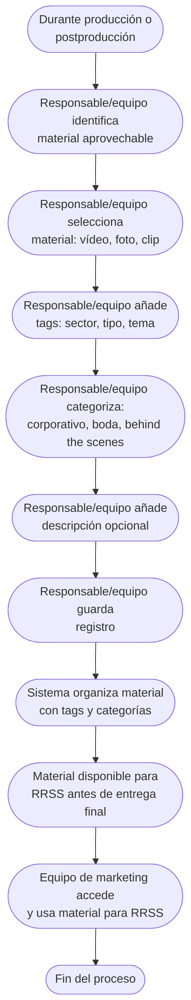

# Proceso TO-BE-018: Registro de material aprovechable para RRSS

## 1. Objetivo y alcance (del proceso)

**Actor principal**: Responsable del proyecto / Equipo de producción

**Evento disparador**: Durante producción o postproducción, identificación de material aprovechable

**Propósito**: Identificar y registrar temprano material aprovechable para redes sociales durante producción, no solo en entrega, con tags y categorización

**Scope funcional**: Desde inicio de producción hasta registro de material aprovechable

**Criterios de éxito**: 
- 100% de material aprovechable registrado durante producción
- Tags y categorización aplicados
- Material disponible para RRSS antes de entrega final
- Tiempo de registro < 2 minutos por material

**Frecuencia**: Continua durante producción y postproducción

**Duración objetivo**: < 2 minutos por registro de material

**Supuestos/restricciones**: 
- Proyecto activado (TO-BE-010) o boda en postproducción
- Material disponible para revisión

## 2. Contexto y actores

**Participantes:**
- **Responsable del proyecto / Equipo de producción**: Identifica y registra material aprovechable
- **Sistema centralizado**: Gestiona tags y categorización
- **Equipo de marketing**: Usa material registrado para RRSS

**Stakeholders clave:** 
- Equipo de producción (identifica material aprovechable)
- Equipo de marketing (usa material para RRSS)
- CEO (necesita material para promoción)

**Dependencias:** 
- TO-BE-010: Proyecto debe estar activado
- Material disponible para revisión

**Gobernanza:** 
- Responsable/equipo registra material durante producción
- Equipo de marketing puede acceder a material registrado

### 2.1 Dependencias entre procesos TO-BE

**Procesos prerequisito:** 
- TO-BE-010: Activación automática de proyectos (proyecto debe estar activado)

**Procesos dependientes:** Ninguno (proceso de registro)

**Orden de implementación sugerido:** Decimoctavo (durante producción)

## 3. Transformación AS-IS → TO-BE (trazabilidad)

### 3.1 Procesos AS-IS relacionados

**Procesos AS-IS de referencia:** AS-IS-005: Producción y postproducción corporativa

**Tipo de transformación:** Nuevo proceso (no existía en AS-IS)

### 3.2 Análisis del estado actual (procesos AS-IS relacionados)

En el proceso AS-IS, el material aprovechable para RRSS se registra en primera entrega cuando material está fresco, pero puede olvidarse. No hay registro temprano durante producción, lo que hace que material se registre tarde o se olvide.

### 3.3 Problemas y oportunidades identificadas

**Dolores principales:**
1. Material para RRSS se registra tarde - se rellena en primera entrega cuando material está fresco, pero puede olvidarse _(Fuente: AS-IS-005 P6)_

**Causas raíz:** 
- Registro solo en entrega final
- Dependencia de memoria para recordar
- No hay registro temprano durante producción

**Oportunidades no explotadas:** 
- Registro temprano durante producción
- Tags y categorización para fácil búsqueda
- Material disponible antes de entrega final

**Riesgo de mantener AS-IS:** 
- Material aprovechable se olvida
- Oportunidades de promoción perdidas
- Material no disponible para RRSS a tiempo

### 3.4 Estrategia de transformación

**Principios de rediseño aplicados:**
- Registro temprano durante producción, no solo en entrega
- Tags y categorización para fácil búsqueda y organización
- Material disponible para RRSS antes de entrega final
- Eliminación de dependencia de memoria

**Justificación del nuevo diseño:** 
Este proceso TO-BE es nuevo y permite registrar material aprovechable temprano durante producción con tags y categorización, mejorando la disponibilidad de material para RRSS y eliminando olvidos.

**Fuentes:** 
- `02-discovery/0201-interviews/020101-interview-01/minute-01.md` (Sección 3)
- `02-discovery/0202-prd/020202-as-is/processes/AS-IS-005-produccion-postproduccion-corporativa/AS-IS-005-produccion-postproduccion-corporativa.md`

## 4. Proceso TO-BE

### **4.1 Descripción detallada**

El proceso inicia durante producción o postproducción cuando se identifica material aprovechable. El sistema:

1. **Responsable/equipo identifica material aprovechable**:
   - Durante grabación/rodaje
   - Durante edición/postproducción
   - Material fresco e interesante para RRSS

2. **Responsable/equipo registra material**:
   - Selecciona material (vídeo, foto, clip)
   - Añade tags (sector, tipo, tema)
   - Categoriza (corporativo, boda, behind the scenes, etc.)
   - Añade descripción opcional
   - Guarda registro

3. **Sistema organiza material**:
   - Material disponible para RRSS
   - Búsqueda por tags y categorías
   - Material listo para uso

4. **Equipo de marketing accede a material**:
   - Búsqueda por tags y categorías
   - Material disponible para publicación
   - Historial de uso

### **4.2 Diagrama de flujo**

### **4.3 Flujo principal (happy path)**

| # | Actor | Actividad | Sistema/Herramienta | Reglas de Negocio | Tiempo |
|---|-------|-----------|-------------------|-------------------|--------|
| 1 | Responsable/Equipo | Identifica material aprovechable durante producción o postproducción | Revisión de material | Material fresco e interesante para RRSS Identificación durante producción | Variable |
| 2 | Responsable/Equipo | Selecciona material (vídeo, foto, clip) | Sistema de selección | Material puede ser en bruto o editado Selección rápida | < 1 min |
| 3 | Responsable/Equipo | Añade tags (sector, tipo, tema) | Sistema de tags | Tags predefinidos con posibilidad de añadir nuevos Múltiples tags por material | < 30 seg |
| 4 | Responsable/Equipo | Categoriza material (corporativo, boda, behind the scenes, etc.) | Sistema de categorización | Categorías predefinidas Una categoría por material | < 30 seg |
| 5 | Responsable/Equipo | Añade descripción opcional | Sistema de descripción | Campo opcional para contexto Máximo de caracteres | < 1 min |
| 6 | Responsable/Equipo | Guarda registro | Sistema centralizado | Registro guardado con timestamp Material vinculado a proyecto | < 10 seg |
| 7 | Sistema | Organiza material con tags y categorías | Sistema de organización | Material disponible para búsqueda Organización automática | < 10 seg |
| 8 | Equipo de marketing | Accede a material registrado mediante búsqueda por tags y categorías | Sistema de búsqueda | Búsqueda avanzada por tags, categorías, proyecto Material listo para uso | Variable |

### **4.5 Puntos de decisión y variantes**

- **Material en bruto vs editado**: Puede registrar material en bruto o editado
- **Tags personalizados**: Puede añadir tags personalizados además de predefinidos
- **Múltiples categorías**: Material puede tener múltiples categorías si aplica

### **4.6 Excepciones y manejo de errores**

- **Material no identificado**: Si material no se identifica, puede registrarse después
- **Tags incorrectos**: Si tags son incorrectos, puede corregirse después
- **Material duplicado**: Si material ya está registrado, sistema puede alertar

### **4.7 Riesgos del proceso y mitigaciones**

| Riesgo | Probabilidad | Impacto | Mitigación |
|--------|--------------|---------|------------|
| Material no se registra | Media | Medio | Recordatorios automáticos, registro facilitado, integración con producción |
| Tags incorrectos | Baja | Bajo | Tags predefinidos, posibilidad de corrección, revisión por equipo |
| Material no se usa para RRSS | Baja | Bajo | Búsqueda facilitada, notificaciones a equipo de marketing, análisis de uso |

### **4.8 Preguntas abiertas**

- ¿Qué tags son más importantes? ¿Sector, tipo, tema, otro?
- ¿Se requiere aprobación de material antes de usar para RRSS?
- ¿Qué hacer si material se registra pero no se usa? ¿Se elimina después de tiempo?
- ¿Se requiere análisis de efectividad de material en RRSS?

### **4.9 Ideas adicionales**

- Análisis automático de material para sugerir tags
- Integración con herramientas de RRSS para publicación directa
- Análisis de efectividad de material en RRSS (likes, shares, etc.)
- Sugerencias automáticas de material para publicar según calendario

---

*GEN-BY:PROMPT-to-be · hash:tobe018_registro_material_rrss_20260120 · 2026-01-20T00:00:00Z*
