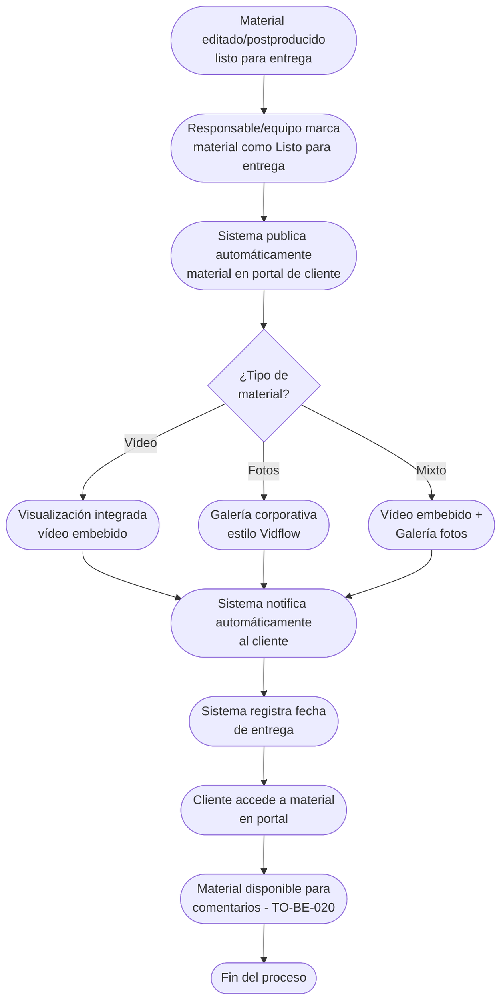

# Proceso TO-BE-019: Entrega de material para revisión

## 1. Objetivo y alcance (del proceso)

**Actor principal**: Responsable del proyecto / Equipo de postproducción

**Evento disparador**: Material editado/postproducido listo para primera entrega

**Propósito**: Publicar automáticamente material editado en portal de cliente, con visualización integrada (vídeo embebido), notificación al cliente, registro de fecha de entrega

**Scope funcional**: Desde material listo hasta publicación en portal y notificación al cliente

**Criterios de éxito**: 
- 100% de material publicado automáticamente en portal
- Visualización integrada sin salir de página
- Notificación automática al cliente
- Registro de fecha de entrega
- Tiempo de publicación < 5 minutos

**Frecuencia**: Por cada proyecto/boda con material listo

**Duración objetivo**: < 5 minutos (proceso automático)

**Supuestos/restricciones**: 
- Material editado/postproducido listo
- Portal de cliente disponible
- TO-BE-020: Gestión de comentarios (requiere material entregado)

## 2. Contexto y actores

**Participantes:**
- **Responsable del proyecto / Equipo de postproducción**: Publica material en portal
- **Cliente**: Accede a material en portal
- **Sistema centralizado**: Gestiona publicación y notificaciones

**Stakeholders clave:** 
- Cliente (espera ver material editado)
- Equipo de producción (necesita entregar material)
- Responsable (coordina entrega)

**Dependencias:** 
- Material editado/postproducido listo
- Portal de cliente disponible
- TO-BE-020: Gestión de comentarios y modificaciones

**Gobernanza:** 
- Responsable/equipo publica material
- Cliente accede a material en portal

### 2.1 Dependencias entre procesos TO-BE

**Procesos prerequisito:** 
- Material editado/postproducido listo

**Procesos dependientes:** 
- TO-BE-020: Gestión de comentarios y modificaciones (requiere material entregado)

**Orden de implementación sugerido:** Decimonoveno (después de postproducción)

## 3. Transformación AS-IS → TO-BE (trazabilidad)

### 3.1 Procesos AS-IS relacionados

**Procesos AS-IS de referencia:** AS-IS-007: Primera entrega, comentarios y segunda entrega (Corporativo y Bodas)

**Tipo de transformación:** Reimaginación con portal integrado

### 3.2 Análisis del estado actual (procesos AS-IS relacionados)

En el proceso AS-IS, la primera entrega se realiza en Frame.io (Corporativo) o se envía material para revisión (Bodas). No hay portal integrado donde cliente pueda ver material sin salir de página. No hay publicación automática ni notificaciones automáticas.

### 3.3 Problemas y oportunidades identificadas

**Dolores principales:**
1. Segunda entrega en PDF - sería mejor presentar material en galería visible con diseño corporativo _(Fuente: AS-IS-007 P4)_

**Causas raíz:** 
- Entrega en Frame.io o archivos, no portal integrado
- No hay visualización integrada sin salir de página
- No hay publicación automática

**Oportunidades no explotadas:** 
- Portal integrado con visualización directa
- Visualización de vídeo embebido sin salir de página
- Publicación automática con notificaciones
- Galería corporativa estilo Vidflow

**Riesgo de mantener AS-IS:** 
- Experiencia de cliente subóptima
- Dificultad para visualizar material
- Proceso manual de entrega

### 3.4 Estrategia de transformación

**Principios de rediseño aplicados:**
- Portal integrado con visualización directa
- Visualización de vídeo embebido sin salir de página
- Publicación automática con notificaciones
- Galería corporativa estilo Vidflow

**Justificación del nuevo diseño:** 
Este proceso TO-BE publica automáticamente material en portal integrado con visualización directa, mejorando significativamente la experiencia del cliente y eliminando necesidad de salir de página.

**Fuentes:** 
- `02-discovery/0201-interviews/020101-interview-01/minute-01.md` (Sección 2)
- `02-discovery/0202-prd/020202-as-is/processes/AS-IS-007-primera-entrega-comentarios-segunda-entrega/AS-IS-007-primera-entrega-comentarios-segunda-entrega.md`

## 4. Proceso TO-BE

### **4.1 Descripción detallada**

El proceso inicia cuando material editado/postproducido está listo. El sistema:

1. **Responsable/equipo marca material como "Listo para entrega"**:
   - Material editado completado
   - Revisión interna realizada
   - Material listo para cliente

2. **Sistema publica automáticamente material en portal de cliente**:
   - Material visible en portal
   - Visualización integrada (vídeo embebido, fotos en galería)
   - Sin necesidad de salir de página

3. **Sistema notifica automáticamente al cliente**:
   - Notificación de material disponible
   - Enlace directo al portal
   - Resumen de material entregado

4. **Sistema registra fecha de entrega**:
   - Timestamp de publicación
   - Material vinculado a proyecto
   - Estado: "Entregado para revisión"

5. **Cliente accede a material en portal**:
   - Visualización integrada
   - Material disponible para comentarios (TO-BE-020)

### **4.2 Diagrama de flujo**

### **4.3 Flujo principal (happy path)**

| # | Actor | Actividad | Sistema/Herramienta | Reglas de Negocio | Tiempo |
|---|-------|-----------|-------------------|-------------------|--------|
| 1 | Responsable/Equipo | Marca material como "Listo para entrega" | Dashboard de producción | Material editado completado Revisión interna realizada | < 1 min |
| 2 | Sistema | Publica automáticamente material en portal de cliente | Portal de cliente | Material visible inmediatamente Visualización integrada | < 2 min |
| 3 | Sistema | Configura visualización según tipo de material (vídeo embebido, galería fotos) | Sistema de visualización | Vídeo: embebido sin salir de página Fotos: galería estilo Vidflow Mixto: ambos | < 1 min |
| 4 | Sistema | Notifica automáticamente al cliente | Sistema de notificaciones | Notificación incluye: material disponible, enlace al portal, resumen | < 1 min |
| 5 | Sistema | Registra fecha de entrega | Base de datos | Timestamp de publicación Material vinculado a proyecto Estado: "Entregado para revisión" | < 10 seg |
| 6 | Cliente | Accede a material en portal | Portal de cliente | Visualización integrada sin salir de página Material disponible para comentarios | Variable |

### **4.5 Puntos de decisión y variantes**

- **Tipo de material**: Vídeo, fotos o mixto requiere diferente visualización
- **Formato de entrega**: Corporativo vs Bodas puede tener diferentes formatos
- **Visualización integrada**: Vídeo embebido (YouTube, Vimeo) o galería de fotos

### **4.6 Excepciones y manejo de errores**

- **Error en publicación**: Si falla publicación, sistema notifica a responsable para publicación manual
- **Material no visible**: Si material no es visible, sistema puede reintentar publicación
- **Error en notificación**: Si falla notificación, sistema reintenta automáticamente

### **4.7 Riesgos del proceso y mitigaciones**

| Riesgo | Probabilidad | Impacto | Mitigación |
|--------|--------------|---------|------------|
| Material no se publica | Baja | Alto | Publicación automática, notificaciones si falla, publicación manual como respaldo |
| Cliente no ve material | Baja | Medio | Portal accesible 24/7, notificaciones automáticas, enlace directo |
| Visualización no funciona | Baja | Medio | Múltiples formatos de visualización, respaldo de descarga directa |

### **4.8 Preguntas abiertas**

- ¿Qué formatos de visualización son preferidos? ¿YouTube embebido, Vimeo, otro?
- ¿Se requiere descarga directa además de visualización?
- ¿Qué hacer si cliente no accede a material? ¿Se envía recordatorio?
- ¿Se requiere protección de material (watermark, contraseña)?

### **4.9 Ideas adicionales**

- Vista previa de material antes de publicar
- Protección de material con watermark o contraseña
- Análisis de visualizaciones (cuántas veces se ve, tiempo de visualización)
- Integración con múltiples plataformas de visualización

---

*GEN-BY:PROMPT-to-be · hash:tobe019_entrega_material_revision_20260120 · 2026-01-20T00:00:00Z*
