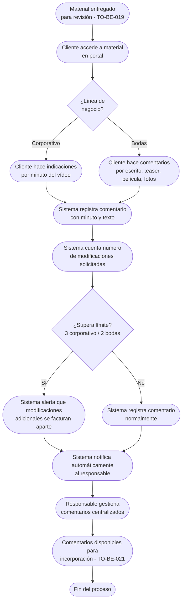

# Proceso TO-BE-020: Gestión de comentarios y modificaciones

## 1. Objetivo y alcance (del proceso)

**Actor principal**: Cliente (comentarios) / Responsable del proyecto (gestión)

**Evento disparador**: Material entregado para revisión (TO-BE-019)

**Propósito**: Sistema centralizado de comentarios (chat/foro integrado), indicaciones por minuto (corporativo) o por escrito, control automático de límites de modificaciones incluidas, registro estructurado

**Scope funcional**: Desde material entregado hasta comentarios registrados y listos para incorporación

**Criterios de éxito**: 
- 100% de comentarios registrados centralizadamente
- Control automático de límites de modificaciones
- Notificaciones automáticas al responsable
- Tiempo de registro de comentarios < 2 minutos

**Frecuencia**: Por cada material entregado que requiere comentarios

**Duración objetivo**: Variable según comentarios del cliente

**Supuestos/restricciones**: 
- Material entregado (TO-BE-019)
- Portal de cliente con sistema de comentarios
- Límites de modificaciones: 3 corporativo, 2 bodas

## 2. Contexto y actores

**Participantes:**
- **Cliente**: Hace comentarios y solicita modificaciones
- **Responsable del proyecto**: Recibe notificaciones y gestiona comentarios
- **Sistema centralizado**: Gestiona comentarios y controla límites

**Stakeholders clave:** 
- Cliente (necesita hacer comentarios fácilmente)
- Responsable del proyecto (necesita recibir comentarios)
- Equipo de producción (necesita saber qué modificar)

**Dependencias:** 
- TO-BE-019: Material debe estar entregado
- Portal de cliente con sistema de comentarios
- TO-BE-021: Incorporación de cambios (requiere comentarios registrados)

**Gobernanza:** 
- Cliente hace comentarios en portal
- Responsable gestiona y responde comentarios

### 2.1 Dependencias entre procesos TO-BE

**Procesos prerequisito:** 
- TO-BE-019: Entrega de material para revisión (material debe estar entregado)

**Procesos dependientes:** 
- TO-BE-021: Incorporación de cambios y segunda entrega (requiere comentarios registrados)

**Orden de implementación sugerido:** Vigésimo (después de entrega)

## 3. Transformación AS-IS → TO-BE (trazabilidad)

### 3.1 Procesos AS-IS relacionados

**Procesos AS-IS de referencia:** AS-IS-007: Primera entrega, comentarios y segunda entrega (Corporativo y Bodas)

**Tipo de transformación:** Reimaginación con sistema centralizado

### 3.2 Análisis del estado actual (procesos AS-IS relacionados)

En el proceso AS-IS, las indicaciones se hacen por email o Frame.io, no centralizadas. No hay registro estructurado ni control automático de límites de modificaciones. El responsable debe ser notificado manualmente de modificaciones.

### 3.3 Problemas y oportunidades identificadas

**Dolores principales:**
1. Proceso manual de gestión de comentarios - indicaciones por email o Frame.io, no centralizadas _(Fuente: AS-IS-007 P1)_
2. Falta de registro estructurado - todos los acuerdos y modificaciones deben quedar registrados pero proceso no está automatizado _(Fuente: AS-IS-007 P2)_
3. Notificaciones manuales - responsable del proyecto debe ser notificado manualmente de modificaciones _(Fuente: AS-IS-007 P3)_
4. Plazo de una semana para comentarios (bodas) - puede generar presión o olvidos si no hay recordatorios _(Fuente: AS-IS-007 P5)_

**Causas raíz:** 
- Comentarios por email o Frame.io, no centralizados
- No hay registro estructurado
- No hay control automático de límites
- No hay notificaciones automáticas

**Oportunidades no explotadas:** 
- Sistema centralizado de comentarios (chat/foro integrado)
- Indicaciones por minuto (corporativo) o por escrito
- Control automático de límites de modificaciones
- Notificaciones automáticas

**Riesgo de mantener AS-IS:** 
- Comentarios perdidos o no registrados
- Superación de límites de modificaciones
- Falta de trazabilidad

### 3.4 Estrategia de transformación

**Principios de rediseño aplicados:**
- Sistema centralizado de comentarios (chat/foro integrado)
- Indicaciones por minuto (corporativo) o por escrito
- Control automático de límites de modificaciones (3 corporativo, 2 bodas)
- Notificaciones automáticas al responsable

**Justificación del nuevo diseño:** 
Este proceso TO-BE centraliza completamente la gestión de comentarios mediante sistema integrado, permitiendo indicaciones por minuto o por escrito, control automático de límites y notificaciones automáticas, mejorando significativamente la gestión de modificaciones.

**Fuentes:** 
- `02-discovery/0201-interviews/020101-interview-01/minute-01.md` (Sección 2)
- `02-discovery/0202-prd/020202-as-is/processes/AS-IS-007-primera-entrega-comentarios-segunda-entrega/AS-IS-007-primera-entrega-comentarios-segunda-entrega.md`

## 4. Proceso TO-BE

### **4.1 Descripción detallada**

El proceso inicia cuando material está entregado para revisión. El sistema:

1. **Cliente accede a material en portal** y puede hacer comentarios:
   - **Corporativo**: Indicaciones por minuto del vídeo
   - **Bodas**: Comentarios por escrito (teaser, película, fotografías)
   - Sistema de chat/foro integrado

2. **Cliente hace comentarios**:
   - Selecciona minuto (corporativo) o elemento (bodas)
   - Escribe comentario
   - Sistema registra comentario

3. **Sistema controla automáticamente límites**:
   - Cuenta número de modificaciones solicitadas
   - Alerta cuando se supera límite (3 corporativo, 2 bodas)
   - Indica que modificaciones adicionales se facturan aparte

4. **Sistema notifica automáticamente al responsable**:
   - Notificación cuando cliente hace comentarios
   - Resumen de comentarios recibidos
   - Enlace directo a comentarios

5. **Responsable gestiona comentarios**:
   - Ve todos los comentarios centralizados
   - Responde si es necesario
   - Prepara para incorporación (TO-BE-021)

6. **Sistema registra todos los comentarios**:
   - Registro estructurado de todos los comentarios
   - Trazabilidad completa
   - Historial de modificaciones

### **4.2 Diagrama de flujo**

### **4.3 Flujo principal (happy path)**

| # | Actor | Actividad | Sistema/Herramienta | Reglas de Negocio | Tiempo |
|---|-------|-----------|-------------------|-------------------|--------|
| 1 | Cliente | Accede a material en portal | Portal de cliente | Material visible con opción de comentarios Sistema de chat/foro integrado | Variable |
| 2 | Cliente | Hace comentarios: selecciona minuto (corporativo) o elemento (bodas) y escribe comentario | Sistema de comentarios | Corporativo: indicaciones por minuto Bodas: comentarios por escrito Registro inmediato | < 2 min |
| 3 | Sistema | Registra comentario con minuto/elemento y texto | Base de datos | Comentario vinculado a minuto/elemento Timestamp automático | < 10 seg |
| 4 | Sistema | Cuenta número de modificaciones solicitadas | Sistema de conteo | Cuenta automática de comentarios Compara con límite (3 corporativo, 2 bodas) | < 10 seg |
| 5 | Sistema | Evalúa si supera límite de modificaciones | Sistema de evaluación | Si supera límite, alerta Si no, registra normalmente | < 10 seg |
| 6 | Sistema | Si supera límite, alerta que modificaciones adicionales se facturan aparte | Sistema de alertas | Alerta visible para cliente Indicación de facturación adicional | < 10 seg |
| 7 | Sistema | Notifica automáticamente al responsable cuando cliente hace comentarios | Sistema de notificaciones | Notificación incluye: resumen de comentarios, enlace directo | < 1 min |
| 8 | Responsable | Gestiona comentarios centralizados desde dashboard | Dashboard del responsable | Todos los comentarios visibles Puede responder si es necesario | Variable |
| 9 | Sistema | Registra todos los comentarios estructuradamente | Base de datos | Registro completo con trazabilidad Historial de modificaciones | < 10 seg |

### **4.5 Puntos de decisión y variantes**

- **Límite superado vs no superado**: Si supera límite, se alerta; si no, se registra normalmente
- **Tipo de comentario**: Corporativo (por minuto) vs Bodas (por escrito)
- **Múltiples comentarios**: Cliente puede hacer múltiples comentarios en una sesión

### **4.6 Excepciones y manejo de errores**

- **Comentario no registrado**: Si falla registro, sistema permite reintentar
- **Límite incorrecto**: Si límite es incorrecto, responsable puede corregir
- **Comentario duplicado**: Si comentario es duplicado, sistema puede alertar

### **4.7 Riesgos del proceso y mitigaciones**

| Riesgo | Probabilidad | Impacto | Mitigación |
|--------|--------------|---------|------------|
| Comentarios no registrados | Baja | Alto | Registro automático, validación, posibilidad de reintentar |
| Límite superado sin alerta | Baja | Medio | Control automático, alertas visibles, notificación al responsable |
| Responsable no recibe notificación | Baja | Medio | Notificaciones automáticas, múltiples canales, seguimiento |

### **4.8 Preguntas abiertas**

- ¿Se requiere confirmación del cliente antes de incorporar comentarios?
- ¿Qué hacer si comentarios son contradictorios? ¿Se aclara con cliente?
- ¿Se requiere límite de tiempo para hacer comentarios? ¿Cuánto tiempo?
- ¿Se requiere respuesta del responsable a cada comentario?

### **4.9 Ideas adicionales**

- Vista previa de comentarios en timeline del vídeo
- Análisis de sentimiento de comentarios para priorización
- Sugerencias automáticas de respuesta para comentarios comunes
- Integración con herramientas de edición para marcar automáticamente secciones a modificar

---

*GEN-BY:PROMPT-to-be · hash:tobe020_gestion_comentarios_modificaciones_20260120 · 2026-01-20T00:00:00Z*
