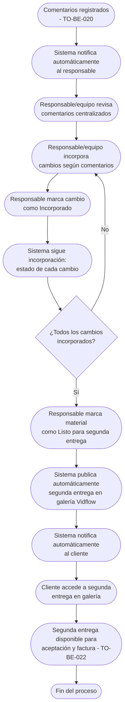

# Proceso TO-BE-021: Incorporación de cambios y segunda entrega

## 1. Objetivo y alcance (del proceso)

**Actor principal**: Responsable del proyecto / Equipo de postproducción

**Evento disparador**: Comentarios y modificaciones registrados (TO-BE-020)

**Propósito**: Notificar automáticamente al responsable de modificaciones, seguir incorporación, publicar segunda entrega en galería corporativa (estilo Vidflow), notificar al cliente

**Scope funcional**: Desde comentarios registrados hasta segunda entrega publicada y notificada

**Criterios de éxito**: 
- 100% de modificaciones incorporadas según comentarios
- Segunda entrega publicada en galería corporativa
- Notificación automática al cliente
- Tiempo de incorporación según complejidad

**Frecuencia**: Por cada material entregado con comentarios

**Duración objetivo**: Variable según complejidad de modificaciones

**Supuestos/restricciones**: 
- Comentarios registrados (TO-BE-020)
- Equipo de postproducción disponible
- TO-BE-022: Generación automática de factura final (requiere segunda entrega aceptada)

## 2. Contexto y actores

**Participantes:**
- **Responsable del proyecto / Equipo de postproducción**: Incorpora cambios
- **Cliente**: Recibe segunda entrega
- **Sistema centralizado**: Gestiona seguimiento y publicación

**Stakeholders clave:** 
- Cliente (espera segunda entrega con cambios incorporados)
- Equipo de postproducción (necesita saber qué modificar)
- Responsable (coordina incorporación)

**Dependencias:** 
- TO-BE-020: Comentarios deben estar registrados
- Equipo de postproducción disponible
- TO-BE-022: Generación automática de factura final

**Gobernanza:** 
- Responsable/equipo incorpora cambios
- Cliente recibe segunda entrega

### 2.1 Dependencias entre procesos TO-BE

**Procesos prerequisito:** 
- TO-BE-020: Gestión de comentarios y modificaciones (comentarios deben estar registrados)

**Procesos dependientes:** 
- TO-BE-022: Generación automática de factura final (requiere segunda entrega aceptada)

**Orden de implementación sugerido:** Vigésimo primero (después de comentarios)

## 3. Transformación AS-IS → TO-BE (trazabilidad)

### 3.1 Procesos AS-IS relacionados

**Procesos AS-IS de referencia:** AS-IS-007: Primera entrega, comentarios y segunda entrega (Corporativo y Bodas)

**Tipo de transformación:** Reimaginación con seguimiento y galería integrada

### 3.2 Análisis del estado actual (procesos AS-IS relacionados)

En el proceso AS-IS, el responsable recibe notificación de modificaciones manualmente. Se incorporan cambios y segunda entrega se realiza en PDF con vínculos o galería corporativa (estilo Vidflow). No hay seguimiento automático ni notificaciones automáticas.

### 3.3 Problemas y oportunidades identificadas

**Dolores principales:**
1. Notificaciones manuales - responsable del proyecto debe ser notificado manualmente de modificaciones _(Fuente: AS-IS-007 P3)_
2. Segunda entrega en PDF - sería mejor presentar material en galería visible con diseño corporativo _(Fuente: AS-IS-007 P4)_

**Causas raíz:** 
- Notificaciones manuales
- Segunda entrega en PDF, no galería integrada
- No hay seguimiento automático

**Oportunidades no explotadas:** 
- Notificaciones automáticas al responsable
- Seguimiento automático de incorporación
- Galería corporativa estilo Vidflow para segunda entrega
- Notificaciones automáticas al cliente

**Riesgo de mantener AS-IS:** 
- Olvidos de incorporación
- Falta de seguimiento
- Experiencia de cliente subóptima

### 3.4 Estrategia de transformación

**Principios de rediseño aplicados:**
- Notificaciones automáticas al responsable cuando hay comentarios
- Seguimiento automático de incorporación de cambios
- Galería corporativa estilo Vidflow para segunda entrega
- Notificaciones automáticas al cliente cuando segunda entrega está lista

**Justificación del nuevo diseño:** 
Este proceso TO-BE automatiza notificaciones y seguimiento, y presenta segunda entrega en galería corporativa integrada, mejorando significativamente la experiencia del cliente y el seguimiento de modificaciones.

**Fuentes:** 
- `02-discovery/0201-interviews/020101-interview-01/minute-01.md` (Sección 2)
- `02-discovery/0202-prd/020202-as-is/processes/AS-IS-007-primera-entrega-comentarios-segunda-entrega/AS-IS-007-primera-entrega-comentarios-segunda-entrega.md`

## 4. Proceso TO-BE

### **4.1 Descripción detallada**

El proceso inicia cuando hay comentarios registrados. El sistema:

1. **Notifica automáticamente al responsable**:
   - Notificación cuando cliente hace comentarios
   - Resumen de comentarios recibidos
   - Enlace directo a comentarios

2. **Responsable/equipo incorpora cambios**:
   - Revisa comentarios centralizados
   - Incorpora modificaciones según comentarios
   - Marca cambios como "Incorporados"

3. **Sistema sigue incorporación**:
   - Estado de cada cambio (pendiente, en proceso, incorporado)
   - Progreso visible para responsable
   - Notificación cuando todos los cambios están incorporados

4. **Responsable marca material como "Listo para segunda entrega"**:
   - Todos los cambios incorporados
   - Material revisado
   - Listo para publicar

5. **Sistema publica automáticamente segunda entrega en galería corporativa**:
   - Galería estilo Vidflow
   - Visualización integrada sin salir de página
   - Material final con cambios incorporados

6. **Sistema notifica automáticamente al cliente**:
   - Notificación de segunda entrega disponible
   - Enlace directo a galería
   - Material listo para aceptación

### **4.2 Diagrama de flujo**

### **4.3 Flujo principal (happy path)**

| # | Actor | Actividad | Sistema/Herramienta | Reglas de Negocio | Tiempo |
|---|-------|-----------|-------------------|-------------------|--------|
| 1 | Sistema | Notifica automáticamente al responsable cuando cliente hace comentarios | Sistema de notificaciones | Notificación incluye: resumen de comentarios, enlace directo | < 1 min |
| 2 | Responsable | Revisa comentarios centralizados desde dashboard | Dashboard del responsable | Todos los comentarios visibles Organizados por minuto/elemento | Variable |
| 3 | Responsable/Equipo | Incorpora cambios según comentarios | Proceso de edición/postproducción | Incorporación según comentarios registrados Seguimiento de progreso | Variable |
| 4 | Responsable | Marca cambio como "Incorporado" cuando está listo | Sistema de seguimiento | Estado visible: pendiente, en proceso, incorporado Progreso actualizado | < 1 min |
| 5 | Sistema | Sigue incorporación: estado de cada cambio, progreso visible | Sistema de seguimiento | Estado de cada cambio visible Progreso calculado automáticamente | < 10 seg |
| 6 | Sistema | Evalúa si todos los cambios están incorporados | Sistema de evaluación | Compara cambios solicitados vs incorporados Notifica cuando todos están listos | < 10 seg |
| 7 | Responsable | Marca material como "Listo para segunda entrega" | Sistema de publicación | Todos los cambios incorporados Material revisado y listo | < 1 min |
| 8 | Sistema | Publica automáticamente segunda entrega en galería corporativa estilo Vidflow | Galería corporativa | Visualización integrada sin salir de página Material final con cambios incorporados | < 2 min |
| 9 | Sistema | Notifica automáticamente al cliente | Sistema de notificaciones | Notificación incluye: segunda entrega disponible, enlace a galería | < 1 min |
| 10 | Cliente | Accede a segunda entrega en galería | Portal de cliente | Galería estilo Vidflow Material final visible | Variable |

### **4.5 Puntos de decisión y variantes**

- **Todos los cambios incorporados vs pendientes**: Si todos están incorporados, se publica; si no, se continúa incorporando
- **Cambios adicionales facturados**: Si hay cambios adicionales facturados, se registran por separado
- **Aceptación vs nuevos comentarios**: Cliente puede aceptar o hacer nuevos comentarios

### **4.6 Excepciones y manejo de errores**

- **Cambio no se puede incorporar**: Si cambio no se puede incorporar, responsable puede comunicar con cliente
- **Error en publicación**: Si falla publicación, sistema notifica a responsable para publicación manual
- **Material no visible**: Si material no es visible, sistema puede reintentar publicación

### **4.7 Riesgos del proceso y mitigaciones**

| Riesgo | Probabilidad | Impacto | Mitigación |
|--------|--------------|---------|------------|
| Cambios no incorporados | Baja | Alto | Seguimiento automático, notificaciones, revisión por responsable |
| Segunda entrega no se publica | Baja | Alto | Publicación automática, notificaciones si falla, publicación manual como respaldo |
| Cliente no ve segunda entrega | Baja | Medio | Notificaciones automáticas, portal accesible 24/7, enlace directo |

### **4.8 Preguntas abiertas**

- ¿Qué hacer si cambio no se puede incorporar? ¿Se comunica con cliente?
- ¿Se requiere confirmación del cliente antes de publicar segunda entrega?
- ¿Qué hacer si cliente hace nuevos comentarios después de segunda entrega?
- ¿Se requiere límite de tiempo para incorporar cambios?

### **4.9 Ideas adicionales**

- Comparación automática entre primera y segunda entrega para mostrar cambios
- Vista previa de cambios antes de publicar segunda entrega
- Análisis de tiempo de incorporación para optimizar proceso
- Integración con herramientas de edición para marcar automáticamente cambios incorporados

---

*GEN-BY:PROMPT-to-be · hash:tobe021_incorporacion_cambios_segunda_entrega_20260120 · 2026-01-20T00:00:00Z*
