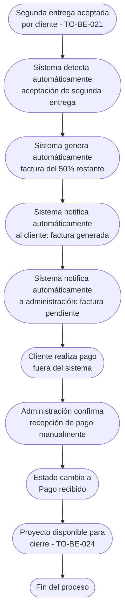

# Proceso TO-BE-022: Generación automática de factura final

## 1. Objetivo y alcance (del proceso)

**Actor principal**: Sistema centralizado

**Evento disparador**: Segunda entrega aceptada por cliente

**Propósito**: Crear automáticamente factura del 50% restante al aceptar segunda entrega, notificar de factura generada. El pago se gestiona fuera del sistema (sin pasarela de pago integrada)

**Scope funcional**: Desde aceptación de segunda entrega hasta factura generada y notificada

**Criterios de éxito**: 
- 100% de facturas finales generadas automáticamente
- Tiempo de generación < 2 minutos desde aceptación
- Notificación automática de factura generada
- Pago gestionado fuera del sistema

**Frecuencia**: Por cada proyecto/boda con segunda entrega aceptada

**Duración objetivo**: < 2 minutos (generación automática)

**Supuestos/restricciones**: 
- Segunda entrega aceptada (TO-BE-021)
- Primer pago (50%) ya recibido
- Pago se gestiona fuera del sistema (sin pasarela de pago integrada)

## 2. Contexto y actores

**Participantes:**
- **Sistema centralizado**: Genera factura automáticamente
- **Cliente**: Recibe factura y realiza pago fuera del sistema
- **Administración**: Gestiona recepción de pago fuera del sistema

**Stakeholders clave:** 
- Cliente (espera factura final)
- Administración (necesita factura generada)
- TO-BE-024: Cierre automático de proyecto (requiere pago final)

**Dependencias:** 
- TO-BE-021: Segunda entrega debe estar aceptada
- Primer pago (50%) ya recibido
- TO-BE-024: Cierre automático de proyecto

**Gobernanza:** 
- Sistema genera factura automáticamente
- Cliente realiza pago fuera del sistema
- Administración confirma recepción de pago

### 2.1 Dependencias entre procesos TO-BE

**Procesos prerequisito:** 
- TO-BE-021: Incorporación de cambios y segunda entrega (segunda entrega debe estar aceptada)

**Procesos dependientes:** 
- TO-BE-024: Cierre automático de proyecto (requiere factura generada y pago recibido)

**Orden de implementación sugerido:** Vigésimo segundo (después de segunda entrega)

## 3. Transformación AS-IS → TO-BE (trazabilidad)

### 3.1 Procesos AS-IS relacionados

**Procesos AS-IS de referencia:** AS-IS-008: Segundo pago, cierre y feedback (Corporativo y Bodas)

**Tipo de transformación:** Reimaginación con generación automática (sin pasarela de pago)

### 3.2 Análisis del estado actual (procesos AS-IS relacionados)

En el proceso AS-IS, se genera automáticamente factura para pago final (50% restante) al aceptar trabajo, se abre pasarela de pago, cliente realiza pago, y sistema envía notificación. Sin embargo, según modificaciones del usuario, el pago se gestiona fuera del sistema (sin pasarela de pago integrada).

### 3.3 Problemas y oportunidades identificadas

**Dolores principales:**
1. Proceso de facturación no completamente integrado - facturas se envían después de cada pago pero proceso no está automatizado _(Fuente: AS-IS-004 P5)_

**Causas raíz:** 
- Generación manual de facturas
- No hay automatización completa
- Pasarela de pago parcialmente implementada

**Oportunidades no explotadas:** 
- Generación automática de factura final
- Notificación automática de factura generada
- Pago gestionado fuera del sistema (según requerimiento)

**Riesgo de mantener AS-IS:** 
- Retrasos en generación de factura
- Olvidos de facturación
- Falta de visibilidad del estado

### 3.4 Estrategia de transformación

**Principios de rediseño aplicados:**
- Generación automática de factura final al aceptar segunda entrega
- Notificación automática de factura generada
- Pago gestionado fuera del sistema (sin pasarela de pago integrada)
- Seguimiento de estado de pago mediante confirmación manual

**Justificación del nuevo diseño:** 
Este proceso TO-BE genera automáticamente la factura final y notifica, pero el pago se gestiona fuera del sistema según requerimiento del usuario, manteniendo flexibilidad en el método de pago.

**Fuentes:** 
- `02-discovery/0201-interviews/020101-interview-01/minute-01.md` (Sección 2)
- `02-discovery/0202-prd/020202-as-is/processes/AS-IS-008-segundo-pago-cierre-feedback/AS-IS-008-segundo-pago-cierre-feedback.md`

## 4. Proceso TO-BE

### **4.1 Descripción detallada**

El proceso inicia cuando el cliente acepta la segunda entrega. El sistema:

1. **Detecta automáticamente aceptación de segunda entrega**:
   - Cliente acepta segunda entrega en portal
   - Estado cambia a "Segunda entrega aceptada"

2. **Genera automáticamente factura del 50% restante**:
   - Número de factura automático
   - Monto: 50% restante del presupuesto
   - Datos del cliente
   - Concepto: nombre proyecto/boda y fecha

3. **Notifica automáticamente**:
   - Al cliente: factura generada, disponible en portal
   - A administración: factura generada, pendiente de pago

4. **Cliente realiza pago fuera del sistema**:
   - Pago gestionado fuera del sistema (sin pasarela de pago integrada)
   - Cliente realiza pago mediante método externo

5. **Administración confirma recepción de pago**:
   - Confirma pago recibido manualmente
   - Estado cambia a "Pago recibido"
   - Proyecto disponible para cierre (TO-BE-024)

### **4.2 Diagrama de flujo**

### **4.3 Flujo principal (happy path)**

| # | Actor | Actividad | Sistema/Herramienta | Reglas de Negocio | Tiempo |
|---|-------|-----------|-------------------|-------------------|--------|
| 1 | Cliente | Acepta segunda entrega en portal | Portal de cliente | Aceptación explícita de segunda entrega Estado cambia a "Aceptada" | < 1 min |
| 2 | Sistema | Detecta automáticamente aceptación de segunda entrega | Sistema centralizado | Trigger automático al cambiar estado a "Aceptada" | < 1 min |
| 3 | Sistema | Genera automáticamente factura del 50% restante | Motor de generación de facturas | Número automático, monto 50%, datos cliente, concepto | < 1 min |
| 4 | Sistema | Notifica automáticamente al cliente | Sistema de notificaciones | Notificación incluye: factura generada, disponible en portal | < 1 min |
| 5 | Sistema | Notifica automáticamente a administración | Sistema de notificaciones | Notificación incluye: factura generada, pendiente de pago | < 1 min |
| 6 | Cliente | Realiza pago fuera del sistema (sin pasarela de pago integrada) | Método de pago externo | Pago gestionado fuera del sistema Según método preferido del cliente | Variable |
| 7 | Administración | Confirma recepción de pago manualmente | Dashboard de administración | Confirmación manual de pago recibido Estado cambia a "Pago recibido" | < 5 min |
| 8 | Sistema | Cambia estado a "Pago recibido" | Base de datos | Estado visible para seguimiento Proyecto disponible para cierre | < 10 seg |

### **4.5 Puntos de decisión y variantes**

- **Pago recibido vs pendiente**: Si pago no se recibe, estado queda como "Pendiente de pago"
- **Confirmación de pago**: Administración confirma manualmente cuando recibe pago

### **4.6 Excepciones y manejo de errores**

- **Factura no generada**: Si falla generación, sistema notifica a administración para generación manual
- **Pago no recibido**: Si pago no se recibe, sistema puede enviar recordatorios
- **Error en confirmación**: Si hay error en confirmación, administración puede corregir

### **4.7 Riesgos del proceso y mitigaciones**

| Riesgo | Probabilidad | Impacto | Mitigación |
|--------|--------------|---------|------------|
| Factura no generada | Baja | Alto | Generación automática, notificaciones si falla, generación manual como respaldo |
| Pago no recibido | Media | Alto | Recordatorios automáticos, seguimiento de estado, comunicación con cliente |
| Confirmación incorrecta | Baja | Medio | Confirmación manual con validación, posibilidad de corrección |

### **4.8 Preguntas abiertas**

- ¿Cuánto tiempo tiene cliente para realizar pago? ¿Hay plazo límite?
- ¿Qué hacer si pago no se recibe? ¿Se envía recordatorio?
- ¿Se requiere justificante de pago para confirmar?
- ¿Qué hacer si cliente paga monto diferente al 50%?

### **4.9 Ideas adicionales**

- Recordatorios automáticos si pago no se recibe en tiempo razonable
- Integración con sistema bancario para detección automática de pagos (futuro)
- Portal donde cliente puede ver estado de factura y pago
- Análisis de tiempo promedio desde factura hasta pago

---

*GEN-BY:PROMPT-to-be · hash:tobe022_generacion_automatica_factura_final_20260120 · 2026-01-20T00:00:00Z*
