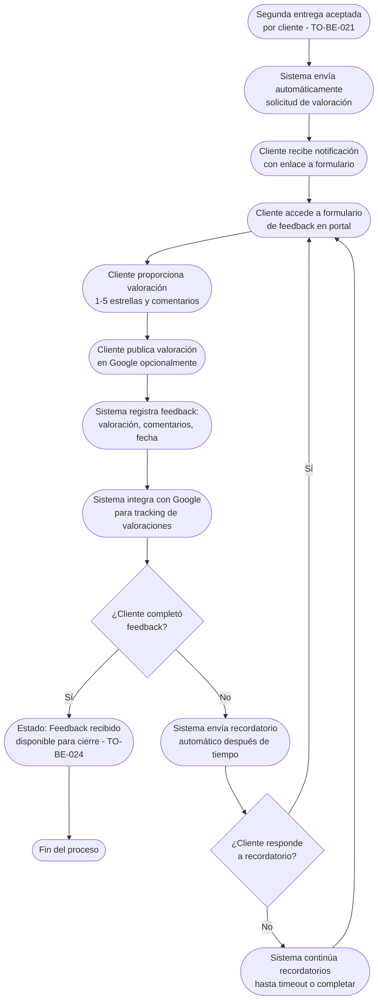

# Proceso TO-BE-023: Solicitud automática de feedback

## 1. Objetivo y alcance (del proceso)

**Actor principal**: Sistema centralizado (con seguimiento)

**Evento disparador**: Segunda entrega aceptada por cliente

**Propósito**: Enviar automáticamente solicitud de valoración tras aceptación de entrega final, seguimiento de completitud, recordatorios si no se completa, integración con Google para publicación

**Scope funcional**: Desde aceptación de segunda entrega hasta feedback recibido o timeout

**Criterios de éxito**: 
- 100% de clientes reciben solicitud automática de feedback
- Seguimiento de completitud
- Recordatorios automáticos si no se completa
- Integración con Google para publicación
- Objetivo: valoración de 5 estrellas

**Frecuencia**: Por cada proyecto/boda con segunda entrega aceptada

**Duración objetivo**: Variable según respuesta del cliente

**Supuestos/restricciones**: 
- Segunda entrega aceptada (TO-BE-021)
- Integración con Google para valoraciones
- Portal de cliente disponible para feedback

## 2. Contexto y actores

**Participantes:**
- **Sistema centralizado**: Envía solicitud y hace seguimiento
- **Cliente**: Completa feedback y publica valoración
- **Equipo comercial**: Revisa feedback recibido

**Stakeholders clave:** 
- Cliente (proporciona feedback)
- Equipo comercial (necesita feedback para mejora)
- CEO (objetivo: valoración 5 estrellas)

**Dependencias:** 
- TO-BE-021: Segunda entrega debe estar aceptada
- Integración con Google para valoraciones
- TO-BE-024: Cierre automático de proyecto

**Gobernanza:** 
- Sistema envía solicitud automáticamente
- Cliente completa feedback
- Equipo revisa feedback recibido

### 2.1 Dependencias entre procesos TO-BE

**Procesos prerequisito:** 
- TO-BE-021: Incorporación de cambios y segunda entrega (segunda entrega debe estar aceptada)

**Procesos dependientes:** 
- TO-BE-024: Cierre automático de proyecto (puede incluir feedback recibido)

**Orden de implementación sugerido:** Vigésimo tercero (después de segunda entrega)

## 3. Transformación AS-IS → TO-BE (trazabilidad)

### 3.1 Procesos AS-IS relacionados

**Procesos AS-IS de referencia:** AS-IS-008: Segundo pago, cierre y feedback (Corporativo y Bodas)

**Tipo de transformación:** Reimaginación con automatización y seguimiento

### 3.2 Análisis del estado actual (procesos AS-IS relacionados)

En el proceso AS-IS, se envía petición de valoración con vínculo a Google para que cliente publique recomendación (objetivo: 5 estrellas), pero proceso es manual y no hay seguimiento de completitud.

### 3.3 Problemas y oportunidades identificadas

**Dolores principales:**
1. Solicitud de feedback manual - se envía petición de valoración por email, proceso no automatizado _(Fuente: AS-IS-008 P1)_
2. Falta de seguimiento de feedback - no hay sistema para asegurar que cliente complete valoración _(Fuente: AS-IS-008 P2)_
3. Falta de registro de satisfacción - no hay base de datos estructurada de feedback recibido _(Fuente: AS-IS-008 P4)_

**Causas raíz:** 
- Solicitud manual
- No hay seguimiento
- No hay registro estructurado

**Oportunidades no explotadas:** 
- Solicitud automática tras aceptación
- Seguimiento de completitud
- Recordatorios automáticos
- Base de datos de feedback

**Riesgo de mantener AS-IS:** 
- Baja tasa de feedback recibido
- Falta de datos de satisfacción
- Dificultad para mejorar servicios

### 3.4 Estrategia de transformación

**Principios de rediseño aplicados:**
- Solicitud automática tras aceptación de entrega final
- Seguimiento de completitud con recordatorios automáticos
- Integración con Google para publicación
- Base de datos estructurada de feedback

**Justificación del nuevo diseño:** 
Este proceso TO-BE automatiza completamente la solicitud de feedback con seguimiento y recordatorios, mejorando significativamente la tasa de feedback recibido y proporcionando datos estructurados de satisfacción.

**Fuentes:** 
- `02-discovery/0201-interviews/020101-interview-01/minute-01.md` (Sección 2)
- `02-discovery/0202-prd/020202-as-is/processes/AS-IS-008-segundo-pago-cierre-feedback/AS-IS-008-segundo-pago-cierre-feedback.md`

## 4. Proceso TO-BE

### **4.1 Descripción detallada**

El proceso inicia cuando el cliente acepta la segunda entrega. El sistema:

1. **Envía automáticamente solicitud de valoración**:
   - Notificación al cliente
   - Enlace a formulario de feedback en portal
   - Vínculo a Google para publicación de valoración
   - Objetivo: valoración de 5 estrellas

2. **Cliente completa feedback**:
   - Accede a formulario en portal
   - Proporciona valoración (1-5 estrellas)
   - Escribe comentarios opcionales
   - Publica valoración en Google (opcional)

3. **Sistema registra feedback**:
   - Valoración recibida
   - Comentarios registrados
   - Fecha de feedback
   - Estado: "Feedback recibido"

4. **Sistema hace seguimiento**:
   - Si cliente no completa feedback, envía recordatorios automáticos
   - Seguimiento hasta completar o timeout

5. **Sistema integra con Google**:
   - Tracking de valoraciones publicadas en Google
   - Registro de valoraciones externas

### **4.2 Diagrama de flujo**

### **4.3 Flujo principal (happy path)**

| # | Actor | Actividad | Sistema/Herramienta | Reglas de Negocio | Tiempo |
|---|-------|-----------|-------------------|-------------------|--------|
| 1 | Sistema | Envía automáticamente solicitud de valoración tras aceptación de segunda entrega | Sistema de notificaciones | Notificación incluye: enlace a formulario, vínculo a Google, objetivo 5 estrellas | < 1 min |
| 2 | Cliente | Recibe notificación y accede a formulario de feedback en portal | Portal de cliente | Formulario accesible desde portal Valoración 1-5 estrellas, comentarios opcionales | Variable |
| 3 | Cliente | Proporciona valoración (1-5 estrellas) y comentarios opcionales | Formulario de feedback | Valoración obligatoria, comentarios opcionales Objetivo: 5 estrellas | < 5 min |
| 4 | Cliente | Publica valoración en Google opcionalmente | Integración Google | Vínculo directo a Google Tracking de valoraciones publicadas | Variable |
| 5 | Sistema | Registra feedback: valoración, comentarios, fecha | Base de datos | Feedback registrado estructuradamente Estado: "Feedback recibido" | < 10 seg |
| 6 | Sistema | Integra con Google para tracking de valoraciones publicadas | Integración Google | Tracking de valoraciones externas Registro de valoraciones publicadas | < 1 min |
| 7 | Sistema | Evalúa si cliente completó feedback | Sistema de evaluación | Si completó, estado "Feedback recibido" Si no, programa recordatorios | < 10 seg |
| 8 | Sistema | Si cliente no completó, envía recordatorios automáticos después de tiempo configurado | Sistema de recordatorios | Recordatorios programados (ej: 3 días, 1 semana) Hasta completar o timeout | Variable |
| 9 | Sistema | Proceso continúa hasta feedback recibido o timeout | Sistema de seguimiento | Seguimiento automático Estado visible para equipo | Variable |

### **4.5 Puntos de decisión y variantes**

- **Feedback completado vs no completado**: Si completó, se registra; si no, se envían recordatorios
- **Valoración en portal vs Google**: Cliente puede valorar en portal y/o publicar en Google
- **Timeout**: Si cliente no responde después de recordatorios, proceso puede finalizar

### **4.6 Excepciones y manejo de errores**

- **Cliente no recibe solicitud**: Si cliente no recibe, sistema puede reenviar automáticamente
- **Error en registro**: Si falla registro, sistema permite reintentar
- **Valoración no publicada en Google**: Si no se publica en Google, feedback queda registrado en sistema

### **4.7 Riesgos del proceso y mitigaciones**

| Riesgo | Probabilidad | Impacto | Mitigación |
|--------|--------------|---------|------------|
| Cliente no completa feedback | Media | Medio | Recordatorios automáticos, múltiples canales, seguimiento |
| Valoración baja | Baja | Medio | Análisis de feedback, mejora de servicios, comunicación con cliente |
| Feedback no se registra | Baja | Bajo | Registro automático, validación, posibilidad de reintentar |

### **4.8 Preguntas abiertas**

- ¿Cuántos recordatorios se envían antes de considerar timeout?
- ¿Qué hacer si cliente da valoración baja? ¿Se contacta para entender?
- ¿Se requiere confirmación de cliente antes de publicar valoración en Google?
- ¿Qué hacer si cliente no responde nunca? ¿Se cierra proyecto sin feedback?

### **4.9 Ideas adicionales**

- Análisis automático de sentimiento de comentarios
- Comparación de feedback con proyectos similares
- Alertas automáticas si valoración es baja
- Integración con múltiples plataformas de valoración (Google, Facebook, etc.)

---

*GEN-BY:PROMPT-to-be · hash:tobe023_solicitud_automatica_feedback_20260120 · 2026-01-20T00:00:00Z*
