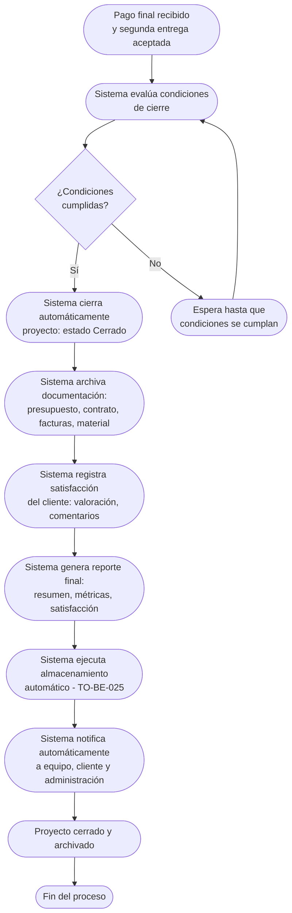

# Proceso TO-BE-024: Cierre automático de proyecto

## 1. Objetivo y alcance (del proceso)

**Actor principal**: Sistema centralizado

**Evento disparador**: Pago final recibido y segunda entrega aceptada

**Propósito**: Cierre automático tras pago final y aceptación, actualización de estado, archivo de documentación, registro de satisfacción del cliente, generación de reporte final

**Scope funcional**: Desde pago final recibido hasta proyecto cerrado y archivado

**Criterios de éxito**: 
- 100% de proyectos cerrados automáticamente cuando se cumplen condiciones
- Documentación archivada completamente
- Satisfacción del cliente registrada
- Reporte final generado
- Tiempo de cierre < 5 minutos

**Frecuencia**: Por cada proyecto/boda completado

**Duración objetivo**: < 5 minutos (proceso automático)

**Supuestos/restricciones**: 
- Pago final recibido (TO-BE-022)
- Segunda entrega aceptada (TO-BE-021)
- Feedback recibido (opcional, TO-BE-023)

## 2. Contexto y actores

**Participantes:**
- **Sistema centralizado**: Cierra proyecto automáticamente
- **Equipo de proyecto**: Recibe notificación de cierre
- **Cliente**: Recibe confirmación de cierre
- **Administración**: Recibe reporte final

**Stakeholders clave:** 
- Equipo de proyecto (necesita saber que proyecto está cerrado)
- Cliente (espera confirmación de cierre)
- Administración (necesita reporte final)

**Dependencias:** 
- TO-BE-022: Pago final debe estar recibido
- TO-BE-021: Segunda entrega debe estar aceptada
- TO-BE-025: Almacenamiento automático de archivos (se ejecuta en este proceso)

**Gobernanza:** 
- Sistema cierra automáticamente cuando se cumplen condiciones
- Administración puede revisar reporte final

### 2.1 Dependencias entre procesos TO-BE

**Procesos prerequisito:** 
- TO-BE-022: Generación automática de factura final (pago final debe estar recibido)
- TO-BE-021: Incorporación de cambios y segunda entrega (segunda entrega debe estar aceptada)

**Procesos dependientes:** 
- TO-BE-025: Almacenamiento automático de archivos (se ejecuta en este proceso)

**Orden de implementación sugerido:** Vigésimo cuarto (después de pago final)

## 3. Transformación AS-IS → TO-BE (trazabilidad)

### 3.1 Procesos AS-IS relacionados

**Procesos AS-IS de referencia:** AS-IS-008: Segundo pago, cierre y feedback (Corporativo y Bodas)

**Tipo de transformación:** Reimaginación con cierre automático

### 3.2 Análisis del estado actual (procesos AS-IS relacionados)

En el proceso AS-IS, el proyecto se cierra manualmente después de pago final y aceptación. No hay cierre automático ni archivo estructurado de documentación.

### 3.3 Problemas y oportunidades identificadas

**Dolores principales:**
1. Proceso de cierre no estructurado - cierre de proyecto requiere intervención manual _(Fuente: AS-IS-008 P3)_

**Causas raíz:** 
- Cierre manual
- No hay archivo estructurado
- No hay registro de satisfacción

**Oportunidades no explotadas:** 
- Cierre automático cuando se cumplen condiciones
- Archivo estructurado de documentación
- Registro de satisfacción del cliente
- Reporte final generado automáticamente

**Riesgo de mantener AS-IS:** 
- Proyectos no se cierran
- Falta de archivo estructurado
- Falta de datos de satisfacción

### 3.4 Estrategia de transformación

**Principios de rediseño aplicados:**
- Cierre automático cuando se cumplen condiciones (pago final recibido, segunda entrega aceptada)
- Archivo estructurado de documentación
- Registro de satisfacción del cliente
- Reporte final generado automáticamente

**Justificación del nuevo diseño:** 
Este proceso TO-BE automatiza completamente el cierre del proyecto cuando se cumplen todas las condiciones, archivando documentación y generando reporte final, mejorando significativamente la gestión de cierre.

**Fuentes:** 
- `02-discovery/0201-interviews/020101-interview-01/minute-01.md` (Sección 2)
- `02-discovery/0202-prd/020202-as-is/processes/AS-IS-008-segundo-pago-cierre-feedback/AS-IS-008-segundo-pago-cierre-feedback.md`

## 4. Proceso TO-BE

### **4.1 Descripción detallada**

El proceso inicia cuando se cumplen las condiciones de cierre. El sistema:

1. **Evalúa condiciones de cierre**:
   - Pago final recibido (TO-BE-022)
   - Segunda entrega aceptada (TO-BE-021)
   - Feedback recibido (opcional, TO-BE-023)

2. **Cierra automáticamente el proyecto**:
   - Estado cambia a "Cerrado"
   - Fecha de cierre registrada
   - Proyecto archivado

3. **Archiva documentación**:
   - Presupuesto, contrato, facturas
   - Material entregado
   - Comentarios y modificaciones
   - Feedback recibido

4. **Registra satisfacción del cliente**:
   - Valoración recibida (si aplica)
   - Comentarios registrados
   - Satisfacción documentada

5. **Genera reporte final**:
   - Resumen del proyecto
   - Métricas de rentabilidad
   - Satisfacción del cliente
   - Lecciones aprendidas

6. **Notifica automáticamente**:
   - Al equipo: proyecto cerrado
   - Al cliente: proyecto cerrado, agradecimiento
   - A administración: reporte final generado

7. **Ejecuta almacenamiento automático** (TO-BE-025):
   - Archivos se suben automáticamente a nube
   - Organización por carpetas

### **4.2 Diagrama de flujo**

### **4.3 Flujo principal (happy path)**

| # | Actor | Actividad | Sistema/Herramienta | Reglas de Negocio | Tiempo |
|---|-------|-----------|-------------------|-------------------|--------|
| 1 | Sistema | Evalúa condiciones de cierre (pago final recibido, segunda entrega aceptada) | Sistema de evaluación | Verifica todas las condiciones Si no se cumplen, espera | < 1 min |
| 2 | Sistema | Cierra automáticamente proyecto cuando condiciones se cumplen | Sistema de cierre | Estado cambia a "Cerrado" Fecha de cierre registrada | < 1 min |
| 3 | Sistema | Archiva documentación (presupuesto, contrato, facturas, material, comentarios) | Sistema de archivo | Documentación organizada por proyecto Archivo estructurado | < 2 min |
| 4 | Sistema | Registra satisfacción del cliente (valoración, comentarios) | Base de datos | Satisfacción documentada Vinculada al proyecto | < 10 seg |
| 5 | Sistema | Genera reporte final (resumen, métricas de rentabilidad, satisfacción) | Motor de generación de reportes | Reporte completo con todos los datos Disponible para descarga | < 1 min |
| 6 | Sistema | Ejecuta almacenamiento automático de archivos (TO-BE-025) | Sistema de almacenamiento | Archivos se suben a nube Organización por carpetas | < 1 min |
| 7 | Sistema | Notifica automáticamente al equipo | Sistema de notificaciones | Notificación incluye: proyecto cerrado, reporte final | < 1 min |
| 8 | Sistema | Notifica automáticamente al cliente | Sistema de notificaciones | Notificación incluye: proyecto cerrado, agradecimiento | < 1 min |
| 9 | Sistema | Notifica automáticamente a administración | Sistema de notificaciones | Notificación incluye: reporte final generado | < 1 min |

### **4.5 Puntos de decisión y variantes**

- **Condiciones cumplidas vs no cumplidas**: Si condiciones no se cumplen, sistema espera hasta que se cumplan
- **Feedback opcional**: Proyecto puede cerrarse con o sin feedback recibido
- **Reporte final**: Se genera automáticamente con todos los datos disponibles

### **4.6 Excepciones y manejo de errores**

- **Condiciones no cumplidas**: Si condiciones no se cumplen, sistema espera y evalúa periódicamente
- **Error en archivo**: Si falla archivo, sistema notifica y permite archivo manual
- **Error en generación de reporte**: Si falla generación, sistema notifica y permite generación manual

### **4.7 Riesgos del proceso y mitigaciones**

| Riesgo | Probabilidad | Impacto | Mitigación |
|--------|--------------|---------|------------|
| Proyecto no se cierra | Baja | Alto | Cierre automático cuando condiciones se cumplen, notificaciones, seguimiento |
| Documentación no archivada | Baja | Alto | Archivo automático, validación, posibilidad de archivo manual |
| Reporte final no generado | Baja | Medio | Generación automática, notificaciones si falla, generación manual como respaldo |

### **4.8 Preguntas abiertas**

- ¿Se requiere feedback para cerrar proyecto o es opcional?
- ¿Qué hacer si condiciones no se cumplen nunca? ¿Se cierra manualmente?
- ¿Qué incluye el reporte final? ¿Qué métricas son más importantes?
- ¿Se requiere aprobación manual antes de cerrar o es completamente automático?

### **4.9 Ideas adicionales**

- Análisis comparativo con proyectos similares en reporte final
- Predicción de satisfacción basada en métricas del proyecto
- Alertas automáticas si satisfacción es baja
- Integración con sistemas de análisis para reportes avanzados

---

*GEN-BY:PROMPT-to-be · hash:tobe024_cierre_automatico_proyecto_20260120 · 2026-01-20T00:00:00Z*
