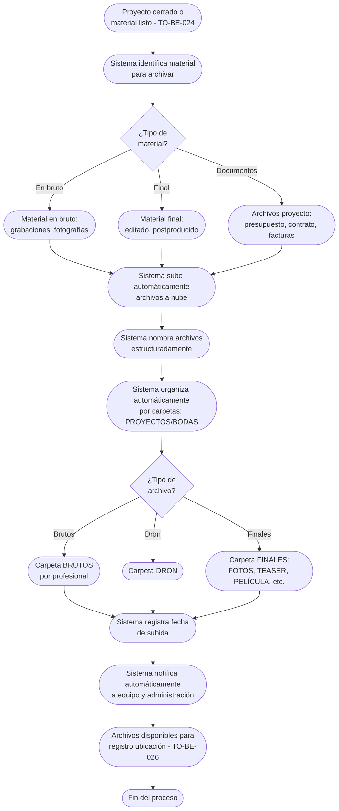

# Proceso TO-BE-025: Almacenamiento automático de archivos

## 1. Objetivo y alcance (del proceso)

**Actor principal**: Sistema centralizado

**Evento disparador**: Proyecto cerrado (TO-BE-024) o material listo para archivo

**Propósito**: Subida automática de material en bruto y final a la nube con nombrado estructurado, organización por carpetas (PROYECTOS/BODAS, BRUTOS, DRON, FINALES), registro de fecha de subida

**Scope funcional**: Desde material disponible hasta archivo subido y organizado en nube

**Criterios de éxito**: 
- 100% de archivos subidos automáticamente a nube
- Nombrado estructurado automático
- Organización por carpetas correcta
- Registro de fecha de subida
- Tiempo de subida según tamaño de archivos

**Frecuencia**: Por cada proyecto/boda cerrado o material listo para archivo

**Duración objetivo**: Variable según tamaño de archivos

**Supuestos/restricciones**: 
- Proyecto cerrado (TO-BE-024) o material listo
- Almacenamiento en nube configurado
- TO-BE-026: Registro de ubicación en discos físicos

## 2. Contexto y actores

**Participantes:**
- **Sistema centralizado**: Sube archivos automáticamente
- **Equipo de producción**: Proporciona material para archivo
- **Administración**: Supervisa almacenamiento

**Stakeholders clave:** 
- Equipo de producción (necesita archivar material)
- Administración (necesita material archivado)
- Cliente (puede necesitar acceso a archivos)

**Dependencias:** 
- TO-BE-024: Proyecto cerrado o material listo
- Almacenamiento en nube configurado
- TO-BE-026: Registro de ubicación en discos físicos

**Gobernanza:** 
- Sistema sube archivos automáticamente
- Administración supervisa almacenamiento

### 2.1 Dependencias entre procesos TO-BE

**Procesos prerequisito:** 
- TO-BE-024: Cierre automático de proyecto (proyecto cerrado o material listo)

**Procesos dependientes:** 
- TO-BE-026: Registro de ubicación en discos físicos (requiere archivos en nube)
- TO-BE-027: Gestión de retención y eliminación (requiere archivos archivados)

**Orden de implementación sugerido:** Vigésimo quinto (después de cierre)

## 3. Transformación AS-IS → TO-BE (trazabilidad)

### 3.1 Procesos AS-IS relacionados

**Procesos AS-IS de referencia:** AS-IS-009: Gestión de almacenamiento y archivo (Corporativo y Bodas)

**Tipo de transformación:** Reimaginación con automatización completa

### 3.2 Análisis del estado actual (procesos AS-IS relacionados)

En el proceso AS-IS, después de entregar producto final, se suben brutos y archivos a la nube manualmente. Archivos se nombran de manera ordenada pero proceso es manual y propenso a errores. Se registra fecha en que se sube proyecto a la nube pero proceso no está automatizado.

### 3.3 Problemas y oportunidades identificadas

**Dolores principales:**
1. Organización manual de archivos - subida y nombrado de archivos es manual, propenso a errores _(Fuente: AS-IS-009 P3)_

**Causas raíz:** 
- Subida manual de archivos
- Nombrado manual propenso a errores
- No hay automatización

**Oportunidades no explotadas:** 
- Subida automática de archivos
- Nombrado estructurado automático
- Organización automática por carpetas
- Registro automático de fecha de subida

**Riesgo de mantener AS-IS:** 
- Errores en nombrado
- Archivos no organizados
- Falta de trazabilidad

### 3.4 Estrategia de transformación

**Principios de rediseño aplicados:**
- Subida automática de archivos a nube
- Nombrado estructurado automático según proyecto/boda
- Organización automática por carpetas (PROYECTOS/BODAS, BRUTOS, DRON, FINALES)
- Registro automático de fecha de subida

**Justificación del nuevo diseño:** 
Este proceso TO-BE automatiza completamente el almacenamiento de archivos, eliminando errores manuales y garantizando organización estructurada y trazabilidad completa.

**Fuentes:** 
- `02-discovery/0201-interviews/020101-interview-01/minute-01.md` (Almacenamiento)
- `02-discovery/0202-prd/020202-as-is/processes/AS-IS-009-gestion-almacenamiento-archivo/AS-IS-009-gestion-almacenamiento-archivo.md`

## 4. Proceso TO-BE

### **4.1 Descripción detallada**

El proceso inicia cuando el proyecto está cerrado o material está listo para archivo. El sistema:

1. **Identifica material para archivar**:
   - Material en bruto (grabaciones, fotografías)
   - Material final (editado, postproducido)
   - Archivos del proyecto (presupuesto, contrato, facturas)

2. **Sube automáticamente archivos a nube**:
   - Subida automática de todos los archivos
   - Progreso visible durante subida
   - Validación de integridad

3. **Nombra archivos estructuradamente**:
   - Nombrado automático según proyecto/boda
   - Formato estructurado: [Proyecto/Boda]_[Tipo]_[Fecha]_[Versión]
   - Sin errores de nombrado

4. **Organiza automáticamente por carpetas**:
   - Carpetas principales: PROYECTOS y BODAS
   - Dentro de cada proyecto/boda: BRUTOS (por profesional), DRON, FINALES
   - Para bodas en FINALES: FOTOS, TEASER, PELÍCULA, HOMILÍA, CARTAS

5. **Registra fecha de subida**:
   - Timestamp automático
   - Fecha registrada para retención (TO-BE-027)

6. **Notifica automáticamente**:
   - Al equipo: archivos archivados
   - A administración: archivos disponibles

### **4.2 Diagrama de flujo**

### **4.3 Flujo principal (happy path)**

| # | Actor | Actividad | Sistema/Herramienta | Reglas de Negocio | Tiempo |
|---|-------|-----------|-------------------|-------------------|--------|
| 1 | Sistema | Identifica material para archivar (en bruto, final, documentos) | Sistema de identificación | Material vinculado a proyecto/boda Identificación automática | < 1 min |
| 2 | Sistema | Sube automáticamente archivos a nube | Sistema de almacenamiento en nube | Subida automática con progreso visible Validación de integridad | Variable |
| 3 | Sistema | Nombra archivos estructuradamente según proyecto/boda | Motor de nombrado | Formato: [Proyecto/Boda]_[Tipo]_[Fecha]_[Versión] Nombrado automático sin errores | < 1 min |
| 4 | Sistema | Organiza automáticamente por carpetas (PROYECTOS/BODAS, BRUTOS, DRON, FINALES) | Sistema de organización | Carpetas principales: PROYECTOS y BODAS Subcarpetas según tipo de archivo | < 1 min |
| 5 | Sistema | Registra fecha de subida automáticamente | Base de datos | Timestamp de subida Fecha registrada para retención (TO-BE-027) | < 10 seg |
| 6 | Sistema | Notifica automáticamente al equipo | Sistema de notificaciones | Notificación incluye: archivos archivados, ubicación | < 1 min |
| 7 | Sistema | Notifica automáticamente a administración | Sistema de notificaciones | Notificación incluye: archivos disponibles, organización | < 1 min |

### **4.5 Puntos de decisión y variantes**

- **Tipo de material**: En bruto, final o documentos requiere diferente organización
- **Tamaño de archivos**: Archivos grandes pueden requerir más tiempo de subida
- **Organización por carpetas**: Diferente estructura para proyectos vs bodas

### **4.6 Excepciones y manejo de errores**

- **Error en subida**: Si falla subida, sistema reintenta automáticamente, si falla notifica
- **Error en nombrado**: Si hay error en nombrado, sistema puede corregir automáticamente
- **Archivo corrupto**: Si archivo está corrupto, sistema valida integridad y notifica

### **4.7 Riesgos del proceso y mitigaciones**

| Riesgo | Probabilidad | Impacto | Mitigación |
|--------|--------------|---------|------------|
| Archivos no se suben | Baja | Alto | Subida automática, reintentos, notificaciones si falla |
| Error en nombrado | Baja | Medio | Nombrado estructurado automático, validación, corrección automática |
| Archivos no organizados | Baja | Medio | Organización automática por carpetas, validación de estructura |

### **4.8 Preguntas abiertas**

- ¿Qué hacer si archivos son muy grandes? ¿Se comprimen antes de subir?
- ¿Se requiere validación de integridad después de subida?
- ¿Qué hacer si archivo ya existe en nube? ¿Se sobrescribe o se versiona?
- ¿Se requiere encriptación de archivos antes de subir?

### **4.9 Ideas adicionales**

- Compresión automática de archivos grandes antes de subir
- Validación de integridad después de subida
- Versionado automático de archivos si ya existen
- Encriptación de archivos sensibles antes de subir

---

*GEN-BY:PROMPT-to-be · hash:tobe025_almacenamiento_automatico_archivos_20260120 · 2026-01-20T00:00:00Z*
