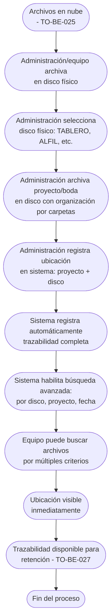

# Proceso TO-BE-026: Registro de ubicación en discos físicos

## 1. Objetivo y alcance (del proceso)

**Actor principal**: Administración / Equipo de producción

**Evento disparador**: Archivos subidos a nube (TO-BE-025) y archivados en discos físicos

**Propósito**: Registro automático de en qué disco duro físico (TABLERO, ALFIL, etc.) se archiva cada proyecto, trazabilidad completa de ubicación, búsqueda avanzada por disco

**Scope funcional**: Desde archivo en disco físico hasta registro de ubicación y trazabilidad

**Criterios de éxito**: 
- 100% de proyectos con ubicación en disco físico registrada
- Trazabilidad completa de ubicación
- Búsqueda avanzada por disco funcional
- Tiempo de registro < 2 minutos por proyecto

**Frecuencia**: Por cada proyecto/boda archivado en disco físico

**Duración objetivo**: < 2 minutos por registro

**Supuestos/restricciones**: 
- Archivos en nube (TO-BE-025)
- Archivo en discos físicos realizado
- Discos físicos nombrados (TABLERO, ALFIL, etc.)

## 2. Contexto y actores

**Participantes:**
- **Administración / Equipo de producción**: Archiva en discos físicos y registra ubicación
- **Sistema centralizado**: Gestiona registro y búsqueda
- **Equipo**: Busca proyectos por disco físico

**Stakeholders clave:** 
- Equipo de producción (necesita saber dónde está cada archivo)
- Administración (necesita trazabilidad completa)
- Cliente (puede necesitar acceso a archivos)

**Dependencias:** 
- TO-BE-025: Archivos deben estar en nube
- Archivo en discos físicos realizado
- TO-BE-027: Gestión de retención y eliminación

**Gobernanza:** 
- Administración archiva en discos físicos
- Sistema registra ubicación automáticamente

### 2.1 Dependencias entre procesos TO-BE

**Procesos prerequisito:** 
- TO-BE-025: Almacenamiento automático de archivos (archivos deben estar en nube)

**Procesos dependientes:** 
- TO-BE-027: Gestión de retención y eliminación (requiere ubicación registrada)

**Orden de implementación sugerido:** Vigésimo sexto (después de almacenamiento)

## 3. Transformación AS-IS → TO-BE (trazabilidad)

### 3.1 Procesos AS-IS relacionados

**Procesos AS-IS de referencia:** AS-IS-009: Gestión de almacenamiento y archivo (Corporativo y Bodas)

**Tipo de transformación:** Reimaginación con registro automático

### 3.2 Análisis del estado actual (procesos AS-IS relacionados)

En el proceso AS-IS, se archivan en discos duros físicos y se registra en qué disco duro está guardado (nombres de piezas de ajedrez: TABLERO, ALFIL, etc.), pero registro es manual y no hay trazabilidad centralizada.

### 3.3 Problemas y oportunidades identificadas

**Dolores principales:**
1. Falta de trazabilidad de ubicación - no hay registro claro y centralizado de en qué disco duro físico está cada proyecto _(Fuente: AS-IS-009 P1)_
2. Falta de estructura clara - no hay sistema centralizado para ver qué archivos están en cada disco físico _(Fuente: AS-IS-009 P4)_

**Causas raíz:** 
- Registro manual de ubicación
- No hay sistema centralizado
- No hay búsqueda avanzada

**Oportunidades no explotadas:** 
- Registro automático de ubicación
- Trazabilidad completa centralizada
- Búsqueda avanzada por disco
- Vista de discos físicos con proyectos

**Riesgo de mantener AS-IS:** 
- Pérdida de trazabilidad
- Dificultad para encontrar archivos
- Falta de visibilidad

### 3.4 Estrategia de transformación

**Principios de rediseño aplicados:**
- Registro automático de ubicación en disco físico
- Trazabilidad completa centralizada
- Búsqueda avanzada por disco, proyecto, fecha
- Vista de discos físicos con proyectos

**Justificación del nuevo diseño:** 
Este proceso TO-BE registra automáticamente la ubicación en discos físicos y proporciona trazabilidad completa con búsqueda avanzada, eliminando pérdida de información y facilitando búsqueda de archivos.

**Fuentes:** 
- `02-discovery/0201-interviews/020101-interview-01/minute-01.md` (Almacenamiento)
- `02-discovery/0202-prd/020202-as-is/processes/AS-IS-009-gestion-almacenamiento-archivo/AS-IS-009-gestion-almacenamiento-archivo.md`

## 4. Proceso TO-BE

### **4.1 Descripción detallada**

El proceso inicia cuando archivos están en nube y se archivan en discos físicos. El sistema:

1. **Administración/equipo archiva en disco físico**:
   - Selecciona disco físico (TABLERO, ALFIL, etc.)
   - Archiva proyecto/boda en disco
   - Organiza por carpetas (BRUTOS, DRON, FINALES)

2. **Administración registra ubicación en sistema**:
   - Selecciona proyecto/boda
   - Selecciona disco físico donde está archivado
   - Sistema registra automáticamente

3. **Sistema registra trazabilidad completa**:
   - Proyecto/boda vinculado a disco físico
   - Ubicación en nube también registrada
   - Fecha de archivo registrada

4. **Sistema habilita búsqueda avanzada**:
   - Búsqueda por disco físico
   - Búsqueda por proyecto/boda
   - Búsqueda por fecha
   - Vista de discos físicos con proyectos

5. **Equipo puede buscar archivos**:
   - Búsqueda rápida por múltiples criterios
   - Ubicación visible inmediatamente
   - Trazabilidad completa

### **4.2 Diagrama de flujo**

### **4.3 Flujo principal (happy path)**

| # | Actor | Actividad | Sistema/Herramienta | Reglas de Negocio | Tiempo |
|---|-------|-----------|-------------------|-------------------|--------|
| 1 | Administración/Equipo | Archiva proyecto/boda en disco físico | Archivo físico | Selecciona disco (TABLERO, ALFIL, etc.) Organiza por carpetas (BRUTOS, DRON, FINALES) | Variable |
| 2 | Administración | Selecciona proyecto/boda y disco físico donde está archivado | Sistema de registro | Selección rápida de proyecto y disco Registro manual pero facilitado | < 1 min |
| 3 | Sistema | Registra automáticamente ubicación en disco físico | Base de datos | Proyecto/boda vinculado a disco físico Ubicación en nube también registrada Fecha de archivo registrada | < 10 seg |
| 4 | Sistema | Habilita búsqueda avanzada por disco, proyecto, fecha | Sistema de búsqueda | Búsqueda por múltiples criterios Resultados instantáneos | < 10 seg |
| 5 | Equipo | Busca archivos por múltiples criterios (disco, proyecto, fecha) | Sistema de búsqueda | Búsqueda rápida y eficiente Ubicación visible inmediatamente | Variable |
| 6 | Sistema | Muestra ubicación completa (nube y disco físico) | Sistema de visualización | Trazabilidad completa visible Ubicación en nube y disco físico | < 10 seg |

### **4.5 Puntos de decisión y variantes**

- **Disco físico seleccionado**: Diferentes discos (TABLERO, ALFIL, etc.) según capacidad y organización
- **Múltiples ubicaciones**: Proyecto puede estar en múltiples discos físicos si es necesario
- **Búsqueda**: Búsqueda por disco, proyecto, fecha o combinación

### **4.6 Excepciones y manejo de errores**

- **Ubicación no registrada**: Si ubicación no se registra, sistema puede enviar recordatorios
- **Error en registro**: Si hay error, administración puede corregir
- **Disco físico no encontrado**: Si disco no está en sistema, se puede añadir

### **4.7 Riesgos del proceso y mitigaciones**

| Riesgo | Probabilidad | Impacto | Mitigación |
|--------|--------------|---------|------------|
| Ubicación no registrada | Media | Alto | Registro facilitado, recordatorios automáticos, validación |
| Error en registro | Baja | Medio | Validación de datos, posibilidad de corrección, revisión |
| Disco físico perdido | Baja | Alto | Registro centralizado, búsqueda avanzada, trazabilidad completa |

### **4.8 Preguntas abiertas**

- ¿Qué hacer si proyecto está en múltiples discos físicos? ¿Se registran todas las ubicaciones?
- ¿Se requiere confirmación de ubicación antes de registrar?
- ¿Qué hacer si disco físico se daña o se pierde? ¿Se actualiza registro?
- ¿Se requiere inventario físico periódico de discos?

### **4.9 Ideas adicionales**

- Código QR en discos físicos para escaneo rápido de registro
- Inventario automático de discos físicos
- Alertas si disco físico no se usa en tiempo razonable
- Integración con sistema de backup para verificación de integridad

---

*GEN-BY:PROMPT-to-be · hash:tobe026_registro_ubicacion_discos_fisicos_20260120 · 2026-01-20T00:00:00Z*
