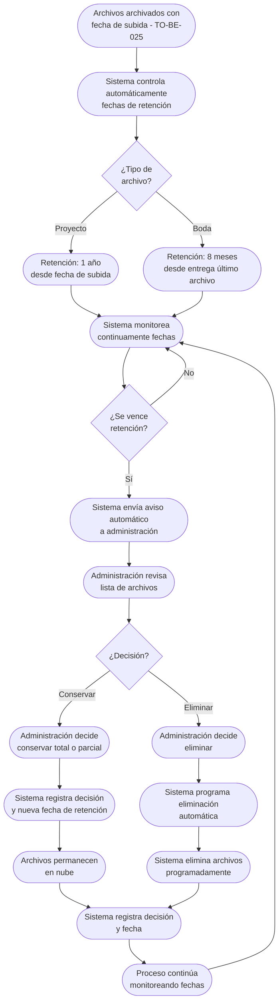

# Proceso TO-BE-027: Gestión de retención y eliminación de archivos

## 1. Objetivo y alcance (del proceso)

**Actor principal**: Sistema centralizado (con decisión de administración)

**Evento disparador**: Archivos archivados (TO-BE-025) con fecha de subida registrada

**Propósito**: Control automático de fechas de retención (1 año proyectos, 8 meses bodas), avisos automáticos para decidir conservación, eliminación programada tras decisión, registro de decisiones

**Scope funcional**: Desde archivo de archivos hasta decisión de conservación o eliminación

**Criterios de éxito**: 
- 100% de archivos con control automático de retención
- Avisos automáticos cuando se vence retención
- Decisión de conservación o eliminación registrada
- Eliminación programada automática tras decisión
- 0% de olvidos de avisos

**Frecuencia**: Continua (monitoreo automático de fechas de retención)

**Duración objetivo**: Proceso automático continuo

**Supuestos/restricciones**: 
- Archivos archivados (TO-BE-025)
- Fecha de subida registrada
- Retención mínima: 1 año proyectos, 8 meses bodas

## 2. Contexto y actores

**Participantes:**
- **Sistema centralizado**: Controla fechas de retención y envía avisos
- **Administración**: Decide conservación o eliminación
- **Equipo**: Puede revisar decisiones

**Stakeholders clave:** 
- Administración (necesita gestionar retención)
- Equipo (necesita saber qué archivos se conservan)
- Cliente (puede necesitar acceso a archivos)

**Dependencias:** 
- TO-BE-025: Archivos deben estar archivados
- Fecha de subida registrada
- TO-BE-026: Ubicación en discos físicos registrada

**Gobernanza:** 
- Sistema controla fechas automáticamente
- Administración decide conservación o eliminación

### 2.1 Dependencias entre procesos TO-BE

**Procesos prerequisito:** 
- TO-BE-025: Almacenamiento automático de archivos (archivos deben estar archivados)
- TO-BE-026: Registro de ubicación en discos físicos (ubicación debe estar registrada)

**Procesos dependientes:** Ninguno (proceso final de ciclo)

**Orden de implementación sugerido:** Vigésimo séptimo (después de registro de ubicación)

## 3. Transformación AS-IS → TO-BE (trazabilidad)

### 3.1 Procesos AS-IS relacionados

**Procesos AS-IS de referencia:** AS-IS-009: Gestión de almacenamiento y archivo (Corporativo y Bodas)

**Tipo de transformación:** Reimaginación con avisos automáticos

### 3.2 Análisis del estado actual (procesos AS-IS relacionados)

En el proceso AS-IS, archivos deben estar al menos un año en nube. Al año debe salir aviso para valorar si se continúa conservando o no el material en su totalidad o en parte. Para bodas: aviso cuando hayan pasado 8 meses desde entrega del último archivo final para eliminar archivos finales y brutos de la nube. Avisos son manuales y pueden olvidarse.

### 3.3 Problemas y oportunidades identificadas

**Dolores principales:**
1. Avisos manuales de eliminación - avisos al año o a los 8 meses (bodas) requieren intervención manual, pueden olvidarse _(Fuente: AS-IS-009 P2)_
2. Retención mínima no automatizada - archivos deben estar 1 año en nube pero no hay control automático _(Fuente: AS-IS-009 P5)_

**Causas raíz:** 
- Avisos manuales
- No hay control automático de fechas
- Dependencia de memoria

**Oportunidades no explotadas:** 
- Control automático de fechas de retención
- Avisos automáticos cuando se vence retención
- Eliminación programada automática
- Registro de decisiones

**Riesgo de mantener AS-IS:** 
- Olvidos de avisos
- Archivos no se eliminan
- Falta de control de espacio

### 3.4 Estrategia de transformación

**Principios de rediseño aplicados:**
- Control automático de fechas de retención (1 año proyectos, 8 meses bodas)
- Avisos automáticos cuando se vence retención
- Eliminación programada automática tras decisión
- Registro de decisiones de conservación o eliminación

**Justificación del nuevo diseño:** 
Este proceso TO-BE automatiza completamente el control de retención con avisos automáticos y eliminación programada, eliminando olvidos y garantizando gestión eficiente del espacio de almacenamiento.

**Fuentes:** 
- `02-discovery/0201-interviews/020101-interview-01/minute-01.md` (Almacenamiento)
- `02-discovery/0202-prd/020202-as-is/processes/AS-IS-009-gestion-almacenamiento-archivo/AS-IS-009-gestion-almacenamiento-archivo.md`

## 4. Proceso TO-BE

### **4.1 Descripción detallada**

El proceso inicia cuando archivos están archivados con fecha de subida registrada. El sistema:

1. **Controla automáticamente fechas de retención**:
   - Proyectos: 1 año desde fecha de subida
   - Bodas: 8 meses desde entrega del último archivo final
   - Monitoreo continuo de fechas

2. **Cuando se vence retención, sistema envía aviso automático**:
   - Notificación a administración
   - Lista de archivos que vencen retención
   - Opción de conservar o eliminar

3. **Administración decide conservación o eliminación**:
   - Revisa lista de archivos
   - Decide: conservar (total o parcial) o eliminar
   - Registra decisión

4. **Sistema ejecuta decisión automáticamente**:
   - Si conservar: archivos permanecen, nueva fecha de retención
   - Si eliminar: eliminación programada automática
   - Registro de decisión

5. **Sistema elimina archivos programadamente**:
   - Eliminación automática según decisión
   - Archivos eliminados de nube
   - Registro de eliminación

6. **Sistema registra todas las decisiones**:
   - Decisión de conservación o eliminación
   - Fecha de decisión
   - Fecha de eliminación (si aplica)
   - Trazabilidad completa

### **4.2 Diagrama de flujo**

### **4.3 Flujo principal (happy path)**

| # | Actor | Actividad | Sistema/Herramienta | Reglas de Negocio | Tiempo |
|---|-------|-----------|-------------------|-------------------|--------|
| 1 | Sistema | Controla automáticamente fechas de retención (1 año proyectos, 8 meses bodas) | Sistema de control de retención | Monitoreo continuo de fechas Cálculo automático de vencimiento | Continuo |
| 2 | Sistema | Monitorea continuamente fechas de retención | Sistema de monitoreo | Evaluación periódica de fechas Detección automática de vencimientos | Continuo |
| 3 | Sistema | Cuando se vence retención, envía aviso automático a administración | Sistema de notificaciones | Notificación incluye: lista de archivos que vencen, opción de conservar o eliminar | < 1 min |
| 4 | Administración | Revisa lista de archivos que vencen retención | Dashboard de administración | Lista visible con detalles de archivos Fechas de vencimiento claras | Variable |
| 5 | Administración | Decide conservación (total o parcial) o eliminación | Sistema de decisión | Decisión registrada Opciones: conservar total, conservar parcial, eliminar | < 10 min |
| 6 | Sistema | Si conservar, registra decisión y nueva fecha de retención | Base de datos | Decisión registrada Nueva fecha de retención calculada | < 10 seg |
| 7 | Sistema | Si eliminar, programa eliminación automática | Sistema de eliminación programada | Eliminación programada según decisión Fecha de eliminación registrada | < 1 min |
| 8 | Sistema | Ejecuta eliminación programada automáticamente | Sistema de eliminación | Archivos eliminados de nube Registro de eliminación | Variable |
| 9 | Sistema | Registra todas las decisiones (conservación o eliminación, fecha) | Base de datos | Trazabilidad completa de decisiones Historial de retención | < 10 seg |

### **4.5 Puntos de decisión y variantes**

- **Conservar vs eliminar**: Administración decide según necesidad
- **Conservar total vs parcial**: Puede conservar todo o solo parte del material
- **Nueva retención**: Si conserva, se establece nueva fecha de retención

### **4.6 Excepciones y manejo de errores**

- **Aviso no recibido**: Si administración no recibe aviso, sistema puede reenviar
- **Decisión no registrada**: Si decisión no se registra, sistema puede enviar recordatorio
- **Error en eliminación**: Si falla eliminación, sistema notifica y permite eliminación manual

### **4.7 Riesgos del proceso y mitigaciones**

| Riesgo | Probabilidad | Impacto | Mitigación |
|--------|--------------|---------|------------|
| Avisos no se envían | Baja | Alto | Avisos automáticos, monitoreo continuo, notificaciones múltiples |
| Archivos se eliminan incorrectamente | Baja | Alto | Decisión explícita de administración, confirmación antes de eliminar, posibilidad de recuperación |
| Decisión no se registra | Baja | Medio | Registro automático, validación, recordatorios si falta |

### **4.8 Preguntas abiertas**

- ¿Qué hacer si administración no decide? ¿Se conserva por defecto o se elimina?
- ¿Se requiere confirmación explícita antes de eliminar archivos?
- ¿Qué hacer si archivos eliminados se necesitan después? ¿Hay backup?
- ¿Se requiere análisis de uso antes de decidir eliminación?

### **4.9 Ideas adicionales**

- Análisis automático de uso de archivos antes de decidir eliminación
- Backup automático antes de eliminar archivos críticos
- Alertas proactivas antes de que se venza retención
- Integración con sistemas de backup para recuperación si es necesario

---

*GEN-BY:PROMPT-to-be · hash:tobe027_gestion_retencion_eliminacion_archivos_20260120 · 2026-01-20T00:00:00Z*
