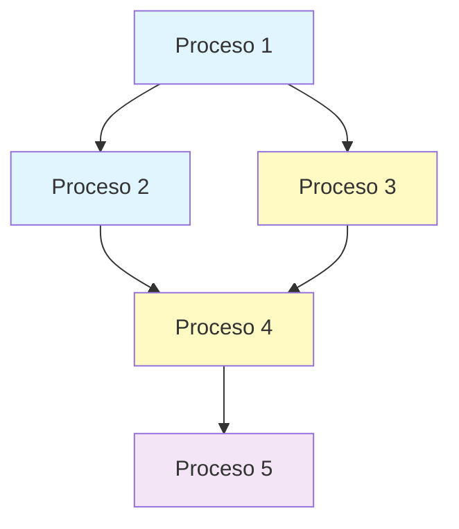

# PROMPT Maestro · 020204 — SCOPE (Análisis y Priorización TO-BE)

## 🎯 OBJETIVO
Generar un documento **SCOPE.md** que analice los procesos TO-BE y proponga un orden lógico de implementación basado en dependencias y sentido común de negocio.

---

## 📋 PARÁMETROS

```yaml
# Proyecto
PRODUCT_NAME: {nombre_producto}
RELEASE_TAG: {version}
AUTHOR: {autor}
ORG: {organizacion}
DATE: {fecha_iso}

# Entrada/Salida
TOBE_DIR: 02-discovery/0202-prd/020203-to-be/processes/
OUTPUT_FILE: 02-discovery/0202-prd/020204-scope/SCOPE.md
```

---

## 🔍 QUÉ ANALIZAR DE CADA PROCESO

Para cada proceso TO-BE, evaluar:

1. **Dependencias**: ¿Qué necesita para funcionar? ¿Qué habilita?
2. **Coste**: Alto/Medio/Bajo (basado en complejidad e integraciones)
3. **Impacto**: Alto/Medio/Bajo (basado en usuarios afectados y valor)
4. **Tipo**: Fundacional/Core/Optimización

---

## 📄 PLANTILLA SCOPE.md

```markdown
# SCOPE — {PRODUCT_NAME} {RELEASE_TAG}

**Fecha**: {DATE}  
**Autor**: {AUTHOR}@{ORG}

## Resumen Ejecutivo

Análisis de **{N} procesos TO-BE** para {PRODUCT_NAME}, ordenados por prioridad de implementación considerando dependencias técnicas y valor de negocio.

**Procesos fundacionales identificados**: {lista}  
**Procesos de mayor impacto**: {lista}  
**Cadenas de dependencia críticas**: {descripción}

## Análisis de Procesos

| ID | Proceso | Tipo | Coste | Impacto | Dependencias | Habilita |
|----|---------|------|-------|---------|--------------|----------|
| TO-BE-001 | {nombre} | {tipo} | {A/M/B} | {A/M/B} | {lista o "Ninguna"} | {lista} |
| TO-BE-002 | {nombre} | {tipo} | {A/M/B} | {A/M/B} | {deps} | {lista} |

### Leyenda:
- **Tipo**: Fundacional (base del sistema) / Core (proceso principal) / Optimización (mejora)
- **Coste**: Alto (complejo) / Medio / Bajo (simple)
- **Impacto**: Alto (crítico) / Medio / Bajo

## Orden de Implementación Propuesto

### 🏗️ Fase 1: Fundamentos
*Procesos base sin dependencias externas que habilitan el resto del sistema*

1. **{Nombre Proceso}** - {justificación breve}
   - Coste: {A/M/B} - {por qué}
   - Impacto: {A/M/B} - {beneficio principal}
   - Habilita: {qué procesos desbloquea}

2. **{Nombre Proceso}** - {justificación}
   {etc...}

### ⚡ Fase 2: Procesos Core
*Funcionalidad principal del negocio*

3. **{Nombre Proceso}** - {justificación}
   - Requiere: {proceso previo necesario}
   - Coste: {A/M/B} - {por qué}
   - Impacto: {A/M/B} - {beneficio principal}

{continuar...}

### 🚀 Fase 3: Optimizaciones
*Mejoras y automatizaciones*

{continuar...}

## Dependencias Visualizadas



## Consideraciones Clave

### Prioridades críticas:
- **No diferir**: {proceso X} porque {razón de negocio}
- **Quick win**: {proceso Y} ofrece valor inmediato con poco esfuerzo
- **Dependencia larga**: La cadena {A→B→C} requiere planificación cuidadosa

### Riesgos identificados:
- {Riesgo 1 y su impacto}
- {Riesgo 2 y su impacto}

### Oportunidades:
- Procesos {X} y {Y} pueden desarrollarse en paralelo
- {Proceso Z} puede servir como piloto para validar enfoque

## Próximos Pasos

1. Validar orden propuesto con stakeholders clave
2. Confirmar dependencias técnicas con arquitectura
3. Generar épicas para procesos de Fase 1
4. Definir criterios de éxito para cada proceso

---

*Documento generado para servir como base para la planificación de épicas e historias de usuario*
```

---

## 🚀 INSTRUCCIONES DE EJECUCIÓN

1. **LEER** todos los archivos `TO-BE-*.md` en la carpeta indicada

2. **EVALUAR** cada proceso:
   - **Coste**: 
     - Alto = Muchas integraciones, flujo complejo, múltiples excepciones
     - Medio = Complejidad moderada, algunas integraciones
     - Bajo = Flujo simple, pocas o ninguna integración
   
   - **Impacto**:
     - Alto = Afecta a todos los usuarios o proceso crítico de negocio
     - Medio = Mejora significativa para grupo específico
     - Bajo = Optimización o mejora menor

3. **ORDENAR** considerando:
   - Primero: Procesos sin dependencias (fundacionales)
   - Segundo: Procesos que habilitan muchos otros
   - Tercero: Balance entre quick wins y complejidad
   - Último: Optimizaciones que requieren datos históricos

4. **AGRUPAR** en fases con sentido de negocio

5. **GENERAR** el documento siguiendo la plantilla

---

## ✅ CRITERIOS DE CALIDAD

- Todos los procesos TO-BE incluidos
- Dependencias respetadas (ningún proceso antes de sus prerequisitos)
- Justificaciones claras y de negocio (no técnicas)
- Lenguaje simple y directo
- Sin estimaciones de tiempo ni detalles de implementación

---

## 📌 EJEMPLO

Si encuentras:
- TO-BE-001: Sistema de login (sin dependencias, impacto alto)
- TO-BE-002: Gestión de proyectos (requiere usuarios, impacto alto)
- TO-BE-003: Reportes BI (requiere datos de proyectos, impacto medio)

El orden sería:
1. Fase 1: Sistema de login (fundacional, habilita todo)
2. Fase 2: Gestión de proyectos (core del negocio)
3. Fase 3: Reportes BI (optimización con datos acumulados)