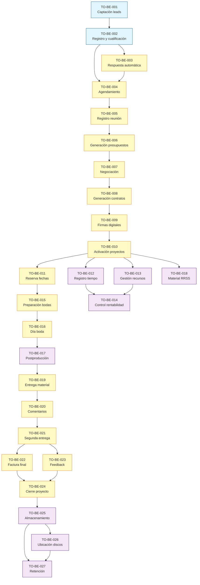

# SCOPE — ONGAKU v1.0.0

**Fecha**: 2026-01-20  
**Autor**: Kameleonlabs@Kameleonlabs

## Resumen Ejecutivo

Análisis de **27 procesos TO-BE** para ONGAKU, ordenados por prioridad de implementación considerando dependencias técnicas y valor de negocio.

**Procesos fundacionales identificados**: TO-BE-001, TO-BE-002  
**Procesos de mayor impacto**: TO-BE-001, TO-BE-002, TO-BE-006, TO-BE-008, TO-BE-010, TO-BE-014, TO-BE-019  
**Cadenas de dependencia críticas**: 
- Flujo comercial: TO-BE-001 → TO-BE-002 → TO-BE-003 → TO-BE-004 → TO-BE-005 → TO-BE-006 → TO-BE-007 → TO-BE-008 → TO-BE-009 → TO-BE-010
- Flujo de producción: TO-BE-010 → TO-BE-012/013 → TO-BE-014
- Flujo de cierre: TO-BE-021 → TO-BE-022 → TO-BE-023 → TO-BE-024 → TO-BE-025

## Análisis de Procesos

| ID | Proceso | Tipo | Coste | Impacto | Dependencias | Habilita |
|----|---------|------|-------|---------|--------------|----------|
| TO-BE-001 | Captación automática de leads | Fundacional | Medio | Alto | Ninguna | TO-BE-002, TO-BE-003 |
| TO-BE-002 | Registro y cualificación de leads | Fundacional | Bajo | Alto | TO-BE-001 | TO-BE-003, TO-BE-004 |
| TO-BE-003 | Respuesta automática inicial | Core | Bajo | Medio | TO-BE-002 | TO-BE-004 |
| TO-BE-004 | Agendamiento de reuniones | Core | Medio | Alto | TO-BE-002, TO-BE-003 | TO-BE-005 |
| TO-BE-005 | Registro de información durante reunión | Core | Bajo | Medio | TO-BE-004 | TO-BE-006 |
| TO-BE-006 | Generación automática de presupuestos | Core | Medio | Alto | TO-BE-005 | TO-BE-007 |
| TO-BE-007 | Negociación de presupuestos | Core | Bajo | Medio | TO-BE-006 | TO-BE-008 |
| TO-BE-008 | Generación automática de contratos | Core | Medio | Alto | TO-BE-007 | TO-BE-009 |
| TO-BE-009 | Gestión de firmas digitales | Core | Alto | Alto | TO-BE-008 | TO-BE-010 |
| TO-BE-010 | Activación automática de proyectos | Core | Medio | Alto | TO-BE-009 | TO-BE-011, TO-BE-012, TO-BE-013, TO-BE-015, TO-BE-018 |
| TO-BE-011 | Reserva automática de fechas | Core | Medio | Medio | TO-BE-010 | TO-BE-015 |
| TO-BE-012 | Registro de tiempo por proyecto | Optimización | Bajo | Medio | TO-BE-010 | TO-BE-014 |
| TO-BE-013 | Gestión de recursos de producción | Optimización | Bajo | Medio | TO-BE-010 | TO-BE-014 |
| TO-BE-014 | Control de rentabilidad en tiempo real | Optimización | Medio | Alto | TO-BE-010, TO-BE-012, TO-BE-013 | Ninguno |
| TO-BE-015 | Preparación de bodas | Core | Bajo | Medio | TO-BE-011 | TO-BE-016 |
| TO-BE-016 | Gestión del día de la boda | Core | Medio | Medio | TO-BE-015 | TO-BE-017, TO-BE-025 |
| TO-BE-017 | Seguimiento de postproducción de bodas | Optimización | Bajo | Medio | TO-BE-016 | TO-BE-019 |
| TO-BE-018 | Registro de material RRSS | Optimización | Bajo | Bajo | TO-BE-010 | Ninguno |
| TO-BE-019 | Entrega de material para revisión | Core | Medio | Alto | Material listo | TO-BE-020 |
| TO-BE-020 | Gestión de comentarios y modificaciones | Core | Medio | Medio | TO-BE-019 | TO-BE-021 |
| TO-BE-021 | Incorporación de cambios y segunda entrega | Core | Medio | Medio | TO-BE-020 | TO-BE-022 |
| TO-BE-022 | Generación automática de factura final | Core | Bajo | Medio | TO-BE-021 | TO-BE-024 |
| TO-BE-023 | Solicitud automática de feedback | Optimización | Bajo | Medio | TO-BE-021 | TO-BE-024 |
| TO-BE-024 | Cierre automático de proyecto | Core | Bajo | Medio | TO-BE-022, TO-BE-023 | TO-BE-025 |
| TO-BE-025 | Almacenamiento automático de archivos | Optimización | Medio | Medio | TO-BE-024 | TO-BE-026 |
| TO-BE-026 | Registro de ubicación en discos físicos | Optimización | Bajo | Medio | TO-BE-025 | TO-BE-027 |
| TO-BE-027 | Gestión de retención y eliminación | Optimización | Bajo | Bajo | TO-BE-025, TO-BE-026 | Ninguno |

### Leyenda:
- **Tipo**: Fundacional (base del sistema) / Core (proceso principal) / Optimización (mejora)
- **Coste**: Alto (complejo, muchas integraciones) / Medio (complejidad moderada) / Bajo (simple)
- **Impacto**: Alto (crítico para negocio) / Medio (mejora significativa) / Bajo (optimización menor)

## Orden de Implementación Propuesto

### 🏗️ Fase 1: Fundamentos (Procesos 1-2)
*Base del sistema sin dependencias externas que habilitan el resto del flujo comercial*

1. **TO-BE-001: Captación automática de leads** - Base del flujo comercial
   - Coste: Medio - Requiere integraciones con múltiples canales (web, LinkedIn, Facebook, Instagram, email)
   - Impacto: Alto - Elimina pérdida de leads por procesos manuales dispersos, habilita todo el flujo comercial
   - Habilita: TO-BE-002, TO-BE-003

2. **TO-BE-002: Registro y cualificación de leads** - Estructuración de información
   - Coste: Bajo - Proceso interno de registro y validación
   - Impacto: Alto - Base de datos unificada, verificación de disponibilidad, segmentación automática
   - Habilita: TO-BE-003, TO-BE-004

### ⚡ Fase 2: Flujo Comercial Core (Procesos 3-10)
*Funcionalidad principal del negocio desde respuesta inicial hasta activación de proyectos*

3. **TO-BE-003: Respuesta automática inicial** - Primera impresión del cliente
   - Requiere: TO-BE-002 (lead cualificado)
   - Coste: Bajo - Envío automático de emails personalizados
   - Impacto: Medio - Mejora experiencia inicial, elimina olvidos de respuesta

4. **TO-BE-004: Agendamiento de reuniones** - Autoservicio para clientes
   - Requiere: TO-BE-002, TO-BE-003
   - Coste: Medio - Integración con calendario, generación de convocatorias
   - Impacto: Alto - Elimina olvidos de convocatorias, mejora experiencia del cliente

5. **TO-BE-005: Registro de información durante reunión** - Captura estructurada
   - Requiere: TO-BE-004 (reunión agendada)
   - Coste: Bajo - Formulario estructurado para captura en tiempo real
   - Impacto: Medio - Permite generación inmediata de presupuesto

6. **TO-BE-006: Generación automática de presupuestos** - Quick win de alto valor
   - Requiere: TO-BE-005 (información de reunión)
   - Coste: Medio - Motor de generación desde plantillas, requiere configuración inicial
   - Impacto: Alto - Elimina olvidos de envío, reduce tiempo de generación de días a minutos

7. **TO-BE-007: Negociación de presupuestos** - Gestión de contrapropuestas
   - Requiere: TO-BE-006 (presupuesto generado)
   - Coste: Bajo - Sistema de registro de versiones y acuerdos
   - Impacto: Medio - Trazabilidad completa de negociaciones

8. **TO-BE-008: Generación automática de contratos** - Automatización crítica
   - Requiere: TO-BE-007 (presupuesto aceptado)
   - Coste: Medio - Motor de generación desde plantillas, permite edición manual
   - Impacto: Alto - Elimina edición manual lenta, reduce tiempo de días a minutos

9. **TO-BE-009: Gestión de firmas digitales** - Cierre de venta
   - Requiere: TO-BE-008 (contrato generado)
   - Coste: Alto - Integración con sistema de firma digital, seguimiento de estado
   - Impacto: Alto - Elimina olvidos de firma, trazabilidad completa

10. **TO-BE-010: Activación automática de proyectos** - Inicio de ejecución
    - Requiere: TO-BE-009 (contrato firmado)
    - Coste: Medio - Detección de pagos, generación de facturas, activación automática
    - Impacto: Alto - Elimina intervención manual, habilita procesos de producción

### 🚀 Fase 3: Producción y Control (Procesos 11-18)
*Gestión de ejecución, control de rentabilidad y procesos específicos de bodas*

11. **TO-BE-011: Reserva automática de fechas** - Integración con calendario
    - Requiere: TO-BE-010 (proyecto activado)
    - Coste: Medio - Integración con Google Calendar, gestión de conflictos
    - Impacto: Medio - Elimina errores de sincronización, reserva automática

12. **TO-BE-012: Registro de tiempo por proyecto** - Datos para rentabilidad
    - Requiere: TO-BE-010 (proyecto activado)
    - Coste: Bajo - Formulario facilitado de registro
    - Impacto: Medio - Facilita control de rentabilidad, comparación con presupuestado

13. **TO-BE-013: Gestión de recursos de producción** - Control de gastos
    - Requiere: TO-BE-010 (proyecto activado)
    - Coste: Bajo - Registro centralizado de recursos y gastos
    - Impacto: Medio - Integración con control de rentabilidad

14. **TO-BE-014: Control de rentabilidad en tiempo real** - Visibilidad crítica
    - Requiere: TO-BE-010, TO-BE-012, TO-BE-013 (proyecto activado con datos)
    - Coste: Medio - Dashboard con visualización en tiempo real, alertas automáticas
    - Impacto: Alto - Visibilidad continua de rentabilidad, detección temprana de problemas

15. **TO-BE-015: Preparación de bodas** - Proceso específico de bodas
    - Requiere: TO-BE-011 (fecha reservada)
    - Coste: Bajo - Formulario digital, coordinación de reunión previa
    - Impacto: Medio - Digitalización de preparación, bloqueo de música

16. **TO-BE-016: Gestión del día de la boda** - Trazabilidad de material
    - Requiere: TO-BE-015 (preparación completada)
    - Coste: Medio - Asignación de equipo, registro de material por profesional
    - Impacto: Medio - Trazabilidad completa del material generado

17. **TO-BE-017: Seguimiento de postproducción de bodas** - Comunicación proactiva
    - Requiere: TO-BE-016 (día de boda completado)
    - Coste: Bajo - Portal de visibilidad, comunicación automática
    - Impacto: Medio - Mejora experiencia durante espera, reduce consultas

18. **TO-BE-018: Registro de material RRSS** - Optimización de marketing
    - Requiere: TO-BE-010 (proyecto activado)
    - Coste: Bajo - Registro temprano con tags y categorización
    - Impacto: Bajo - Optimización para marketing, puede desarrollarse en paralelo

### 📦 Fase 4: Entrega y Cierre (Procesos 19-24)
*Finalización de proyectos, entrega de material y cierre estructurado*

19. **TO-BE-019: Entrega de material para revisión** - Portal de cliente
    - Requiere: Material editado/postproducido listo
    - Coste: Medio - Portal con visualización integrada, publicación automática
    - Impacto: Alto - Mejora experiencia del cliente, visualización sin salir de página

20. **TO-BE-020: Gestión de comentarios y modificaciones** - Comunicación estructurada
    - Requiere: TO-BE-019 (material entregado)
    - Coste: Medio - Sistema centralizado de comentarios, control de límites
    - Impacto: Medio - Elimina comentarios dispersos, registro estructurado

21. **TO-BE-021: Incorporación de cambios y segunda entrega** - Finalización
    - Requiere: TO-BE-020 (comentarios registrados)
    - Coste: Medio - Seguimiento de incorporación, galería corporativa
    - Impacto: Medio - Mejora experiencia de entrega final

22. **TO-BE-022: Generación automática de factura final** - Facturación
    - Requiere: TO-BE-021 (segunda entrega aceptada)
    - Coste: Bajo - Generación automática, pago fuera del sistema
    - Impacto: Medio - Automatización de facturación final

23. **TO-BE-023: Solicitud automática de feedback** - Mejora continua
    - Requiere: TO-BE-021 (segunda entrega aceptada)
    - Coste: Bajo - Solicitud automática, seguimiento, integración con Google
    - Impacto: Medio - Mejora tasa de feedback recibido

24. **TO-BE-024: Cierre automático de proyecto** - Finalización estructurada
    - Requiere: TO-BE-022, TO-BE-023 (pago final y feedback)
    - Coste: Bajo - Cierre automático, archivo de documentación, reporte final
    - Impacto: Medio - Cierre estructurado, registro de satisfacción

### 🗄️ Fase 5: Almacenamiento y Archivo (Procesos 25-27)
*Gestión de archivos, trazabilidad y retención*

25. **TO-BE-025: Almacenamiento automático de archivos** - Organización
    - Requiere: TO-BE-024 (proyecto cerrado)
    - Coste: Medio - Subida automática, nombrado estructurado, organización por carpetas
    - Impacto: Medio - Elimina errores de nombrado, organización automática

26. **TO-BE-026: Registro de ubicación en discos físicos** - Trazabilidad
    - Requiere: TO-BE-025 (archivos en nube)
    - Coste: Bajo - Registro de ubicación, búsqueda avanzada
    - Impacto: Medio - Trazabilidad completa de ubicación física

27. **TO-BE-027: Gestión de retención y eliminación** - Optimización de espacio
    - Requiere: TO-BE-025, TO-BE-026 (archivos archivados con ubicación)
    - Coste: Bajo - Control automático de fechas, avisos automáticos
    - Impacto: Bajo - Optimización de espacio, gestión de retención

## Dependencias Visualizadas

## Consideraciones Clave

### Prioridades críticas:
- **No diferir**: TO-BE-001 y TO-BE-002 porque son la base de todo el flujo comercial y sin ellos no se puede avanzar
- **Quick win**: TO-BE-006 (Generación automática de presupuestos) ofrece valor inmediato con esfuerzo moderado, elimina olvidos críticos
- **Dependencia larga**: La cadena TO-BE-001 → TO-BE-002 → TO-BE-003 → TO-BE-004 → TO-BE-005 → TO-BE-006 requiere planificación cuidadosa pero es el flujo crítico del negocio
- **Alto impacto temprano**: TO-BE-014 (Control de rentabilidad) requiere datos acumulados pero proporciona visibilidad crítica para toma de decisiones

### Riesgos identificados:
- **TO-BE-001**: Integraciones con múltiples canales pueden ser complejas, considerar implementación por fases (web primero, luego redes sociales)
- **TO-BE-009**: Integración con firma digital requiere validación legal y técnica, puede ser cuello de botella
- **TO-BE-010**: Detección automática de pagos sin pasarela integrada puede requerir solución híbrida (justificantes + confirmación manual)
- **Dependencias cruzadas**: TO-BE-012, TO-BE-013 y TO-BE-014 forman un triángulo de dependencias que debe implementarse coordinadamente

### Oportunidades:
- **Desarrollo en paralelo**: TO-BE-012, TO-BE-013 y TO-BE-018 pueden desarrollarse en paralelo una vez TO-BE-010 esté listo
- **Piloto con bodas**: TO-BE-015, TO-BE-016, TO-BE-017 pueden servir como piloto para validar enfoque antes de aplicar a corporativo
- **Fase 5 independiente**: Los procesos de almacenamiento (TO-BE-025, TO-BE-026, TO-BE-027) pueden implementarse de forma independiente y en paralelo con otras fases
- **Quick wins tempranos**: TO-BE-003, TO-BE-005, TO-BE-012, TO-BE-013 son procesos simples con impacto inmediato

## Próximos Pasos

1. Validar orden propuesto con stakeholders clave (Javi, Fátima, Paz)
2. Confirmar dependencias técnicas con arquitectura (integración con canales, firma digital, calendario)
3. Generar épicas para procesos de Fase 1 (TO-BE-001, TO-BE-002)
4. Definir criterios de éxito para cada proceso
5. Estimar esfuerzo y recursos necesarios para cada fase
6. Identificar riesgos técnicos y de negocio específicos por proceso

---

*Documento generado para servir como base para la planificación de épicas e historias de usuario*

*GEN-BY:PROMPT-scope · hash:scope_ongaku_v1_20260120 · 2026-01-20T00:00:00Z*
