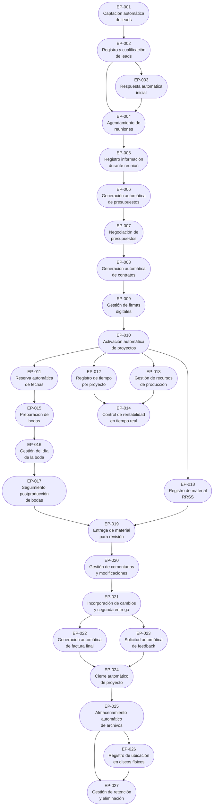

# Requisitos Funcionales — Índice de Epics

## Resumen de análisis:
- Procesos TO-BE identificados en SCOPE.md: 27
- Total de bloques funcionales identificados: 27
- Total de epics propuestos: 27

## Epics propuestos:

ID | Epic | Proceso TO-BE | Bloque Funcional | # US Est. | Justificación de la división
---|------|---------------|------------------|-----------|------------------------------
EP-001 | Entrada estandarizada y registro automático de leads | TO-BE-001 | Entrada estandarizada mediante formulario único | 3 | Formulario web unificado accesible desde todos los canales mediante CTAs, con registro automático y notificaciones
EP-002 | Registro y cualificación de leads | TO-BE-002 | Cualificación y segmentación | 2 | Segmentación automática sugerida (corporativo) y marcado como cualificado con validaciones. Verificación de disponibilidad integrada en EP-001 durante captación.
EP-003 | Respuesta automática inicial | TO-BE-003 | Envío automático de correos modelo | 4 | Generación y envío automático de correos personalizados según disponibilidad y línea de negocio
EP-004 | Agendamiento de reuniones | TO-BE-004 | Agendamiento autónomo por cliente | 6 | Sistema completo de agendamiento con calendario visible, generación de convocatorias y recordatorios
EP-005 | Registro de información durante reunión | TO-BE-005 | Captura estructurada en tiempo real | 5 | Formulario guiado para captura durante reunión con información lista para presupuesto
EP-006 | Generación automática de presupuestos | TO-BE-006 | Generación desde plantillas | 6 | Motor de generación automática desde plantillas con personalización y aprobación de ONGAKU
EP-007 | Negociación de presupuestos | TO-BE-007 | Gestión de contrapropuestas | 5 | Sistema de registro de versiones y acuerdos con trazabilidad completa de negociación
EP-008 | Generación automática de contratos | TO-BE-008 | Generación desde plantillas | 5 | Motor de generación automática desde plantillas con edición manual permitida
EP-009 | Gestión de firmas digitales | TO-BE-009 | Seguimiento de estado de firmas | 6 | Sistema completo de seguimiento con notificaciones automáticas y trazabilidad
EP-010 | Activación automática de proyectos | TO-BE-010 | Activación tras detección de pago | 5 | Detección automática de pago, generación de factura y activación con reserva de fecha
EP-011 | Reserva automática de fechas | TO-BE-011 | Reserva en calendario integrado | 4 | Integración con Google Calendar y bloqueo automático de fechas con validación
EP-012 | Registro de tiempo por proyecto | TO-BE-012 | Registro facilitado con desglose | 5 | Formulario rápido con desglose por fase y comparación automática con presupuestado
EP-013 | Gestión de recursos de producción | TO-BE-013 | Registro centralizado de recursos | 5 | Registro estructurado de recursos y gastos con integración a rentabilidad
EP-014 | Control de rentabilidad en tiempo real | TO-BE-014 | Visualización continua | 6 | Dashboard con visualización en tiempo real y alertas automáticas
EP-015 | Preparación de bodas | TO-BE-015 | Formulario digital y reunión previa | 5 | Digitalización completa con bloqueo automático de música
EP-016 | Gestión del día de la boda | TO-BE-016 | Asignación de equipo y trazabilidad | 6 | Asignación digital, registro de material por profesional y trazabilidad completa
EP-017 | Seguimiento de postproducción de bodas | TO-BE-017 | Visibilidad y comunicación proactiva | 5 | Portal de visibilidad con comunicación automática mensual
EP-018 | Registro de material RRSS | TO-BE-018 | Registro temprano con tags | 4 | Identificación y registro durante producción con categorización
EP-019 | Entrega de material para revisión | TO-BE-019 | Publicación en portal integrado | 5 | Portal con visualización integrada y publicación automática
EP-020 | Gestión de comentarios y modificaciones | TO-BE-020 | Sistema centralizado de comentarios | 6 | Chat/foro integrado con control automático de límites
EP-021 | Incorporación de cambios y segunda entrega | TO-BE-021 | Seguimiento y galería corporativa | 6 | Seguimiento de incorporación y publicación en galería estilo Vidflow
EP-022 | Generación automática de factura final | TO-BE-022 | Generación tras aceptación | 4 | Generación automática del 50% restante con notificaciones
EP-023 | Solicitud automática de feedback | TO-BE-023 | Solicitud y seguimiento | 5 | Solicitud automática con recordatorios e integración con Google
EP-024 | Cierre automático de proyecto | TO-BE-024 | Cierre y archivo estructurado | 5 | Cierre automático con archivo de documentación y reporte final
EP-025 | Almacenamiento automático de archivos | TO-BE-025 | Subida y organización automática | 6 | Subida automática con nombrado estructurado y organización por carpetas
EP-026 | Registro de ubicación en discos físicos | TO-BE-026 | Trazabilidad de ubicación física | 4 | Registro de ubicación en discos físicos con búsqueda avanzada
EP-027 | Gestión de retención y eliminación | TO-BE-027 | Control automático de retención | 5 | Control automático de fechas con avisos y eliminación programada

## Dependencias identificadas entre epics:
- EP-002 requiere EP-001 (lead capturado)
- EP-003 requiere EP-002 (lead cualificado)
- EP-004 requiere EP-002 y EP-003 (lead cualificado y respuesta inicial)
- EP-005 requiere EP-004 (reunión agendada)
- EP-006 requiere EP-005 (información de reunión)
- EP-007 requiere EP-006 (presupuesto generado)
- EP-008 requiere EP-007 (presupuesto aceptado)
- EP-009 requiere EP-008 (contrato generado)
- EP-010 requiere EP-009 (contrato firmado)
- EP-011 requiere EP-010 (proyecto activado) - se ejecuta dentro de EP-010
- EP-012 requiere EP-010 (proyecto activado)
- EP-013 requiere EP-010 (proyecto activado)
- EP-014 requiere EP-010, EP-012, EP-013 (proyecto activado con datos)
- EP-015 requiere EP-011 (fecha reservada)
- EP-016 requiere EP-015 (preparación completada)
- EP-017 requiere EP-016 (día de boda completado)
- EP-018 requiere EP-010 (proyecto activado)
- EP-019 requiere material editado listo
- EP-020 requiere EP-019 (material entregado)
- EP-021 requiere EP-020 (comentarios registrados)
- EP-022 requiere EP-021 (segunda entrega aceptada)
- EP-023 requiere EP-021 (segunda entrega aceptada)
- EP-024 requiere EP-022 y EP-023 (pago final y feedback)
- EP-025 requiere EP-024 (proyecto cerrado)
- EP-026 requiere EP-025 (archivos en nube)
- EP-027 requiere EP-025 y EP-026 (archivos archivados con ubicación)

## Roadmap propuesto

## Decisiones de validación (cerradas)

| # | Tema | Decisión |
|---|------|----------|
| 1 | EP-011 (Reserva automática de fechas) como epic separado o parte de EP-010 | **Epic separado** — Se mantiene EP-011 para trazabilidad y backlog independiente. |
| 2 | EP-018 (Registro de material RRSS) en paralelo con otros epics de producción | **Sí** — Puede desarrollarse en paralelo (solo requiere EP-010). |
| 3 | EP-023 (Solicitud automática de feedback) obligatorio u opcional para cierre | **Definido** — Según diseño actual: EP-024 puede ejecutarse con EP-022 y EP-023; feedback puede ser opcional. |
| 4 | EP-025, EP-026, EP-027 en paralelo o fase independiente | **Válido** — Pueden implementarse de forma independiente o en paralelo cuando el funnel esté estable. |

✅ **Estructura validada.** Documentos maestros y historias de usuario de los 27 epics generados. Ver EPICS-REVIEW.md para revisión y nomenclatura.
