# Roadmap — Plan de entregas

**Origen:** EPICS-INDEX.md, BACKLOG.md.  
**Alcance:** 27 epics, 133 US, 4 fases, 2 releases sugeridos.

---

## 1. Resumen del roadmap

| Concepto | Descripción |
|----------|-------------|
| **Release 1 (MVP)** | Lead → contrato → activación → producción (bodas) → entrega → revisión → segunda entrega → factura → cierre. ~20 epics, ~186 SP. |
| **Release 2** | Archivo en nube, ubicación en discos físicos, retención y eliminación. EP-025, EP-026, EP-027. ~30 SP. |
| **Fases** | 4 fases por valor; el orden respeta dependencias entre epics. |
| **Timeline** | A definir según capacidad (sprints/trimestres). |

---

## 2. Vista por releases

### Release 1 — MVP (flujo completo sin archivo/retención)

| Fase | Epics | Entregable clave | SP (sug.) |
|------|--------|-------------------|-----------|
| Fase 1 | EP-001 a EP-009 | Lead capturado hasta contrato firmado | 84 |
| Fase 2 (parte) | EP-010, EP-011, EP-015 a EP-019 | Activación, reserva fechas, flujo bodas, entrega para revisión | 82 |
| Fase 3 (parte) | EP-020, EP-021, EP-022, EP-024 | Comentarios → segunda entrega → factura → cierre | 42 |
| **Total Release 1** | **20 epics** | **Flujo lead → cierre operativo** | **~186** |

Opcional en Release 1 (según prioridad): EP-012 (tiempo), EP-013 (recursos), EP-014 (rentabilidad), EP-018 (RRSS), EP-023 (feedback).

### Release 2 — Archivo y retención

| Fase | Epics | Entregable clave | SP (sug.) |
|------|--------|-------------------|-----------|
| Fase 4 | EP-025, EP-026, EP-027 | Almacenamiento en nube, discos físicos, políticas de retención/eliminación | 30 |
| **Total Release 2** | **3 epics** | **Ciclo de vida completo del archivo** | **~30** |

---

## 3. Vista por fases (orden de ejecución)

El orden es secuencial por dependencias; dentro de cada fase algunos epics pueden desarrollarse en paralelo.

| Fase | Nombre | Epics | SP (sug.) | Release |
|------|--------|--------|-----------|---------|
| **1** | De lead a contrato | EP-001 → EP-009 | 84 | R1 |
| **2** | Activación y producción | EP-010 → EP-019 | 80 | R1 (parcial) + opc. |
| **3** | Revisión, segunda entrega y cierre | EP-020 → EP-024 | 52 | R1 (parcial) |
| **4** | Archivo y retención | EP-025 → EP-027 | 30 | R2 |

---

## 4. Diagrama del roadmap (dependencias y releases)

```mermaid
%%{init: {'flowchart': {'htmlLabels': true, 'useMaxWidth': false}}}%%
flowchart LR
    subgraph R1["Release 1 (MVP)"]
        subgraph F1["Fase 1"]
            EP001[EP-001]
            EP002[EP-002]
            EP003[EP-003]
            EP004[EP-004]
            EP005[EP-005]
            EP006[EP-006]
            EP007[EP-007]
            EP008[EP-008]
            EP009[EP-009]
        end
        subgraph F2["Fase 2"]
            EP010[EP-010]
            EP011[EP-011]
            EP015[EP-015]
            EP016[EP-016]
            EP017[EP-017]
            EP019[EP-019]
        end
        subgraph F3["Fase 3"]
            EP020[EP-020]
            EP021[EP-021]
            EP022[EP-022]
            EP024[EP-024]
        end
    end
    subgraph R2["Release 2"]
        subgraph F4["Fase 4"]
            EP025[EP-025]
            EP026[EP-026]
            EP027[EP-027]
        end
    end
    F1 --> F2 --> F3 --> F4
```



---

## 5. Diagrama temporal (fases en el tiempo)

Ejemplo de planificación por trimestres (ajustar según capacidad real):

```mermaid
gantt
    title Roadmap por fases (ejemplo)
    dateFormat  YYYY-Q
    section Release 1
    Fase 1 — Lead a contrato     :r1, 2025-Q1, 1Q
    Fase 2 — Activación y prod.  :r2, after r1, 1Q
    Fase 3 — Revisión y cierre   :r3, after r2, 1Q
    section Release 2
    Fase 4 — Archivo y retención :r4, after r3, 1Q
```

*(Las fechas son orientativas; sustituir por sprints/trimestres reales.)*

---

## 6. Hitos sugeridos

| Hito | Epics completados | Criterio de éxito |
|------|-------------------|-------------------|
| **M1 — Captación y cualificación** | EP-001, EP-002 | Leads entrando por formulario y cualificados en sistema. |
| **M2 — Reunión y presupuesto** | EP-003, EP-004, EP-005, EP-006 | Respuesta automática, agendamiento, registro reunión, presupuesto generado. |
| **M3 — Contrato y firma** | EP-007, EP-008, EP-009 | Negociación registrada, contrato generado, firma digital operativa. |
| **M4 — Proyecto activo** | EP-010, EP-011 | Pago detectado, proyecto activado, fecha reservada en calendario. |
| **M5 — Producción y entrega** | EP-015 a EP-019 (y opc. EP-012 a EP-014, EP-018) | Flujo bodas, material entregado para revisión. |
| **M6 — Segunda entrega y cierre** | EP-020, EP-021, EP-022, EP-024 | Comentarios gestionados, segunda entrega, factura final, proyecto cerrado. |
| **M7 — Archivo y retención** | EP-025, EP-026, EP-027 | Archivos en nube, ubicación en discos, políticas de retención aplicadas. |

---

## 7. Supuestos del roadmap

- **Capacidad:** SP por sprint/trimestre a definir según equipo; las cifras son orientativas (2 SP/US).
- **Dependencias:** El orden entre fases es fijo por dependencias; dentro de una fase puede haber paralelismo (ej. EP-011, EP-012, EP-013, EP-018 tras EP-010).
- **MVP:** Release 1 puede recortarse (ej. solo bodas o solo corporativo) o ampliarse con EP-012/013/014/018/023 según prioridad.
- **Release 2:** Puede ejecutarse en paralelo a mejoras de Release 1 o después de estabilizar el funnel.

---

## 8. Referencias

- **EPICS-INDEX.md** — Índice de epics, dependencias y diagrama de flujo.
- **BACKLOG.md** — Backlog por fases, SP sugeridos, MVP y próximos pasos de refinamiento.
- **EPICS-REVIEW.md** — Revisión de documentos maestros y US.
